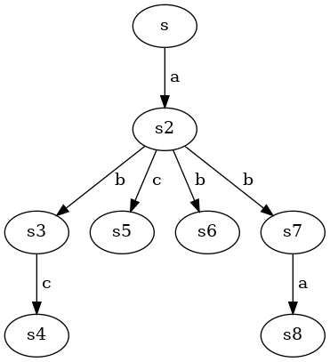
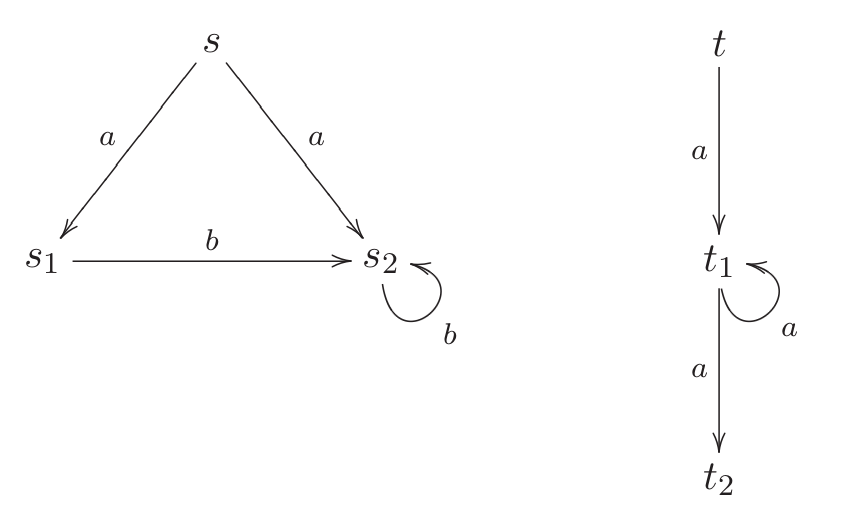

[home](./index.md)
-------------------

*author: niplav, created: 2021-10-14, modified: 2022-03-22, language: english, status: in progress, importance: 2, confidence: likely*

> __This page contains some solutions to exercises from the textbook
“Reactive Systems” by Ingólfsdóttir et al. 2007.__

Solutions to “Reactive Systems”
================================

Chapter 2
----------

### 2.1

> Give a CCS process which describes a clock that ticks at least once
and may stop ticking after each clock tick.

`$\text{Clock} \overset{\text{def}}{=} (\text{tick}.\mathbf{0}+\text{tick}.\text{Clock})$`

### 2.2

> Give a CCS process which describes a coffee machine that may behave
like that given by (2.1) but may also steal the money it receives and
fail at any time.

This exercise is not quite well-defined. Should it sometimes take the
money and offer nothing in return, but continue functioning, or should
it actually fail sometimes and break down? The former case would be
described by

`$\text{CTM} \overset{\text{def}}{=} \text{coin}.(\text{CTM}+\overline{\text{coffee}}.\text{CTM}+\overline{\text{tea}}.\text{CTM})$`,

the latter by

`$\text{CTM} \overset{\text{def}}{=} \text{coin}.(\text{CTM}+\mathbf{0}+\overline{\text{coffee}}.\text{CTM}+\overline{\text{tea}}.\text{CTM})$`

Hey look! `$+$` is commutative here!

### 2.3

> A finite process graph `$T$` is a quadruple `$(\mathcal{Q}, A, \delta, q_0)$`, where  
• `$\mathcal{Q}$` is a finite set of states,  
• `$A$` is a finite set of labels,  
• `$q_0 \in \mathcal{Q}$` is the start state, and  
• `$\delta: \mathcal{Q} \times A \rightarrow 2^{\mathcal{Q}}$` is the transition function.  

> Using the operators introduced so far, give a CCS process that describes `$T$`.

	$$ T=q_0.\underset{a_1 \in A}{\mathbf{+}} (a_1. \underset{q_1 \in δ(q_0, a_1)}{\mathbf{+}} (q_1.\underset{a_2 \in A}{\mathbf{+}} (a_2. \underset{q_2 \in δ(q_1, a_2)}{\mathbf{+}} (q_2. \cdots))))$$

where `$\mathbf{+}$` is _supposed_ to be a big iterative operator like
`$\sum$`, if only I could get MathJax to accept `\scalerel`. The equation
is nested infinitely deep at most places that result in a loop that
doesn't include `$q_0$`, and in some places end with `$.T$`, if `$q_0
\in δ(q_n,a)$`.

### 2.4

> Consider the following LTS:

> Define the LTS as a triple
`$(\textbf{Proc}, \text{Act}, \{\overset{α}{\rightarrow}|α \in \text{Act}\})$`.
Use sketches to illustrate the reflexive closure, symmetric closure and
transitive closure of the binary relation `$\overset{α}{\rightarrow}$`?

The process, in triple form, is
`$(\{s, s_1, s_2, s_3\}, \{a\}, \overset{a}{\rightarrow}=\{(s, s_1), (s_1, s_2), (s_2, s_3), (s_3, s)\})$`.

I'm not sure about the sketch part, but I can try to describe the
different closures.

The reflexive closure of `$\overset{a}{\rightarrow}$` would additionally
contain the elements
`$\{(s,s), (s_1, s_1), (s_2, s_2), (s_3, s_3)\}$`.

The symmetric closure is similarly easy to generate: it additionally
contains the elements `$\{(s_1, s), (s_2, s_1), (s_3, s_2), (s, s_3)\}$`.

The transitive closure additionally contains the elements from the set
`$\{(s, s_2), (s, s_3), (s_1, s_3), (s_1, s), (s_2, s), (s_2, s_1), (s_3, s_1), (s_3, s_2)\}$`.

### 2.5

The set of reachable states includes all states: `$p, p_1$` and `$p_2$`.

### 2.6

* `$a.b.A+B$` ✓
* `$(a.\mathbf{0}.\overline{a}.A)\backslash \{a,b\}$` ✓
* `$(a.\mathbf{0}|\overline{a}.A)\backslash \{a,τ\}$` ✗: `$τ$` can't be excluded
* `$a.B+[a/b]$` ✗: a renaming is not a process
* `$τ.τ.B+\mathbf{0}$` ✓
* `$(a.B+b.B)[a/b, b/a]$` ✓
* `$(a.B+τ.B)[a/τ, b/a]$` ✓
* `$(a.b.A+\overline{a}.\mathbf{0})|B$` ✓
* `$(a.b.A+\overline{a}.\mathbf{0}).B$` ✗: the object in the parentheses is not a label, but a process
* `$(a.b.A+\overline{a}.\mathbf{0})+B$` ✓
* `$(\mathbf{0}|\mathbf{0})+\mathbf{0}$` ✓

### 2.7

> Use the rules of SOS semantics for CCS to derive the LTS for the
process `$\text{SmUni}$` defined by (2.4). (Use the definition of CS in
Table 2.1.)

As a refresher:

* `$\text{SmUni}\overset{\text{def}}{=}(\text{CM}|\text{CS})\backslash \text{coin} \backslash \text{coffee}$`
* `$\text{CM}\overset{\text{def}}{=}\text{coin}.\overline{\text{coffee}}.\text{CM}$`
* `$\text{CS}\overset{\text{def}}{=}\overline{\text{pub}}.\overline{\text{coin}}.\text{coffee}.\text{CS}$`

I'm not going to draw all the images, I'm way too lazy for that.

* Using COM1: SmUni transitions to `$(\text{CM}|\text{CS}_1)\backslash\{\text{coin},\text{coffee}\}$` via `$\overline{\text{pub}}$`
* Using COM3: `$(\text{CM}|\text{CS}_1)\backslash\{\text{coin},\text{coffee}\}$` transitions to `$(\text{CM}_1|\text{CS}_2)\backslash\{\text{coin},\text{coffee}\}$` via `$τ$`, internally `$\text{coin}$`
* Using COM3: `$(\text{CM}_1|\text{CS}_2)\backslash\{\text{coin},\text{coffee}\}$` transitions to SmUni via `$τ$`, internally `$\text{coffee}$`

### 2.12

#### Defining a Bag

`$\text{Bag} \overset{\text{def}}{=} (\text{Cell}|\text{Cell}).\text{Bag}$`

This definition works by keeping two Cells running in parallel. If both
cells are emptied, the Bag restarts, otherwise it keeps its state.

#### Defining a FIFO queue

The two-place FIFO queue should have the following traces available
(for different values of `$x$` and `$y$`):

* `$\text{in}(x) \rightarrow \text{in}(y) \rightarrow \overline{\text{out}}(x) \rightarrow \overline{\text{out}}(y).\text{FIFO}$`
* `$\text{in}(x) \rightarrow \overline{\text{out}}(x).\text{FIFO}$`

(The case where `$x$` is input and output, and then `$y$` is input and
output, is equivalent to the second trace).

`$\text{FIFO} \overset{\text{def}}{=} (\text{Cell}+(\text{in}(x).\text{in}(y).\text{Cell}(x).\text{Cell}(y)).\text{FIFO}$`

This is much uglier than I thought it would be. Maybe there's a nicer
version? Just concatenating two cells doesn't work, of course.

Chapter 3
----------

### 3.1

Identity relation is an equivalence relation, as well as the universal
relation is.  The standard `$\le$` relation is not an equivalence relation
(but it is a preorder, since it is an order). However, the parity relation
`$M_2$` is.

### Stray Exercise 1

> To answer these questions, consider the coffee and tea machine CTM
defined in (2.2) and compare it with the following machine:

	$$\text{CTM}'\overset{\text{def}}{=} \text{coin}.\overline{\text{coffee}}.\text{CTM}' + \text{coin}.\overline{\text{tea}}$$

> You should be able to convince yourself that CTM and CTM' afford the
same traces. (Do so!)

It suffices to show that traces of one recursive iteration of CTM and CTM'
are equivalent. The trace of CTM' is
`$\{(\text{coin}, \overline{\text{coffee}}),(\text{coin}, \overline{\text{tea}})\}$`
(choose at the beginning, then insert coin & get beverage), the trace
of CTM is
`$\{(\text{coin}, \overline{\text{coffee}}), (\text{coin}, \overline{\text{tea}})\}$`
(insert coin, then choose).

### 3.2

> 1\. Do the processes (CA|CTM)\\{coin, coffee, tea} and (CA|CTM')\\{coin,
coffee, tea} defined above have the same completed traces?

Yes. Both processes start able to making the coin transition. Then
(CA|CTM') either finds itself in the coffee arm, makes the coffee
transition and returns to the starting state, or gets stuck only emitting
tea, but only accepting coffee. (CA|CTM) decides after the first coin
transition; if CTM transitions into the tea arm, we have a deadlock,
but if it transitions into the coffee arm, it can transition and returns
to the starting state.

For them to have different traces, CTM in (CA|CTM) would need to decide
which arm to transition into by knowing which transitions are available
in CA, which isn't included in the formalism.

Both processes have traces that can be described by the regular expression
`coin(,coffee,coin)*`

> 2\. Is it true that if P and Q are two CCS processes affording the
same completed traces and L is a set of labels then P\L and Q\L also
have the same completed traces?

Yes. The restriction operator \ only restricts transitions outside of
the process it applies to, inside that process the same transitions can
still occur.

### 3.3

The strong bisimulation of `$P$` and `$Q$` is
`${\mathcal{R}}=\{(P,Q),(P,Q_2),(P_1,Q_1),(P_1,Q_3)\}$`.

To show that this relation is a bisimulation, we examine all steps in
the model:

For `$(P,Q)$`: `$P$` transitions to `$P_1$` via `$a$`, and `$Q$`
transitions to `$Q_1$` via `$a$`, with `$(P_1, Q_1)$` in `$\mathcal{R}$`.
`$Q$` transitions to `$Q_1$` via `$a$`, and `$P$` transitions to `$P_1$`
via `$a$`, with the same relation as above.

For `$(P,Q_2)$`: `$P$` transitions to `$P_1$` via `$a$`, and `$Q_2$`
transitions to `$Q_3$` via `$a$`, with `$(P_1, Q_3)$` in `$\mathcal{R}$`.
`$Q_2$` transitions to `$Q_3$` via `$a$`, and `$P$` transitions to `$P_1$`
via `$a$`, with the same relation as above.

For `$(P_1,Q_1)$`: `$P_1$` transitions to `$P$` via `$b$`, and `$Q_1$`
transitions to `$Q$` via `$c$`, with `$(P, Q)$` in `$\mathcal{R}$`
(the same holds for the transition action `$b$` instead of `$c$` and
`$Q_2$` instead of `$Q$`).
`$Q_1$` transitions to `$Q$` via `$b$`, and `$P_1$` transitions to `$P$`
via `$b$`, with the same relation as above (and, similarly, also with
`$c$` and `$Q_2$`).

For `$(P_1,Q_3)$`: `$P_1$` transitions to `$P$` via `$b$`, and `$Q_3$`
transitions to `$Q$` via `$b$`, with `$(P, Q)$` in `$\mathcal{R}$`
(the same holds for the transition action `$c$` instead of `$b$` and
`$Q_2$` instead of `$Q_3$`).
`$Q_3$` transitions to `$Q$` via `$b$`, and `$P_1$` transitions to `$P$`
via `$b$`, with the same relation as above (and, similarly, also with
`$c$` and `$Q_2$` instead of `$Q$`).

### 3.4

Assume that `$P \mathcal{R} Q$`. Then we transition via `$a$` (the only
option), which works for all states `$P$` can transition into, and then
know that it must also hold that

* We assume that `$P \mathcal{R} Q \equiv a.(b.\mathbf{0}+c.\mathbf{0}) \mathcal{R} a.b.\mathbf{0} + a.c.\mathbf{0}$`
	* We transition on the left side, which we can only do via `$a$`, with the resulting assumptions
		* `$b.\mathbf{0}+c.\mathbf{0} \mathcal{R} b.\mathbf{0}$`
			* We can transition via `$b$`
				* which results in the relation `$\mathbf{0} \mathcal{R} \mathbf{0}$`, which is clearly true
			* or via `$c$`, which has no equivalent on the right hand side, so we already encounter a problem, which tells us that this relation is not valid
		* `$b.\mathbf{0}+c.\mathbf{0} \mathcal{R} c.\mathbf{0}$`
			* We can transition via `$b$`
				* which again brings us into trouble, because we can't transition via `$b$` on the right side
			* Transitioning via `$c$` is fine, since this brings us back to `$\mathbf{0} \mathcal{R} \mathbf{0}$`

We thus know that `$P \not \mathcal{R} Q$`.

I assume this exercise is an attempt at making the student invent the
game-theoretic approach to checking bisimulation before it is introduced.

### 3.7

> show that the union of an arbitrary family of bisimulations is always a bisimulation.

Let `$ℜ=\bigcup_i \mathcal{R}_i$` be the union of a family
`$\{\mathcal{R}\}_i$` of bisimulations (`$i \in \mathbb{N}$`).

For `$ℜ$` not to be a bisimulation, there must exist a
`$(s_1, s_2) \in ℜ$` and an `$α$` with
`$s_1 \overset{α}{\rightarrow} s_1'$` so that there is no `$s_2'$` such
that `$s_2 \overset{α}{\rightarrow} s_2'$` with `$(s_1', s_2') \in ℜ$`.

If such an `$(s_1, s_2)$` exists, then it must have been an element of
a bisimulation `$\mathcal{R}_k$`. But, by definition, for that `$α$`
so that `$s_1 \overset{α}{\rightarrow} s_1'$`, `$\mathcal{R}_k$`
must have contained an element `$(s_1', s_2')$` such that
`$s_2 \overset{α}{\rightarrow} s_2'$`, since `$\mathcal{R}_k$` is a
bisimulation. So exactly that `$(s_1', s_2')$` must also be an element of
`$ℜ$` because `$\mathcal{R}_k \subseteq ℜ$` and elements don't just
get lost during a union.

Therefore, such a pair `$(s_1, s_2) \in ℜ$` can't exist.

### 3.9

This screams after a proof by induction.

Induction basis: If `$σ$` is a label, that is, if there exists an action
`$α=σ$`, then the definitions for strong bisimulation and string
bisimulation coincide (I'm not gonna write it all out, sorry).

Induction assumption: Assume that if `$σ$` is a sequence of actions, then
two states `$s$` and `$s'$` are string bisimilar off they are strongly
bisimilar.

Induction step:

String bisimilarity `$\Rightarrow$` strong bisimilarity:

If we know that `$s_1 \mathcal{R} s_2$` are string bisimilar
by a transition `$σα$`, where `$α$` is a single action. Then there must be
some `$s_1'', s_2''$` so that `$s_1 \overset{σα}{\rightarrow} s_1''$`
and `$s_2 \overset{σα}{\rightarrow} s_2''$` and `$s_1'' \mathcal{R} s_2''$`,
and there must be some
`$s_1'$`, `$s_2'$` so that `$s_1 \overset{σ}{\rightarrow} s_1'$` and
`$s_2 \overset{σ}{\rightarrow} s_2'$` with `$s_1' \mathcal{R} s_2'$`
(and the other way around, with `$s_1$` and `$s_2$` exchanged), where
`$s_1'$` transitions to `$s_1''$` via `$α$`. Then the induction
assumption holds, and we know that the states are also strongly bisimilar.

Strong bisimilarity `$\Rightarrow$` string bisimilarity:

This is equivalent to the induction basis: if `$s_1 \mathcal{R} s_2$`
strongly bisimilar via `$β$`, then they are also string bisimilar via
`$σ=β$`.

### 3.12

To be shown: `$\{(P|Q, Q|P) |\text{where }P,Q \text{ are CCS processes}\}$`
is a strong bisimulation.

I am slightly confused: doesn't strong bisimilarity apply to *states*,
and aren't `$P|Q$` and `$Q|P$` processes?

If there is no `$α$` so that either `$P$` or `$Q$` can transition to
another state, `$P|Q$` and `$Q|P$` are strongly bisimilar.

If `$P|Q \overset{α}{\rightarrow} P'|Q$`, then `$Q|P \overset{α}{\rightarrow} Q|P'$`
by first applying COM1 and then COM2, and so `$P'|Q$` and `$Q|P'$`
are strongly bisimilar.

Another idea: we can prove this by backward induction, e.g. assuming that
there is a final state `$P_f|Q_f$`, which can't transition further, and
then proving that every `$α$` transition that lands there is a strong
bisimulation, and induced back as well?

The same holds if `$Q$` can transition via `$α$`.

If `$(P|Q)\backslash \{α\} \overset{τ}{\rightarrow} P'|Q'$`, then
similarly `$(Q|P)\backslash \{α\} \overset{τ}{\rightarrow} Q|P$`
per COM3, so they're strongly bisimilar.

To be shown: `$\{(P|\mathbf{0}, P) |\text{where }P \text{ is a CCS process}\}$`
is a strong bisimulation.

Isn't this trivial? If `$P \overset{α}{\rightarrow} P'$`, then surely
also `$P|\mathbf{0} \overset{α}{\rightarrow} P'|\mathbf{0}$`, and if
`$P|\mathbf{0} \overset{α}{\rightarrow} P'|\mathbf{0}$`, then
`$P \overset{α}{\rightarrow} P'$`. `$τ$`-transitions are not possible here.

To be shown: `$\{((P|Q)|R,P|(Q|R)) |\text{where }P,Q,R \text{ are CCS processes}\}$`
is a strong bisimulation.

Assume that `$(P|Q)|R$` makes an `$α$` transition. Then:

* If `$(P|Q)$` made the transition, then:
	* If `$P$` made the transition, then on the right side `$P$` can also make the transition
	* If `$Q$` made the transition, then on the right side `$(Q|R)$` can make the transition (e.g. to `$(Q'|R)$`)
* If `$R$` made the transition, then on the right side `$(Q|R)$` can make the transition (e.g. to `$(Q|R')$`)

Otherwise asume that `$(P|Q)|R \overset{τ}{\rightarrow} (P|Q')|R'$`. Then
there must be a `$β$` so that `$Q \overset{β}{\rightarrow} Q'$`
and `$R \overset{\overline{β}}{\rightarrow} R'$` (or `$R$` outputs
`$β$` and `$Q$` inputs `$β$`, but that's symmetric). Then similarly
`$P|(Q|R) \overset{τ}{\rightarrow} P|(Q'|R')$` by the same internal
`$β$` transitions.

All other cases are symmetric, and I won't enumerate them here.

Since these relations are all bisimulations, it is clear that for any
`$P,Q,R$`, the mentioned combined processes are bisimilar.

> Find three CCS processes `$P,Q,R$` such that `$(P+Q)|R \not \sim (P|R)+(Q|R)$`.

I haven't been able to solve this completely yet. Let's take something
like `$P \overset{\text{def}}{=}a.a.a.a.a$`, `$Q \overset{\text{def}}{=}a.a.a.a.b$`
and `$R \overset{\text{def}}{=}a.a.a.a.(a+b)$`. Then it *could* be the
case that in a bisimulation game, the attacker has chosen the `$P$`
path on the left hand side, while the defender has chosen the `$Q$`
path on the right hand side. But this is not guaranteed.

### 3.14

> Prove that `$\sim$` is preserved by action prefixing, summation and
relabelling.

Assume that `$P \sim Q$`. Then:

#### `$α.P \sim α.Q$` for each action `$α$`

`$α.P$` can make only one transition, that is, `$P.α
\overset{α}{\rightarrow} P$`. Then there exists a transition `$α$`
in `$α.Q$` so that the result of the transition is `$\sim$` to `$P$`,
namely `$α.Q \overset{α}{\rightarrow} Q$`, since `$P \sim Q$` by
definition. Therefore, action prefixing preserves bisimilarity.

#### `$P+R \sim Q+R$` and `$R+P \sim R+Q$` for each process `$R$`

Two different cases:

* `$P$` makes a `$P \overset{ಎ}{\rightarrow} P'$` transition: by definition of `$\sim$` there must be a `$Q \overset{ಎ}{\rightarrow} Q'$` transition so that `$P' \sim Q'$`, if we decide to take the `$Q$` branch of the sum.
* `$R$` makes a `$R \overset{ಫ}{\rightarrow} R'$` transition: then the right hand side can decide to make the same `$R \overset{ಫ}{\rightarrow} R'$` transition in the `$R$` branch of the decision.

Since both `$\sim$` and `$+$` are symmetric, this is without loss of
generality.

#### `$P[f] \sim Q[f]$` for each relabelling `$f$`

Let there be a transition `$P[f] \overset{ᰑ‎}{\rightarrow} P'[f]$`.
Then either the same transition was also possible before
the replacement (`$P \overset{ᰑ‎}{\rightarrow} P'$`), in which
case no replacement took place, and the same transition should be
possible for `$Q$` (`$Q \overset{ᰑ‎}{\rightarrow} Q'$`) because we
assumed that `$P \mathcal{R} Q$`, or a replacement took place. In that case,
the replacement would have replaced another variable `$α$` (perhaps
because we thought that those greek variable names are [boring after a
while](./mathematics_notation_convention.html#Things_I_Would_Like_To_Do_But_Im_Not_Brave_Enough)),
so we assume (witout loss of generality) that `$f(α)=ᰑ‎$`.

Then we know that if `$P \mathcal{R} Q$` and `$P
\overset{α}{\rightarrow}P'$`, then there is also a transition
`$Q \overset{α}{\rightarrow} Q'$` so that `$P' \mathcal{R} Q'$`.
Then the transition in the replacement version is
`$P[f] \overset{f(α)=ᰑ‎}{\rightarrow} P'[f]$`, and the
previous `$Q \overset{α}{\rightarrow} Q'$` becomes
`$Q[f] \overset{f(α)=ᰑ‎}{\rightarrow} Q'[f]$`, so we know that
`$P[f] \mathcal{R} Q[f]$` has the equivalent `$P'[f] \mathcal{R} Q'[f]$`
for the `$ᰑ‎$` transition.

### 3.17

#### 1.

> Prove that `$\underset{\sim}{\sqsubset}$` is a preorder and that
`$\simeq$` is an equivalence relation.

A preorder is reflexive and transitive.

##### Reflexivity

`$\underset{\sim}{\sqsubset}$` is reflexive (`$s \underset{\sim}{\sqsubset} s$`)
because, if we assume `$s$` can't make any transitions, the condition
is trivially fulfilled. If `$s$` can make an `$α$` transition
`$s \overset{α}{\rightarrow} s'$`, the same `$s$` on the right
hand side can also make that `$α$` transition, and we know that
`$s'\underset{\sim}{\sqsubset} s'$` by induction.

##### Transitivity

Assume that there are `$s, t, r$` so that
`$s \underset{\sim}{\sqsubset} t$` and `$t \underset{\sim}{\sqsubset} r$`, and
for every transition `$s \overset{α}{\rightarrow} s'$` and there is
a `$t \overset{α}{\rightarrow} t'$` so that
`$s' \underset{\sim}{\sqsubset} t'$`, and similarly for every
transition `$t \overset{β}{\rightarrow} t'$` there is a
`$r \overset{β}{\rightarrow} r'$` so that `$t' \underset{\sim}{\sqsubset} r'$`.

Now let there be a `$γ$` so that `$s \overset{γ}{\rightarrow} s'$`,
then there must be the equivalent `$γ$`-transition to a `$t'$`, and
because that `$γ$`-transition exists for `$t$`, the equivalent
`$r \overset{γ}{\rightarrow} r'$` must also exist.

Therefore it must also be the case that `$s \underset{\sim}{\sqsubset} r$`.

----

An equivalence relation is reflexive, symmetric, and transitive.

##### Reflexivity

`$\simeq$` is reflexive iff for any `$s$`, `$s \underset{\sim}{\sqsubset}s$`
and `$s \underset{\sim}{\sqsubset} s$` (it felt dumb typing both of those
out). Since we proved reflexivity for `$\underset{\sim}{\sqsubset}$`,
it is also given here.

##### Symmetry

`$\simeq$` is symmetric iff `$s \simeq t \Leftrightarrow t \simeq s$`.
We know that `$s \simeq t$` iff `$s \underset{\sim}{\sqsubset} t \land t \underset{\sim}{\sqsubset} s$`. Because of the symmetry of the logical and operator, we therefore know that

	$$s \simeq t \equiv \\
	 s \underset{\sim}{\sqsubset} t \land t \underset{\sim}{\sqsubset} s \equiv \\
	t \underset{\sim}{\sqsubset} s \land s \underset{\sim}{\sqsubset} t \equiv \\
	t \simeq s$$

##### Transitivity

For `$\simeq$` to be transitive, it must hold that if `$s \simeq t$`
and `$t \simeq r$`, then also `$s \simeq r$`.

	$$s \simeq t \land t \simeq r \equiv \\
	s \underset{\sim}{\sqsubset} t \land t \underset{\sim}{\sqsubset} s \land t \underset{\sim}{\sqsubset} r \land r \underset{\sim}{\sqsubset} t \equiv \\
	s \underset{\sim}{\sqsubset} t \land t \underset{\sim}{\sqsubset} r \land r \underset{\sim}{\sqsubset} t \land t \underset{\sim}{\sqsubset} s \Rightarrow (\text{by the transitivity of } \underset{\sim}{\sqsubset})\\
	s \underset{\sim}{\sqsubset} r \land r \underset{\sim}{\sqsubset} s \equiv
	s \simeq r$$

#### 2.

For `$a.\mathbf{0} \underset{\sim}{\sqsubset} a.a.\mathbf{0}$`,
`$\mathcal{R}$` is
`$\{(a.\mathbf{0}, a.a.\mathbf{0}), (\mathbf{0}, a.\mathbf{0})\}$`.

The converse is not true: `$a.a.\mathbf{0}$` can make an `$a$`-transition,
but then it's stuck in `$(a.\mathbf{0}, \mathbf{0})$`.

For `$a.b.\mathbf{0} + a.c.\mathbf{0} \underset{\sim}{\sqsubset} a.(b.\mathbf{0}+c.\mathbf{0})$`,
`$\mathcal{R}=\{(b.\mathbf{0}, (b.\mathbf{0}+c.\mathbf{0})), (c.\mathbf{0}, (b.\mathbf{0}+c.\mathbf{0}))\, (\mathbf{0}, \mathbf{0})\}$`.

Here, as well, the converse relation does not hold: When we do
the `$a$`-transition, we have to decide which branch on the left to
take. But this brings us into a problematic situation: if we choose the
`$b$` branch, we can't do the `$b$` transition on the right anymore,
if we choose the `$c$` branch, we can't do the `$c$` transition on the
right anymore.

#### 3.

Let's recap the basic definitions.

A binary relation `$R$` is a simulation equivalence iff whenever
`$s_1 \mathcal s_2$` and `$α$` is an action:

* If `$s_1 \overset{α}{\rightarrow} s_1'$` then there is a transition `$s_2 \overset{α}{\rightarrow} s_2'$` so that `$s_1' \mathcal{R} s_2'$`
* If `$s_2 \overset{α}{\rightarrow} s_2'$` then there is a transition `$s_1 \overset{α}{\rightarrow} s_1'$` so that `$s_2' \mathcal{R} s_1'$`

A binary relation `$R$` is a bisimulation iff whenever
`$s_1 \mathcal{R} s_2$` and `$α$` is an action:

* If `$s_1 \overset{α}{\rightarrow} s_1'$` then there is a transition `$s_2 \overset{α}{\rightarrow} s_2'$` so that `$s_1' \mathcal{R} s_2'$`
* If `$s_2 \overset{α}{\rightarrow} s_2'$` then there is a transition `$s_1 \overset{α}{\rightarrow} s_1'$` so that `$s_2' \mathcal{R} s_1'$`

A relation `$\sim$` is a strong bisimilarity iff there is a bisimulation
that relates them (the book is not clear on the exact distinction between
bisimulation and strong bisimulation, I have assumed they are the same).

This makes it fairly easy to see that the definitions of bisimulation
and simulation equivalence are the same. However, the definition of
strong bisimilarity requires the maximal bisimulation. So, for example,
for the processes `$a.\mathbf{0}$`, `$a.\mathbf{0}$`, `$\{(\mathbf{0},\mathbf{0})\}$`
is a simulation equivalence and also a bisimulation, but it is not
a strong bisimilarity equivalence (the maximal bisimulation being
`$\{(\mathbf{0}, \mathbf{0}), (a.\mathbf{0}, a.\mathbf{0})\}$`).

----

There is a process that simulates every other CCS process, the null
process `$\mathbf{0}$`.

### 3.30

> Show that observational equivalence is the largest symmetric relation
`$\mathcal{R}$` satisfying that whenever `$s_1 \mathcal{R} s_2$` then, for
each action `$α$` (including `$τ$`), if `$s_1 \overset{α}{\Rightarrow}
s_1'$` then there is a transition `$s_2 \overset{α}{\Rightarrow} s_2'$`
such that `$s_1' \mathcal{R} s_2'$`.

Assume there is a relation `$\mathcal{R}_{\star}$` which satisfies the
conditions given for `$\mathcal{R}$` above. Then there must be two states
`$s_{\star}, t_{\star}$` so that if
`$s_{\star} \overset{α}{\Rightarrow} s_{\star}'$`, then there must be
a transition `$t_{\star} \overset{α}{\Rightarrow} t_{\star}'$` so that
`$s_{\star}' \mathcal{R}_{\star} t_{\star}'$`. Since
`$\mathcal{R}_{\star}$` is supposed to be symmetric, the same must hold
for `$t_{\star}$`: `$t_{\star} \overset{α}{\Rightarrow} t_{\star}'$`
implies that there is a transition `$s_{\star} \overset{α}{\Rightarrow} s_{\star}'$`
so that `$t_{\star}' \mathcal{R}_{\star} s_{\star}'$`.

We now have to determine whether, if we know that `$s_{\star} \mathcal{R}_{\star} t_{\star}$`,
we also know that `$s_{\star} \approx t_{\star}$`. Then there are four different
cases:

* If `$s_{\star} \overset{α}{\Rightarrow} s_{\star}'$` is realized by `$s_{\star} \overset{α}{\rightarrow} s_{\star}'$` in the LTS, then this is equivalent to the definition of observational equivalence.
* If `$s_{\star} \overset{α}{\Rightarrow} s_{\star}'$` is realized by `$s_{\star} \overset{α}{\rightarrow} s_{\star}'' \overset{τ}{\rightarrow} s_{\star}'$` in the LTS, then there must be a `$t_{\star}''$` so that `$s_{\star}'' \mathcal{R}_{\star} t_{\star}''$` (per definition in the exercise), so we can take that relation as belonging to `$\approx$`.
* If `$s_{\star} \overset{α}{\Rightarrow} s_{\star}'$` is realized by `$s_{\star} \overset{τ}{\rightarrow} s_{\star}'' \overset{α}{\rightarrow} s_{\star}'$` in the LTS, then there must be a `$t_{\star}''$` so that `$s_{\star}'' \mathcal{R}_{\star} t_{\star}''$`, only this time via a `$τ$` transition (i.e. `$t_{\star} \overset{τ}{\rightarrow} t_{\star}''$`). So we can take that relation as belonging to `$\approx$`. (This doesn't work! What if `$t_{\star} \overset{α}{\Rightarrow} t_{\star}'$` is realized by `$t_{\star} \overset{α}{\rightarrow} t_{\star}'' \overset{τ}{\rightarrow} t_{\star}'$`? Then we can't just take the first part of the transition and declare it to be a `$τ$` transition. Hmmm.)
* If `$s_{\star} \overset{α}{\Rightarrow} s_{\star}'$` is realized by `$s_{\star} \overset{α}{\rightarrow} s_{\star}'' \overset{τ}{\rightarrow} s_{\star}'$`, then we can again just chop off the last transition and declare the rest to be the `$α$` transition, so that now `$s_{\star} \approx t_{\star}$` and `$s_{\star}'' \approx t_{\star}'$`.

Since every `$\rightarrow$` transition is also a weak transition,
there can be no observational equivalence that isn't also in
`$\mathcal{R}_{\star}$`. So `$\mathcal{R}_{\star}$` is the biggest
observational equivalence `$\approx$`.

### 3.37

`$s \not \sim t$`. Winning strategy for the attacker:

* `$t \overset{a}{\rightarrow} t_1$`, defender answers with `$s \overset{a}{\rightarrow} s_1$`
* `$t_1 \overset{b}{\rightarrow} t_2$`, defender answers with `$s_1 \overset{b}{\rightarrow} s_2$`
* `$s_2 \overset{b}{\rightarrow} s_2$`, defender can't transition anywhere using `$b$`

`$s \sim u$`. Winning strategy for the defender:

* In `$(s, u)$`
	* If the attacker plays `$\overset{a}{\rightarrow} s_1$`, play `$\overset{a}{\rightarrow} u_1$`
	* If the attacker plays `$\overset{a}{\rightarrow} u_1$`, play `$\overset{a}{\rightarrow} s_1$`
* In `$(s_1, u_1)$`
	* If the attacker plays `$\overset{b}{\rightarrow} s_2$`, play `$\overset{b}{\rightarrow} u_3$`
	* If the attacker plays `$\overset{b}{\rightarrow} u_3$`, play `$\overset{b}{\rightarrow} s_2$`
* In `$(s_2, u_3)$`
	* If the attacker plays `$\overset{b}{\rightarrow} s_2$`, play `$\overset{b}{\rightarrow} u_2$`
	* If the attacker plays `$\overset{b}{\rightarrow} u_2$`, play `$\overset{b}{\rightarrow} s_2$`
	* If the attacker plays `$\overset{a}{\rightarrow} s$`, play `$\overset{a}{\rightarrow} u$`
	* If the attacker plays `$\overset{a}{\rightarrow} u$`, play `$\overset{a}{\rightarrow} s$`
* In `$(s_2, u_2)$`
	* If the attacker plays `$\overset{b}{\rightarrow} s_2$`, play `$\overset{b}{\rightarrow} u_2$`
	* If the attacker plays `$\overset{b}{\rightarrow} u_2$`, play `$\overset{b}{\rightarrow} s_2$`
	* If the attacker plays `$\overset{a}{\rightarrow} s$`, play `$\overset{a}{\rightarrow} u$`
	* If the attacker plays `$\overset{a}{\rightarrow} u$`, play `$\overset{a}{\rightarrow} s$`

Strong bisimulation relating the pair of processes:
`$\mathcal{R}=\{(u,s), (u_1, s_1), (u_3, s_2), (u_2, s_2)\}$`.

`$s\not \sim v$`. Winning strategy for the attacker:

* `$s \overset{a}{\rightarrow} s_1$`, defender answers with `$v \overset{a}{\rightarrow} v_1$`
* `$s_1 \overset{b}{\rightarrow} s_2$`
	* defender answers with `$v_1 \overset{b}{\rightarrow} v_2$`
		* `$s_2 \overset{b}{\rightarrow} s_2$`
		* defender can't transition using `$b$` from `$v_2$`
	* defender answers with `$v_1 \overset{b}{\rightarrow} v_3$`
		* `$s_2 \overset{a}{\rightarrow} s$`
		* defender can't transition using `$a$` from `$v_3$`

### 3.41

Assume that there is some `$α$` that the attacker would be able to play
`$s \overset{α}{\Rightarrow} s_3$`, but not `$s \overset{α}{\rightarrow}
s'$`. Then the `$\overset{α}{\Rightarrow}$` would decompose into
`$s \overset{τ}{\rightarrow}^+ s_1 \overset{α}{\rightarrow} s_2 \overset{τ}{\rightarrow}^* s_3$`.
So the only additional possible action the attacker could additionally
play would be `$τ$`. But in this case, the defender can answer by doing
nothing, i.e. idling on the same state (see p. 89). So the additional
`$τ$` transition doesn't give the attacker any useful moves, and both
versions of the game are equivalent.

### Stray Exercise 2

> For example, you should be able to convince yourself
that the LTS associated with the CCS expression
`$a_1.\mathbf{0}|a_2.\mathbf{0}|\dots|a_n.\mathbf{0}$` has `$2^n$` states.

Actually, I don't have a good idea of how to put this into LTS form?
I would have to invent a starting state `$s_0$`, or maybe a set of
`$n$` starting states, or perhaps `$2^n$` starting states? Then those
would transition to `$\mathbf{0}$` via any subset of
`$\{a_1, a_2, \dots, a_n\}$`.

I should clarify how this is done.

Chapter 4
----------

### 4.1

Show that the set of strings `$A^*$` over an alphabet `$A$` with prefix
ordering `$\le$` is a poset (prefix ordering is for all `$s, t \in A^*: s \le t$`
iff there exists a `$w \in A^*$` so that `$sw=t$`).

* Reflexive: Yes, `$s$` is a prefix for `$s$` with `$w=ε$`.
* Antisymmetric: Yes, if `$sw=t$` and `$tw=s$`, then `$sw=tw$`, so `$s=t$` and `$w=ε$`.
* Transitive: Yes, if `$r$` is a prefix for `$s$` with `$v$` and `$s$` is a prefix for `$t$` with `$w$`, then `$r$` is a prefix for `$t$` with `$vw$`.

<!--TODO: finish with other examples-->

### 4.2

> Is the poset `$(2^S, \subseteq)$` totally ordered?

No: Let `$S=\{a,b,c\}$`, then it is the case that
`$\{a,b\} \not \subseteq \{b,c\}$` and `$\{b,c\} \not \subseteq \{a,b\}$`.

### 4.3

> Prove that the lub and the glb of `$X$` are unique, if they exist.

`$d$` must be an upper bound for `$X$`, and `$d \sqsubseteq d'$` for every
upper bound `$d' \in D$` of `$X$`. Per antisymmetry of `$\sqsubseteq$`,
there can be no `$d'$` so that `$d' \sqsubseteq d$` and `$d \sqsubseteq
d'$` with `$d' \not = d$`. And for `$d$` to be an upper bound, then it
must be comparable to every other upper bound of `$X$`, so there is no
uncomparable least other upper bound `$d'$`.

The same argument applies symmetrically to the greatest lower bound,
and is not worth elaborating.

<!--
### Stray Exercise 3

p. 99, prove snd part of Tarski's fixed point theorem.

TODO
-->

### 4.7

To summarize, `$f: 2^ℕ \mapsto 2^ℕ$`,
`$f(X)=\{1,2,3\} \text{ if } X=\{2\}, X \cup \{1,2\} \text{ otherwise}$`.

This function is not monotonic: for `$X'=\{2\} \subset \{1,2\}= X$`,
but `$f(X')=\{1,2,3\} \supset \{1,2\}=f(X)$`.

### 4.9

Least fixed point:

Start with `$d=\emptyset$`. Then `$f^0(d)=\{2\}$`, and `$f^1(d)=\{2\}$`
as well. So `$\{2\}$` is the least fixed point.

Largest fixed point:

Start with `$d=\{0,1,2\}$`. Then `$f^0(d)=\{1,2\}$`, and
`$f^1(d)=\{1,2\}$`. So `$\{1,2\}$` is the largest fixed point.

### Stray Exercise 4

> We note that if `$\mathcal{R}, \mathcal{S} \in 2^{(\textbf{Proc} \times \textbf{Proc})}$`
and `$\mathcal{R} \subseteq \mathcal{S}$` then
`$\mathcal{F}(\mathcal{R}) \subseteq \mathcal{F}(\mathcal{S})$`,
that is, the function `$\mathcal{F}$` is monotonic over
`$(2^{(\textbf{Proc} \times \textbf{Proc})}, \subseteq)$`.

Assume that `$\mathcal{R} \subseteq \mathcal{S}$`, but
`$\mathcal{F}(\mathcal{R}) \not \subseteq \mathcal{F}(\mathcal{S})$`
(that is, `$\mathcal{F}(\mathcal{S}) \subset \mathcal{F}(\mathcal{R})$`).

Then there must be a `$(p,q) \in \mathcal{F}(\mathcal{R})$`
(`$p, q \in \textbf{Proc}$`) that is not in `$\mathcal{F}(\mathcal{S})$`.

Then there are `$(p', q') \in \mathcal{R}$` so that `$p, q$` can transition
to `$p', q'$` via some `$α$`, and `$(p', q') \not \in \mathcal{S}$`. But
that can't be the case, since we assumed that `$\mathcal{R} \subseteq \mathcal{S}$`.
This is a contradiction.

Chapter 5
----------

### 5.1

`$\langle \cdot b \cdot \rangle \{s_1, t_1\}=\{t_1\}$`

`$[ \cdot b \cdot ] \{s_1, t_1\}=\{s,t,t_1\}$`

### 5.2

#### 1

	$$  [\text{coffee}] \langle \text{biscuit} \rangle \textit{t}\!\textit{t}=\\
	[\cdot \text{coffee} \cdot ]  \langle \text{biscuit} \rangle \textit{t}\!\textit{t} =\\
	[\cdot \text{coffee} \cdot ] \langle \cdot \text{biscuit} \cdot \rangle \textit{t}\!\textit{t} =\\
	[\cdot \text{coffee} \cdot ](\langle \cdot \text{biscuit} \cdot \rangle \textbf{Proc})= \\
	[\cdot \text{coffee} \cdot ] \{p \in \textbf{Proc} | p \overset{\text{biscuit}}{\rightarrow} p' \text{ and } p' \in \textbf{Proc} \text{ for some } p'\}= \\
	[\cdot \text{coffee} \cdot ] \{p \in \textbf{Proc} | p \overset{\text{biscuit}}{\rightarrow}\} \\
	\{p \in \textbf{Proc} | p \overset{\text{coffee}}{\rightarrow} p' \Rightarrow p' \overset{\text{biscuit}}{\rightarrow}\} $$

An element would exactly not be in that set if the computer scientist
were to not eat a biscuit after drinking coffee.

#### 2

* `$(\langle \text{coffee} \rangle \textit{t}\!\textit{t}) \lor (\langle \text{tea} \rangle \textit{t}\!\textit{t})$`
* `$(\langle \text{coffee} \rangle \textit{t}\!\textit{t}) \land ([ \text{tea} ] \textit{f}\!\textit{f})$`
* `$[\text{coffee}] [\text{coffee}] \langle \text{tea} \rangle \textit{t}\!\textit{t}$`

#### 3

* `$\langle a \rangle \textit{f}\!\textit{f}$`: It is not possible to perform action `$\text{a}$` now, since there is no `$p' \in \emptyset$`
* `$[a] \textit{t}\!\textit{t}$`: This is trivially true for every process: if you can perform action `$\text{a}$`, you end up in `$\textbf{Proc}$`

### 5.3

#### 1

* `$s \overset{?}{\models} \langle a \rangle \textit{t}\!\textit{t}$` : ✓
* `$s \overset{?}{\models} \langle b \rangle \textit{t}\!\textit{t}$` : ✗
* `$s \overset{?}{\models} [a] \textit{f}\!\textit{f}$` : ✗ (e.g. `$s_1 \not \in \emptyset$`)
* `$s \overset{?}{\models} [b] \textit{f}\!\textit{f}$` : ✓ (all quantification with no elements automatically right)
* `$s \overset{?}{\models} [ a ] \langle b \rangle \textit{t}\!\textit{t}$` : ✓
* `$s \overset{?}{\models} \langle a \rangle \langle b \rangle \textit{t}\!\textit{t}$` : ✗ (`$s_2$` can proceed with `$b$`)
* `$s \overset{?}{\models} [ a ] \langle a \rangle [a] [b] \textit{f}\!\textit{f}$` : ✓ (`$[ a ] \langle a \rangle [a]$` ends up at `$s$` again, which has no `$b$` transitions, and an all quantification with no elements is automatically correct, even over unsatisfiable propositions like `$s_1 \in \emptyset$`)
* `$s \overset{?}{\models} \langle a \rangle (\langle a \rangle \textit{t}\!\textit{t} \land \langle b \rangle \textit{t}\!\textit{t})$` : ✗ (it is not possible to `$b$`-transition from `$s_2$`)
* `$s \overset{?}{\models} [ a ] (\langle a \rangle \textit{t}\!\textit{t} \lor \langle b \rangle \textit{t}\!\textit{t})$` : ✓
* `$s \overset{?}{\models} \langle a \rangle ([b][a] \textit{f}\!\textit{f} \land \langle b \rangle \textit{t}\!\textit{t})$` : ✗ (it's impossible to transition from `$s_2$` via `$b$`)
* `$s \overset{?}{\models} \langle a \rangle ([a] (\langle a \rangle \textit{t}\!\textit{t} \land [ b ] \textit{f}\!\textit{f}) \land \langle b \rangle \textit{f}\!\textit{f})$` : ✗ (since one can transition to `$s_1$` via `$a$`, and one can transition from `$s_1$` via `$b$`, which violates the `$\langle b \rangle \textit{f}\!\textit{f}$`)

#### 2

* `$[a][b]\textit{f}\!\textit{f}=[\cdot a \cdot][\cdot b \cdot]\emptyset=[\cdot a \cdot]\{s, s_2, s_3, s_4\}=\{s_2, s_3, s_4\}$`
* `$(\langle a \rangle (\langle a \rangle \textit{t}\!\textit{t} \land \langle b \rangle \textit{t}\!\textit{t})=\langle \cdot a \cdot \rangle (\langle a \rangle \textit{t}\!\textit{t} \cap \langle b \rangle \textit{t}\!\textit{t})=\langle \cdot a \cdot \rangle (\{s, s_1, s_2, s_3, s_4\} \cap \{s_1\})=\langle \cdot a \cdot \rangle \{s_1\}=\{s\}$`
* `$[a][a][b] \textit{f}\!\textit{f}=[\cdot a \cdot][\cdot a \cdot][\cdot b \cdot] \emptyset=[\cdot a \cdot][\cdot a \cdot]\{s, s_2, s_3, s_4\}=[\cdot a \cdot]\{s_2, s_3, s_4\}=\{s_2\}$`
* `$[a][a][b] \textit{f}\!\textit{f}=[\cdot a \cdot] \textbf{Proc}=\{s, s_1, s_2, s_3, s_4\}$`

### 5.4

	$$[\text{tick}](\langle \text{tick} \rangle \textit{t}\!\textit{t} \land [\text{tock}] \textit{f}\!\textit{f})=\\
	[\cdot \text{tick} \cdot ](\langle \text{tick} \rangle \textit{t}\!\textit{t}  \cap [ \text{tock} ] \textit{f}\!\textit{f} )=\\
	[\cdot \text{tick} \cdot ]((\langle \cdot \text{tick} \cdot \rangle \mathbf{Proc}) \cap ([ \cdot \text{tock} \cdot ] \emptyset))$$

Since we know that `$\mathbf{Proc}=\{\text{tick}.\text{Clock}\}$`,
`$(\langle \cdot \text{tick} \cdot \rangle \mathbf{Proc})=\{\text{Clock}\}=\{\text{tick}.\text{Clock}\}$`,
and also, since there are no `$\text{tock}$`
transitions, that
`$[ \cdot \text{tock} \cdot ] \emptyset=\mathbf{Proc}=\{\text{tick}.\text{Clock}\}$`.

Finally,
`$[\cdot \text{tick} \cdot ] \{\text{tick}.\text{Clock}\}=\{\text{Clock}\}=\mathbf{Proc}$`.

Therefore, the process satisfies the formula.

-----

Proof that for any
[`$n \in ℕ$`](./mathematics_notation_convention.html#Basics),
`$\text{Clock}$` satisfies
`$\langle \text{tick} \rangle^n \textit{t}\!\textit{t}$`.

Base case: For `$n=0$`, `$\text{Clock}$` satisfies
`$\textit{t}\!\textit{t}$`.

Assume `$\text{Clock} \models \langle \text{tick} \rangle^n \textit{t}\!\textit{t}$`.

Then
`$\text{Clock}=\text{tick}.\text{Clock} \models \langle \text{tick} \rangle \langle \text{tick} \rangle^n \textit{t}\!\textit{t}=\langle \text{tick} \rangle^{n+1} \textit{t}\!\textit{t}$`.

### 5.5

`$\langle a \rangle (\langle b \rangle \textit{t}\!\textit{t} \land \langle c \rangle \textit{f}\!\textit{f})$`
is satisfied by `$a.b.\mathbf{0}+a.c.\mathbf{0}$` but not
`$a.(b.\mathbf{0}+c.\mathbf{0})$`.

`$[a]\langle b \rangle(\langle c \rangle \textit{t}\!\textit{t} \land \langle d \rangle \textit{f}\!\textit{f})$`
is satisfied by `$a.(b.c.\mathbf{0}+b.d.\mathbf{0})$` but not `$a.b.c.\mathbf{0}+a.b.d.\mathbf{0}$`.

### 5.7

<!--TODO: add tooltip explainin the content of the image-->

### 5.11

`$b.a.\mathbf{0}+b.\mathbf{0}$` and `$b.(a.\mathbf{0}+b.\mathbf{0})$`:
Not strongly bisimilar, the right expression fulfills
`$\langle b \rangle \langle b \rangle \textit{t}\!\textit{t}$`
while the left one does not.

`$a.(b.c.\mathbf{0}+b.d.\mathbf{0}$` and
`$a.b.c.\mathbf{0}+a.b.d.\mathbf{0}$`: Not strongly bisimilar,
the left formula fulfills
`$[a]\langle b \rangle(\langle c \rangle \textit{t}\!\textit{t} \land \langle d \rangle \textit{t}\!\textit{t}$`,
while the right one does not.

`$a.\mathbf{0}|b.\mathbf{0}$` and `$a.b.\mathbf{0}+b.a.\mathbf{0})$`
are strongly bisimilar.

`$(a.\mathbf{0}|b.\mathbf{0})+c.a.\mathbf{0}$` and
`$a.\mathbf{0}|(b.\mathbf{0}+c.\mathbf{0})$` are not strongly bisimilar,
the right expression fulfills the formula
`$\langle a \rangle \langle c \rangle \textit{t}\!\textit{t}$`,
while the left one does not.

<!--TODO: check with concurrency workbench-->

Chapter 6
----------

### Stray Exercise 4

> What is the set `$\mathcal{O}_{[b]X}(\{p_2\})$`?

That would be `$\{p_2, p_3\}$`.

### 6.4

> calculate `$\mathcal{O}_{[b]\textit{f}\!\textit{f} \land [a]X} (\{p_2\})$`.

	$$\mathcal{O}_{[b]\textit{f}\!\textit{f} \land [a]X} (\{p_2\})=\\
	\mathcal{O}_{[b]\textit{f}\!\textit{f}}(\{p_2\}) \cap \mathcal{O}_{[a]X}(\{p_2\})=\\
	([ \cdot b \cdot ] \emptyset) \cap ([ \cdot a \cdot ] \{p_2\})=\\
	\{p_2, p_3\} \cap \{p_1\}=\\
	\emptyset$$

### 6.5

Base case `$F=\textit{t}\!\textit{t}$`: If `$S_1 \subseteq S_2$`, then `$\mathcal{O}_{\textit{t}\!\textit{t}}(S_1)=\mathbf{Proc} \subseteq \mathbf{Proc}=\mathcal{O}_{\textit{t}\!\textit{t}}(S_2)$`

Base case `$F=\textit{f}\!\textit{f}$`: If `$S_1 \subseteq S_2$`, then `$\mathcal{O}_{\textit{f}\!\textit{f}}(S_1)=\emptyset \subseteq \emptyset=\mathcal{O}_{\textit{f}\!\textit{f}}(S_2)$`

Base case `$F=X$`: If `$S_1 \subseteq S_2$`, then `$\mathcal{O}_{X}(S_1)=S_1 \subseteq S_2=\mathcal{O}_{X}(S_2)$`

Assume that for `$F$`, if `$S_1 \subseteq S_2$`, then
`$\mathcal{O}_F(S_1) \subseteq \mathcal{O}_F(S_2)$`.

Case `$\langle a \rangle F$`: If `$S_1 \subseteq S_2$`, then

	$$\mathcal{O}_{\langle a \rangle F}(S_1)=\\
	\langle \cdot a \cdot \rangle \mathcal{O}_{F}(S_1)=\\
	\{p \in \mathbf{Proc} | p \overset{a}{\rightarrow} p' \text{ and } p'\in S_1 \text{ for some } p'\}$$

Then we can argue: If `$S_1 \subseteq S_2$`, then every `$p' \in S_1$`
that can be reached via `$a$` from `$p$` can also be reached in `$S_2$`,
and there might be some `$p^* \in S_2 \backslash S_1$` so that
there are some `$p^+$` that can only reach those `$p^*$` via `$a$`,
but no `$p' \in S_1$` exists so that `$p^+ \overset{a}{\rightarrow} p'$`.

So

	$$\{p \in \mathbf{Proc} | p \overset{a}{\rightarrow} p' \text{ and } p'\in S_1 \text{ for some } p'\} \subseteq \\
	\{p \in \mathbf{Proc} | p \overset{a}{\rightarrow} p' \text{ and } p'\in S_2 \text{ for some } p'\}=\\
	\langle \cdot a \cdot \rangle \mathcal{O}_{F}(S_2)=\\
	\mathcal{O}_{\langle a \rangle F}(S_2)$$

We can argue very similarly in the case `$[a]F$`: If `$S_1 \subseteq S_2$`, then

	$$\mathcal{O}_{[ a ] F}(S_1)=\\
	[ \cdot a \cdot ] \mathcal{O}_{F}(S_1)=\\
	\{p \in \mathbf{Proc} | p \overset{a}{\rightarrow} p' \text{ implies } p'\in S_1 \text{ for each } p'\}$$

Assume there is a `$p \in [ \cdot a \cdot ] \mathcal{O}_{F}(S_1)$` and
`$p \not \in [ \cdot a \cdot ] \mathcal{O}_{F}(S_2)$`. Then either
`$p \overset{a}{\not \rightarrow}$`, in which case it must be that
`$p \in [ \cdot a \cdot ] \mathcal{O}_{F}(S_2)$` as well (since that
would mean that `$S_1=\mathbf{Proc} \subseteq S_2$`), or there is some
`$p'$` so that `$p' \not \in S_2$` but `$p' \in S_1$` (since that would
violate the requirement that all `$a$`-descendants of `$p$` must be in
the set following the `$[\cdot \cdot]$` operator).

However, this would violate the assumption that `$S_1 \subseteq S_2$`.

So

	$$\{p \in \mathbf{Proc} | p \overset{a}{\rightarrow} p' \text{ implies } p'\in S_1 \text{ for each } p'\} \subseteq \\
	\{p \in \mathbf{Proc} | p \overset{a}{\rightarrow} p' \text{ implies } p'\in S_2 \text{ for each } p'\}=\\
	[ \cdot a \cdot ] \mathcal{O}_{F}(S_2)=\\
	\mathcal{O}_{[ a ] F}(S_2)$$

Case `$F=F_1 \land F_2$`:

	$$\mathcal{O}_{F_1 \land F_2}(S_1)= \\
	\mathcal{O}_{F_1}(S_1) \cap \mathcal{O}_{F_2}(S_1) \subseteq (\text{ adding elements to an intersection can only make it bigger})\\
	\mathcal{O}_{F_1}(S_2) \cap \mathcal{O}_{F_2}(S_1) \subseteq (\text{ same here})\\
	\mathcal{O}_{F_1}(S_2) \cap \mathcal{O}_{F_2}(S_2)= \\
	\mathcal{O}_{F_1 \land F_2}(S_2)
	$$

Case `$F=F_1 \lor F_2$`:

	$$\mathcal{O}_{F_1 \lor F_2}(S_1)= \\
	\mathcal{O}_{F_1}(S_1) \cup \mathcal{O}_{F_2}(S_1) \subseteq (\text{ adding elements to a union can only make it bigger})\\
	\mathcal{O}_{F_1}(S_2) \cup \mathcal{O}_{F_2}(S_1) \subseteq (\text{ same here})\\
	\mathcal{O}_{F_1}(S_2) \cup \mathcal{O}_{F_2}(S_2)= \\
	\mathcal{O}_{F_1 \lor F_2}(S_2)
	$$

----

How might we add negation to our logic?

We could define
`$\mathcal{O}_{\lnot F}(S)=\mathbf{Proc} \backslash \mathcal{O}_{F}(S)$`.

However, this would violate monotonicity: If we define `$S_1=\emptyset \subseteq \mathbf{Proc}=S_2$` and `$F=X$`, then

	$$\mathcal{O}_{\lnot X}(\emptyset)=\\
	\mathbf{Proc} \backslash \mathcal{O}_{X}(\emptyset)=\\
	\mathbf{Proc} \backslash \emptyset=\\
	\mathbf{Proc} \not \subseteq \\
	\emptyset=\\
	\mathbf{Proc} \backslash \mathbf{Proc}=\\
	\mathbf{Proc} \backslash \mathcal{O}_{X}(\mathbf{Proc})=\\
	\mathcal{O}_{\lnot X}(\mathbf{Proc})$$

### 6.7

<!--TODO: more elaborate description-->

#### 1. `$s_1$` satisfies the formula `$X\overset{\text{max}}{=} \langle b \rangle \textit{t}\!\textit{t} \land [b] X$`

* Starting with the configuration `$(s_1, \langle b \rangle \textit{t}\!\textit{t} \land [b] X)$`.
* The attacker can pick the next configuration
	* If they pick `$(s_1, \langle b \rangle \textit{t}\!\textit{t})$`, the defender is next
		* The defender can only pick the configuration `$(s_2, \textit{t}\!\textit{t})$`
		* The defender wins
	* If they pick `$(s_1, [b] X)$`
		* The attacker can pick the next state, which can only be `$(s_2, X)$`
		* The next move is made by the referee of the game, and results in `$(s_2, \langle b \rangle \textit{t}\!\textit{t} \land [b] X)$`
		* The attacker then can decide on two moves:
			* If they pick `$(s_2, \langle b \rangle \textit{t}\!\textit{t})$`, the defender is next
				* The defender can only pick the configuration `$(s_2, \textit{t}\!\textit{t})$`
				* The defender wins
			* If they pick `$(s_2, [b] X)$`, the attacker is next
				* The attacker can only pick `$(s_2, X)$`, which brings us back to $(s_2, \langle b \rangle \textit{t}\!\textit{t} \land [b] X)$`, which means the game is infinite here
				* Since the formula is defined via `$\overset{\text{max}}{=}$`, the defender wins

#### 2. `$s$` satisfies the formula `$Y\overset{\text{min}}{=} \langle b \rangle \textit{t}\!\textit{t} \lor \langle \{a,b\} \rangle Y$`, but `$t$` does not

For `$s$`:

* Starting with the configuration `$(s, \langle b \rangle \textit{t}\!\textit{t} \lor \langle \{a,b\} \rangle Y)$`
* The defender picks the next configuration
	* They don't want to pick `$(s, \langle b \rangle \textit{t}\!\textit{t})$`, since then they are stuck
	* They can pick `$(s, \langle \{a,b\} \rangle Y)$`, and then are next
		* The only possible resulting state is `$(s_1, Y)$`, which the referee resolves to `$(s_1, \langle b \rangle \textit{t}\!\textit{t} \lor \langle \{a,b\} \rangle Y)$`
		* They can now pick `$(s_1, \langle b \rangle \textit{t}\!\textit{t})$`
		* Then the next state is `$(s_1, \textit{t}\!\textit{t})$`, in which they win

For `$t$`:

* Starting with the configuration `$(t, \langle b \rangle \textit{t}\!\textit{t} \lor \langle \{a,b\} \rangle Y)$`
	* The defender can pick:
		* `$(t, \langle b \rangle \textit{t}\!\textit{t})$`
			* Here they are stuck, and the attacker wins
		* `$(t, \langle \{a,b\} \rangle Y)$`
			* The next configuration they can choose is `$(t_1, \langle \{a,b\} \rangle Y)$`
			* From there, the defender can choose two configurations:
				* `$(t_1, Y)$`
					* The referee resolves this to `$(t_1, \langle b \rangle \textit{t}\!\textit{t} \lor \langle \{a,b\} \rangle Y)$`
					* Either, the defender now cycles through `$t_1$` indefinitely, by always choosing the `$a$` transition, but then the attacker wins, since the formula is defined via `$\overset{\text{min}}{=}$`, or they transition to `$t_2$`, in which case the scenario described below happens, in which they also loose
				* `$(t_2, Y)$`
					* The referee resolves this to `$(t_2, \langle b \rangle \textit{t}\!\textit{t} \lor \langle \{a,b\} \rangle Y)$`
					* Now, the defender can either choose `$(t_2, \langle b \rangle \textit{t}\!\textit{t}$` or `$(t_2, \langle \{a,b\} \rangle Y)$`, but is then stuck in both of these, so the attacker wins

A property that `$t$` satisfies is `$Z\overset{\text{max}}{=}\langle a \rangle Z$`,
since we have a similar scenario to above, but the infinite
loop on `$t_1$` makes it possible for the defender to win (since the
formula is defined via `$\overset{\text{max}}{=}$`).

### 6.9

The sets corresponding to `$X=[a]Y, Y= \langle a \rangle X$` are
`$([\cdot a \cdot ] S_2, \langle \cdot a \cdot \rangle S_1)$`.

Start with `$S_2=\{p,q,r\}$` and `$S_1=\{p,q,r\}$`.

Then `$([\cdot a \cdot ] \{p,q,r\}, \langle \cdot a \cdot \rangle \{p,q,r\})=(\{p,q,r\},\{p,q\})$`.

That makes `$S_2=\{p,q\}$` and `$S_1=\{p,q,r\}$`.

Then `$([\cdot a \cdot ] \{p,q\}, \langle \cdot a \cdot \rangle \{p,q,r\})=(\{p,q\},\{p,q\})$`.

That makes `$S_2=\{p,q\}$` and `$S_1=\{p,q\}$`.

Then `$([\cdot a \cdot ] \{p,q\}, \langle \cdot a \cdot \rangle \{p,q\})=(\{p,q\},\{p,q\})$`.

We have reached a fixpoint.
