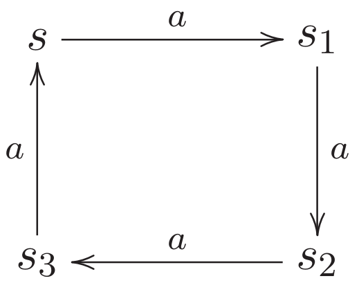

[home](./index.md)
-------------------

*author: niplav, created: 2021-10-14, modified: 2021-11-01, language: english, status: in progress, importance: 2, confidence: likely*

> __.__

Solutions to “Reactive Systems”
================================

Chapter 2
----------

### 2.1

> Give a CCS process which describes a clock that ticks at least once
and may stop ticking after each clock tick.

`$\text{Clock} \overset{\text{def}}{=} (\text{tick}.\mathbf{0}+\text{tick}.\text{Clock})$`

### 2.2

> Give a CCS process which describes a coffee machine that may behave
like that given by (2.1) but may also steal the money it receives and
fail at any time.

This exercise is not quite well-defined. Should it sometimes take the
money and offer nothing in return, but continue functioning, or should
it actually fail sometimes and break down? The former case would be
described by

`$\text{CTM} \overset{\text{def}}{=} \text{coin}.(\text{CTM}+\overline{\text{coffee}}.\text{CTM}+\overline{\text{tea}}.\text{CTM})$`,

the latter by

`$\text{CTM} \overset{\text{def}}{=} \text{coin}.(\text{CTM}+\mathbf{0}+\overline{\text{coffee}}.\text{CTM}+\overline{\text{tea}}.\text{CTM})$`

Hey look! `$+$` is commutative here!

### 2.3

> A finite process graph `$T$` is a quadruple `$(\mathcal{Q}, A, \delta, q_0)$`, where  
• `$\mathcal{Q}$` is a finite set of states,  
• `$A$` is a finite set of labels,  
• `$q_0 \in \mathcal{Q}$` is the start state, and  
• `$\delta: \mathcal{Q} \times A \rightarrow 2^{\mathcal{Q}}$` is the transition function.  

> Using the operators introduced so far, give a CCS process that describes `$T$`.

	$$ T=q_0.\underset{a_1 \in A}{\mathbf{+}} (a_1. \underset{q_1 \in δ(q_0, a_1)}{\mathbf{+}} (q_1.\underset{a_2 \in A}{\mathbf{+}} (a_2. \underset{q_2 \in δ(q_1, a_2)}{\mathbf{+}} (q_2. \cdots))))$$

where `$\mathbf{+}$` is _supposed_ to be a big iterative operator like
`$\sum$`, if only I could get MathJax to accept `\scalerel`. The equation
is nested infinitely deep at most places that result in a loop that
doesn't include `$q_0$`, and in some places end with `$.T$`, if `$q_0
\in δ(q_n,a)$`.

### 2.4

> Consider the following LTS:

> Define the LTS as a triple
`$(\text{Proc}, \text{Act}, \{\overset{α}{\rightarrow}|α \in \text{Act}\})$`.
Use sketches to illustrate the reflexive closure, symmetric closure and
transitive closure of the binary relation `$\overset{α}{\rightarrow}$`?

The process, in triple form, is
`$(\{s, s_1, s_2, s_3\}, \{a\}, \overset{a}{\rightarrow}=\{(s, s_1), (s_1, s_2), (s_2, s_3), (s_3, s)\})$`.

I'm not sure about the sketch part, but I can try to describe the
different closures.

The reflexive closure of `$\overset{a}{\rightarrow}$` would additionally
contain the elements
`$\{(s,s), (s_1, s_1), (s_2, s_2), (s_3, s_3)\}$`.

The symmetric closure is similarly easy to generate: it additionally
contains the elements `$\{(s_1, s), (s_2, s_1), (s_3, s_2), (s, s_3)\}$`.

The transitive closure additionally contains the elements from the set
`$\{(s, s_2), (s, s_3), (s_1, s_3), (s_1, s), (s_2, s), (s_2, s_1), (s_3, s_1), (s_3, s_2)\}$`.

### 2.5

The set of reachable states includes all states: `$p, p_1$` and `$p_2$`.

### 2.6

* `$a.b.A+B$` ✓
* `$(a.\mathbf{0}.\overline{a}.A)\backslash \{a,b\}$` ✓
* `$(a.\mathbf{0}|\overline{a}.A)\backslash \{a,τ\}$` ✗: `$τ$` can't be excluded
* `$a.B+[a/b]$` ✗: a renaming is not a process
* `$τ.τ.B+\mathbf{0}$` ✓
* `$(a.B+b.B)[a/b, b/a]$` ✓
* `$(a.B+τ.B)[a/τ, b/a]$` ✓
* `$(a.b.A+\overline{a}.\mathbf{0})|B$` ✓
* `$(a.b.A+\overline{a}.\mathbf{0}).B$` ✗: the object in the parentheses is not a label, but a process
* `$(a.b.A+\overline{a}.\mathbf{0})+B$` ✓
* `$(\mathbf{0}|\mathbf{0})+\mathbf{0}$` ✓

### 2.7

> Use the rules of SOS semantics for CCS to derive the LTS for the
process `$\text{SmUni}$` defined by (2.4). (Use the definition of CS in
Table 2.1.)

As a refresher:

* `$\text{SmUni}\overset{\text{def}}{=}(\text{CM}|\text{CS})\backslash \text{coin} \backslash \text{coffee}$`
* `$\text{CM}\overset{\text{def}}{=}\text{coin}.\overline{\text{coffee}}.\text{CM}$`
* `$\text{CS}\overset{\text{def}}{=}\overline{\text{pub}}.\overline{\text{coin}}.\text{coffee}.\text{CS}$`
