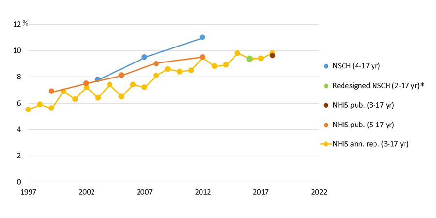

[home](./index.md)
------------------

*author: niplav, created: 2023-01-17, modified: 2023-04-09, language: english, status: notes, importance: 7, confidence: possible*

> __I investigate whether the attention span of individual humans has
been falling over the last two decades (prompted by curiosity about
whether the introduction of the internet may be harmful to cognitive
performance). I find little direct work on the topic, despite its wide
appeal. Reviewing related research indicates that individual attention
spans might indeed have been declining70%.__

Have Attention Spans Been Declining?
=====================================

In what might be just the age-old regular
[ephebiphobia](https://en.wikipedia.org/wiki/Ephebiphobia),
claims have been raised that individual attention spans [have been
declining](#Appendix_A_Claims_That_Attention_Spans_Have_Been_Declining)—not
just among adolescents, but among the general population. If so, this
would be quite worrying: Much of the economy in industrialized societies
is compromised of knowledge work, and knowledge work depends on attention
to the task at hand: switching between tasks too often might prevent
progress on complicated and difficult problems.

I became interested in the topic after
[seeing](https://edition.cnn.com/2023/01/11/health/short-attention-span-wellness/index.html)
[several](https://eu.usatoday.com/story/life/health-wellness/2021/12/22/covid-attention-span-exhaustion/8926439002/)
[claims](https://twitter.com/amix011/status/1603927882459672576) that
e.g. [Generation Z](https://en.wikipedia.org/wiki/Generation_Z) allegedly
has lower attention spans, observing myself and how I struggled to get
any work done when connected to the internet, and hearing reports from
others online and in person having the same problem.<!--I was finally
convinced to actually investigate™ the topic after making [a comment on
LessWrong](https://www.lesswrong.com/posts/Bfq6ncLfYdtCb6sat/i-converted-book-i-of-the-sequences-into-a-zoomer-readable?commentId=7SDEJibu5hedqqNmo)
asking the question and receiving a surprisingly large amount of
upvotes.-->

The exact question being asked is:

__"Have the attention spans of individuals on neutral tasks (that is,
tasks that are not specifically intended to be stimulating) declined
from 2000 to the present?"__

(One might also formulate it as "Is there an equivalent of the “[Reversed
Flynn Effect](https://en.wikipedia.org/wiki/Flynn_Effect#Possible_end_of_progression)”
for attention span?") I am not particularly wedded to the specific
timeframe, though the worries mentioned above assert that this has
become most stark during the last decade or so, attributing the change
to widespread social media/smartphone/internet usage. Data from before
2000 or just the [aughts](https://en.wikipedia.org/wiki/Aughts)
would be less interesting. The near-global [COVID-19
lockdows](https://en.wikipedia.org/wiki/COVID-19_lockdowns)
could provide an especially enlightening [natural
experiment](https://en.wikipedia.org/wiki/Natural_experiment): Did
social media usage increase (my guess: yes90%), and if so, did
attention spans decrease at the same time (or with a lag) (my guess:
also yes75%), but I don't think anyone has the data on that *and*
wants to share it.

Ideally want to have experiments from ~2000 up to 2019: close enough to
the present to see whether there is a downward trend (a bit
more than a decade after the introduction of the [iPhone in
2007](https://en.wikipedia.org/wiki/iPhone_\(1st_generation\))),
but before the [COVID-19
pandemic](https://en.wikipedia.org/wiki/COVID-19_pandemic) which might
be a huge confounder, or just have accelerated existing trends (which
we can probably check in another 2 years).

I am mostly interested in the attention
span of individual humans and not groups: [Lorenz-Spreen et al.
2019](./doc/psychology/attention_span/accelerating_dynamics_of_collective_attention_lorenz-spreen_et_al_2019.pdf
"Accelerating dynamics of collective attention") investigate the
development of a construct they call "collective attention" (and indeed
find a decline), but that seems less economically relevant than individual
attention span. I am also far less interested in self-perception of
attention span, give me data from a proper [power-](http://www.careergym.com/psychometric_glossary/power_test) or [speed-test](http://www.careergym.com/psychometric_glossary/speed_test), cowards!

So the question I am asking is not any of the following:

* "Does more social media/internet usage cause decreased attention spans?"
* "Does more social media/internet usage correlate with decreased attention spans?"
* "Does more social media/internet usage correlate with people reporting having shorter attention spans?"
* "Did collective attention spans decrease?"
* "Are people on average spending less time on webpages than they used to?"

How Is Attention Span Defined?
-------------------------------

[Attention](https://en.wikipedia.org/wiki/Attention) is generally
divided into three distinct categories: **sustained attention**,
which is the consistent focus on a specific task or piece of
information over time (Wikipedia states that the span for sustained
attention has a [leprechaun](https://www.gwern.net/Leprechauns)
figure of 10 minutes floating around, elaborated on in [Wilson &
Korn 2007](./doc/psychology/attention_span/attention_during_lectures_beyond_ten_minutes_wilson_korn_2007.pdf)); **selective attention**, which is
the ability to resist distractions while focusing on important
information while performing on a task (the thing trained during
[mindfulness meditation](https://en.wikipedia.org/wiki/Mindfulness));
and **alternating** or **divided attention**, also known as the ability to
[multitask](https://en.wikipedia.org/wiki/Human_multitasking).

<!--Alternative partitioning in *arousal*, *capacity* and *selectity*. See
Plude et al., 1994 p. 4-->

When asking the question "have attention spans been declining",
we'd ideally want the same test measuring all those three aspects of
attention (and not just asking people about their [perception via
surveys](https://guzey.com/statistics/dont-believe-self-reported-data/ "Don't believe self-reported data (Alexey Guzey, 2020)")),
performed anually on large random samples of humans over decades,
ideally with additional information such as age, sex, intelligence (or
alternatively educational attainment), occupation etc. I'm personally
most interested in the development of sustained attention, and less so
in the development of selective attention. But I have not been able to
find such research, and in fact there is apparently no agreed upon test
for measuring attention span in the first place:

> She studies attention in drivers and witnesses to crime and says the
idea of an "average attention span" is pretty meaningless. "It's very
much task-dependent. How much attention we apply to a task will vary
depending on what the task demand is."

*— Simon Maybin quoting Dr. Gemma Briggs, [“Busting the attention span myth”](https://www.bbc.com/news/health-38896790), 2017*

So, [similar to
comas](https://slatestarcodex.com/2014/08/11/does-the-glasgow-coma-scale-exist-do-comas/),
attention span doesn't exist…sure, [super-proton things come in
varieties](https://unremediatedgender.space/2019/Dec/on-the-argumentative-form-super-proton-things-tend-to-come-in-varieties/index.html "On the Argumentative Form "Super-Proton Things Tend to Come In Varieties"),
but **_which varieties_**?? And how??? Goddamn,
psychologists, do your job and don't just
[worship](https://www.lesswrong.com/rationality/explain-worship-ignore "Explain/Worship/Ignore?")
complexity.

Perhaps I should soften my tone, as this perspective appears elsewhere:

> […] Gould suggests the metaphor of a dense bush whose branches
are periodically pruned by nature. This allows for paallel evolutionary
sequences, some of which are adaptive and others not — at any moment in
time only the tips of adaptive branches are in evidence, the pruned ones
cannot be seen. Thus rather than being direct descendants of primitive
hominids, for example, huankind would have evolved along a separate but
parallel line from other primates.  
> Might the ontogeny of selective attention recapitulate this theme? That
is, rather than selective attention comprising a single construct
with a fixed ontogenic plan, might it be better conceptualized as
a multidimensional construct with separat, parallel developmental
trajectories for different components. To carry the analogy still
further, might the specific developmental progression for a particular
component of selective attention be determined by the adaptive fit of that
component with the individual's ‘environmental press’? Although such
a conjecture rekindles the tened of *ontogeny recapitulates phylogney*
long since abandoned in physiological development (e.g., Dixon and Lerner,
1985), we suggest that it may nonetheless provide an overarching framework
within which to cast life-span research and theory on the development
of selective attention.

*— Plude et al., [“The development of selective attention: A life-span overview”](./doc/psychology/attention_span/the_development_of_selective_attention_plude_et_al_1994.pdf) p. 31, 1994*

How Do We Measure Attention Span?
----------------------------------

One of my hopes was that there is a canonical and well-established (and
therefore, ah, *tested*) test for attention span (or just attention)
à la the IQ test for *g*: If so, I would be able to laboriously go
through the literature on attention, extract the individual measurements
(and maybe even acquire some datasets) and perform a meta-analysis.

### Continuous Performance Tests

For measuring sustained and selective attention,
I found the family of [continuous performance
tests](https://en.wikipedia.org/wiki/Continuous_performance_task),
including the Visual and Auditory CPT (IVA-2), the [Test of Variables of
Attention](https://en.wikipedia.org/wiki/Test_of_variables_of_Attention)
(T.O.V.A.), Conners' CPT-III, the
gradCPT and the QbTest, some of which are described
[here](https://en.wikipedia.org/wiki/Continuous_performance_task#Test_administration)<!--TODO:
links for all of these-->. These tests usually contain two parts: a part
with low stimulation and rare changes of stimuli, which tests for lack
of attention, and a part with high stimulation and numerous changes of
stimuli, which tests for impulsivity/self control.

Those tests [usually report four different scores](https://en.wikipedia.org/wik/Continuous_performance_task#Test_scoring):

> 1. __Correct detection:__ This indicates the number of times the client
responded to the target stimulus. Higher rates of correct detections
indicate better attentional capacity.
2. __[Reaction times](https://en.wikipedia.org/wiki/Reaction_time):__
This measures the amount of time between the presentation of the stimulus
and the client's response.
3. __Omission errors:__ This indicates the number of times the target
was presented, but the client did not respond/click the mouse. High
omission rates indicate that the subject is either not paying attention
(distractibility) to stimuli or has a sluggish response.
4. __Commission errors:__ This score indicates the number of times the
client responded but no target was presented. A fast reaction time and
high commission error rate points to difficulties with impulsivity. A
slow reaction time with high commission and omission errors, indicates
inattention in general.

I'm currently unsure about two crucial points:

* How much does any CPT measure the concept we naively call attention span? The papers I've read don't refer to attention span per se, but a general capability of sustained and selective attention.
* Are there any time-series analyses or longitudinal studies using a CPT, or alternatively meta-analyses using data collected from existing studies? I have not been able to find any.

### Other Heterogenous Metrics

I also attempted to find a survey or review paper on attention span,
but was unsuccessful in my quest, so I fell back to collecting metrics
for attention span from different papers:

* [Gausby 2015](./doc/psychology/attention_span/attention_spans_gausby_et_al_2015.pdf)
	* Three online tests (probably devised by the authors (?), since no source is given) (n≈2000 Canadians). Very little information about the exact nature of the tests.
		* Sustained attention span: "Counting the number of times responds correctly identified an X occurring after an A."
		* Selective attention span: "Counting the number of times respondents correctly identified a change in the orientation of the rectangles"
		* Alternating attention span: "Calculating the difference in the time lapsed to perform a series of consecutive number or letter classification, compared to a mixture of number and letter classifications."
	* Neurological research: The same games/tests as above with the participants being measured with an [EEG](https://en.wikipedia.org/wiki/Electroencephalography) ("Results were reported as ACE (Attention, Connectivity, Encoding) scores, as well as the number of attention bursts") (n=112 Canadians)
* [Carstens et al. 2018](./doc/psychology/attention_span/social_media_impact_on_attention_span_carstens_et_al_2018.pdf) (n=209 American respondents to a survey)
	* Questionnaire developed by the authors based on Conners 2004<!--TODO: link--> (reliability: α=0.786)
* [Wilson & Korn 2007](./doc/psychology/attention_span/attention_during_lectures_beyond_ten_minutes_wilson_korn_2007.pdf) report several different measures of attention span during lectures: the amount of notes taken over time<!--TODO: McKeachie (1986, 1999)-->, observation of the students by an author of one study<!--TODO: Lloyd 1968--> or two independent observers in another study<!--TODO: Johnstone and Percival (1976)-->, retention of material after the lecture<!--TODO: McLeish 1986-->, self-report in 5-minute intervals during the lecture<!--TODO: Stuard & Rutherford 1978-->, and heart rate<!--TODO: Bligh 2000-->. They also note that "Researchers use behaviors such as fidgeting, doodling, yawning, and looking around as indicators of inattentiveness (e.g., Frost, 1965; Johnstone & Percival, 1976)."
* [Plude et al. 1994](./doc/psychology/attention_span/the_development_of_selective_attention_plude_et_al_1994.pdf) review how selective attention develops during a human life. For measuring attention, they mainly focus on studies using reaction time as a metric—the speed at which an action occurs as a result of a changing stimulus: eye movement patterns of infants, simple tests such as pressing a button on a changing (often visual) stimulus, the influence of irrelevant visual stimuli at the periphery on a task performed at the centre of the visual field, judging similarity of stimuli at various distances in the visual field<!--Enns and Girgus, 1985-->, responding to a target stimulus surrounded by interfering distractor stimuli, and determining whether a visual target item is present or absent<!--TODO: continue-->. They also mention skin conductance (measuring arousal)<!--TODO: continue-->.
	* They also mention studies investigating the time required for attentional switching in acoustic contexts: "Pearson and Lane (1991a) studied the time course of the attention-shifting process between lists and also found large age-related improvements between 8 and 11 years. Whereas 8-year-olds required more than 3.5 s to completely switch from monitoring one list to another, 11-year-olds and adults appeared to complete the switch in less than 2.5 seconds."
* [Muhammad 2020](https://www.digitalinformationworld.com/2020/02/report-shows-that-attention-spans-are-shortening.html)
	* Time spent on websites on average.
		* This is not an adequate metric, I believe: It would also decline if people would become better at prioritising on which websites are more worthy of their attention.
* [Lorenz-Spreen et al. 2019](./doc/psychology/attention_span/accelerating_dynamics_of_collective_attention_lorenz-spreen_et_al_2019.pdf "Accelerating dynamics of collective attention")
	* Time that specific pieces of information (hashtags/n-grams/Reddit submissions &c) were popular

<!--TODO: revise this-->

-------

As it stands, I think there's a decent chance60% that one or
several tests from the CPT family can be used as tests for attention
span without much of a problem.

I don't think a separate dedicated test for attention span
exists45%: The set of listed measures I found (apart from the CPT)
appears to be too heterogenous, idiosyncratic, mostly not quantitative
enough and measuring slightly different things to be robustly useful
for a meta-analysis.

What Are the Existing Investigations?
-------------------------------------

> A lack of long-term studies means we can't tell whether attention
spans have actually declined.

*—Bobby Duffy & Marion Thain, [“Do we have your attention”]()<!--TODO--> p. 5, 2022*

* [Gausby 2015](./doc/psychology/attention_span/attention_spans_gausby_et_al_2015.pdf)
	* Questions answered:
		* Sustained attention:
			* *Do younger people perform worse on the sustained attention span test?*, Yes (31% high sustained attention for group aged 18-34, 34% for group aged 35-54, and 35% group aged 55+) (the methodology is wholly unclear here, though: how do we determine the group that has "high sustained attention span"? Did they perform any statisitical tests? If yes, which?).
			* *Do people who report more technology usage (web browsing/multi-screen usage while online/social media usage/tech adoption) perform worse on the sustained attention span test?*, Yes. Light:medium:heavy usage for web browsing has 39%:33%:27% users with high sustained attention span, 36%:33%:27% for light:medium:heavy multi-screen usage, 36%:29%:23% for light:medium:heavy social media usage and 35%:31%:25% for light:medium:heavy tech adoption (though these numbers are basically not elaborated on).
		* Selective attention:
			* *Do younger people perform worse on the selective attention span test?* No (34% high selective attention for group aged 18-34, 30% for group aged 35-54, and 35% group aged 55+).
			* *Do people with high selective attention use fewer devices at the same time?* Yes (details p. 31).
		* Alternating attention:
			* *Do younger people perform worse on the alternating attention span test?* No (36% high selective attention for group aged 18-34, 28% for group aged 35-54, and 36% group aged 55+).
			* *Do people who report more technology usage (tech adoption/web browsing/multi-screen usage while online) perform worse on the alternating attention span test?* No, they seem to perform better: Light:medium:heavy tech adoption corresponds to 31%:39%:40% having high alternating attention spans, light:medium:heavy web browsing to 29%:34%:37% and multi-screening while online to 27%:32%:37%.
			* *Do people who use social media more have higher Attention/Connection/Encoding scores on EEG measurements?*, Not quite: "Moderate users of social media are better at multi-tasking than lower users. But, when crossing into the top quartile of social media usage, scores plummet."
	* This is a marketing statement wearing the skinsuit of a previously great paper, it would be awesome if they released their exact methodology (tests performed, data collected, exact calculations & code written). I can smell that they actually put effort into the research: Creating an actual test instead of just asking respondents about their attention spans, doing EEG measurements of over 100 people, for 3 different types of attention…come on! Just put out there what you did!
* [Carstens et al. 2018](./doc/psychology/attention_span/social_media_impact_on_attention_span_carstens_et_al_2018.pdf) (n=209 American respondents to a survey)
	* Questions answered:
		* *Is self-reported attention span related to the number of social media accounts?*, No, not statistically significant (F(2, 206)=0.1223, p>0.05) (via a one-way [ANOVA](https://en.wikipedia.org/wiki/ANOVA)
		* *Is self-reported attention span related to whether a respondent mainly uses a mobile phone or a computer?*, No, not statistically significant (P(2,713)=0.923, p>0.05) (via a one-way ANOVA)
	* I do **not** trust this paper: Calling (what I think is) Generation Z "Generation D" (without source for the term), being clearly written in Word, and confusing grammar (I *think* the authors are all Americans, so no excuse here):

> Users that are older such as late adolescents and emerging adults
average approximately 30-minutes daily for just Facebook that does not
calculate the time spent on all social media networks

*—Carstens et al., [“Social Media Impact on Attention Span”](./doc/psychology/attention_span/social_media_impact_on_attention_span_carstens_et_al_2018.pdf) p. 2, 2018*

> Bakardjieva and Gaden (2012) examined the field of social interaction
in general to the everyday chatter of unstructured and spontaneous
interactions among individuals to highly structured and regulated
interaction consisting of the military or the stock exchange.

*—Carstens et al., [“Social Media Impact on Attention Span”](./doc/psychology/attention_span/social_media_impact_on_attention_span_carstens_et_al_2018.pdf) p. 3, 2018*

* [Muhammad 2020](https://www.digitalinformationworld.com/2020/02/report-shows-that-attention-spans-are-shortening.html)
	* Question answered: *How much time do people spend on a website, on average?*, "if you look at the trend for mobile browsing between the years 2017 and 2019 you would see that there is a drop of about 11 seconds in the average time spent on a website." and "The data suggests that the average amount of time spent on websites before navigating away for all devices has gone down by 49 seconds which is a pretty huge reduction all things considered."
	* The data is from the right timeframe (up to but not including 2020), but the linked [SimilarWeb report](https://www.similarweb.com/corp/reports/2020-digital-trends-lp/) is behind a paywall, so I can't confirm the numbers<!--TODO: get hold of the report-->. Furthermore, the time spent on websites is a weak proxy: Perhaps people simply have become better at prioritising information sources.
* [Lorenz-Spreen et al. 2019](./doc/psychology/attention_span/accelerating_dynamics_of_collective_attention_lorenz-spreen_et_al_2019.pdf "Accelerating dynamics of collective attention")
	* Questions answered:
		* *How long does any particular hashtag stay in the group of the top 50 most used hashtags? Specifically, how has that number developed from 2013 to 2016?*, "in 2013 a hashtag stayed within the top 50 for 17.5 hours on average, a number which gradually decreases to 11.9 hours in 2016", and "The average maximum popularity `$\langle L(t_{\hbox{peak}}) \rangle$` on one day `$t_{\hbox{peak}}$` stays relatively constant, while the average gradients `$\langle ΔL \rangle$` in positive and negative direction become steeper over the years."
		* *Do things become more popular faster over time? That is, when e.g. a movie is gaining popularity, did it take longer to become popular in 1985 than it did in 2018?*, Broadly yes (the trends holds for popularity of hashtags in tweets (2013-2016)/[n-grams](https://en.wikipedia.org/wiki/n-gram) in books (1900-2004)/number of theaters that movies were screened in (1985-2018)/topics for search queries on Google (2010-2017)/Reddit comments on posts (2010-2015)/citations of publications (1990-2015)/daily traffic for Wikipedia articles (2012-2017)). Again the length of the time at the peak mostly didn't change (except in the case of Wikipedia articles, where the time at the peak *shrunk*)
	* While it investigates a question different from the one I have, this paper seems good and trustworthy to me, while supporting a suspicion I've had (observing that the lifecycle of e.g. memes has apparently sped up significantly). I'd be interested in seeing whether the same process holds for internet communities I'm part of (for example on votes [LessWrong](https://www.lesswrong.com/) and the [EA Forum](https://forum.effectivealtruism.org/) or forecasts on [Metaculus](https://www.metaculus.com/)).

 which form a peak in the middle and fall off at the sides. The yellow line is highest around the peak, the green one is lower, blue even lower and purple the lowest.")

Do People Believe Attention Spans Have Declined?
-------------------------------------------------

> Half of the public feel their attention span is shorter than it used
to be, compared with around a quarter (23%) who believe they are just
attentive [sic] as they've always been.
>
> Again, the feeling of is not just reported by the young — it's
also the dominant feeling among the middle aged too, with 56% of 35-
to 54-year-olds thinking their attention spans have worsened.

*—Bobby Duffy & Marion Thain, [“Do we have your attention”](./doc/psychology/attention_span/do_we_have_your_attention_duffy_thain_2022.pdf) p. 6, 2022*

> Even more widespread is the belief that young people's attention spans
in particular are worse than they were in the past—two-thirds of people
think this is the case (66%).
>
> Perhaps unsurprisingly, this belief is most common among the oldest
age group surveyed, of those aged 55 or over — however, young people
themselves also feel this way, with a majority of 18- 34-year-olds
holdngi this view.

*—Bobby Duffy & Marion Thain, [“Do we have your attention”](./doc/psychology/attention_span/do_we_have_your_attention_duffy_thain_2022.pdf) p. 7, 2022*

Note that [selectiev attention mostly improves with
age](./doc/psychology/attention_span/the_development_of_selective_attention_plude_et_al_1994.pdf),
so the older age-groups might be comparing themselves now to the younger
age groups now (as opposed to remembering back at their own attention
spans).

> The absence of long-term research means it remains unknown whether
technology has caused a deterioration in the country's ability to
concentrate — but comparisons with survey data from previous decades
indicate that, on some measures the public feel more pressured than they
did in the past.

*—Bobby Duffy & Marion Thain, [“Do we have your attention”](./doc/psychology/attention_span/do_we_have_your_attention_duffy_thain_2022.pdf) p. 18, 2022*

In response to the questions (n=2093 UK adults aged 18+ in 2021):

* "To what extent do you agree or disagree with the following statement? __The pace of life is too much for me these days__" (1983: 30% agree, 2021: 41% agree)
* "To what extent do you agree or disagree with the following statement? __I wish I could slow down the pace of my life__" (1997: 47% agree, 1999: 51% agree, 2008: 45% agree, 2021: 54% agree)

What About Rates of ADHD?
--------------------------

[Data from the CDC](https://www.cdc.gov/ncbddd/adhd/timeline.html) shows
a clear increase in the percentage of children with a parent-reported
ADHD diagnosis:

<!--TODO: label-->

There has been a similar increase in the diagnosis of [ADHD among
adults](https://www.psychologytoday.com/us/blog/balanced/202302/why-is-the-prevalence-of-adhd-increasing),
"from 0.43 to 0.96 percent" between 2007 and 2016.

However, this does not necessarily mean that the *rate* of ADHD has
increased, if e.g. awareness of ADHD has increased and therefore
leads to more diagnoses<!--TODO: find the number of tests for ADHD or
something?-->.

What Could A Study Look Like?
-------------------------------

Compared to other feats that psychology is accomplishing,
finding out whether individual attention spans are declining
appears to be of medium difficulty, so I'll try to outline how
this could be accomplished in three different ways:

1. Develop a good instrument for measuring attention
span (optionally just use a [continuous performance
test](https://en.wikipedia.org/wiki/Continuous_performance_task)).
Once one has a suitable instrument for measuring attention
span, one can every year (or every second year) for a couple
of years pick a random sample from the population (not of
the same set of people, though, since attention span [increases with
age](./doc/psychology/attention_span/the_development_of_selective_attention_plude_et_al_1994.pdf)),
e.g. via the internet if the test can be done
online. One could then apply a [linear trend
estimation](https://en.wikipedia.org/wiki/Linear_trend_estimation) or a
fancier statistical technique I don't know to find out whether attention
spans have declined between the measurements.
	1. This could be done relatively cheaply: Let's say we collect 50 datapoints a year, from Mechanical Turk workers at \$10/hr. A conservative estimate is that the test takes ~30 minutes to complete, so for three years the cost of the data would be `$50 \cdot 3 \cdot 10 \frac{\$}{\text{h}} \cdot 0.5\text{h}=\$750$`. It looks like there are open-source implementations of the test available<!--TODO: links-->, so the additional cost is for the researcher setting up the test and recruiting the participants, which could take ~30 hours, and another ~30 hours for analysing the data. So the total cost of the experiment would be, at an hourly wage of \$15 for the researcher (come on, we can let a grad student do it), `$\$750+60 \text{hr} \cdot 15 \frac{\$}{\text{hr}}=\$1650$`. Fudging upwards by taking the [planning fallacy](https://en.wikipedia.org/wik/Planning_fallacy) into account gives \$2k for the experiment.
2. Find someone who has been collecting data on attention span, ask them
for it nicely, and analyse that data.
3. Use the [control groups](https://en.wikipedia.org/wiki/Control_group)
from studies testing the effect of
interventions on attention as data and then perform a
[meta-analysis](https://en.wikipedia.org/wiki/Meta-analysis). A lot of
studies use some variant of the CPT, I started collecting such studies
[here](./spans.html#Appendix_B_Studies_for_a_MetaAnalysis).

Conclusion
-----------

Given the amount of interest the question about shrinking attention spans
has received, I was surprised to not find a knockdown study of the type
I was looking for, and instead many different investigations that were
either not *quite* answering the question I was asking or too shoddy
(or murky) to be trusted. I seems likely to me that individual attention
spans have declined (I'd give it ~70%), but I wouldn't be surprised if
the decline was relatively small, noisy & dependent on specific tests.

So—why hasn't anyone investigated this question to satisfaction
yet? After all, it doesn't seem to me to be extremely difficult to do
(compared to [other](https://en.wikipedia.org/wiki/Large_Hadron_Collider)
[things](https://en.wikipedia.org/wiki/Smallpox#Eradication)
[science](https://en.wikipedia.org/wiki/Apollo_11)
[has](https://en.wikipedia.org/wiki/Dolly_\(sheep\))
[accomplished](https://en.wikipedia.org/wiki/AlphaFold)),
there is pretty clearly a lot of media attention on
the question (so much so that [a likely incorrect number
proliferates](https://www.bbc.com/news/health-38896790) far & wide),
it appears economically and strategically relevant to me (especially
sustained attention is *probably* an important factor in knowledge work,
I'd guess?) and it slots more or less into cognitive psychology.

I'm not sure why this hasn't happened yet (and consider
this text evidence for a partial violation of [Cowen's 2nd
law](https://marginalrevolution.com/marginalrevolution/2015/04/tyler-cowens-three-laws.html)).
The reasons I can think of is that one would need to first develop a
good test for determining attention span, which is some work in itself
(or use the CPT); be relatively patient (since the test would need to
be re-run at least twice with a >1 year pause, for which the best grant
structure might not exist); there are many partial investigations into
the topic, making it appear like it's solved; and perhaps there just
aren't enough cognitive psychologists around to investigate all the
interesting questions that come up.

So I want to end with a call to action: If you have the capacity
to study this problem, there is room for improvement in the existing
literature! Attention spans could be important, it's probably not hard to
measure them, and many people claim that they're declining, but are way
too confident about it given the state of the evidence. False numbers are
widely circulated, meaning that correct numbers might be cited even more
widely. And it's [probably](./spans.html#What_Could_A_Study_Look_Like)
not even (that) hard!

Consider your incentives :-).

<!--
* `https://web.archive.org/web/20100601192507/http://blogs.suntimes.com/ebert/2010/05/the_french_word_frisson_descri.html`
* `https://www.wired.com/2010/05/ff-nicholas-carr/`
* `https://www.wired.com/beyond-the-beyond/2016/08/nicholas-carr-world-wide-cage/`
* `https://web.archive.org/web/20100601192507/http://blogs.suntimes.com/ebert/2010/05/the_french_word_frisson_descri.html`
* `https://www.digitalinformationworld.com/2020/02/report-shows-that-attention-spans-are-shortening.html`
* `https://www.euruni.edu/blog/the-truth-about-decreasing-attention-spans-in-university-students/`
* `https://www.dtu.dk/english/news/all-news/nyhed?id=246BBED3-8683-4012-A294-20DB7F0015F4`
* `https://www.brainbalancecenters.com/blog/normal-attention-span-expectations-by-age`
* `https://www.dtu.dk/english/news/all-news/nyhed?id=246BBED3-8683-4012-A294-20DB7F0015F4`
* `https://lsf.org/grammar/are-attention-spans-getting-shorter/`
* `https://statenews.com/article/2022/01/having-the-attention-span-of-a-goldfish-may-no-longer-be-the-the-joke-you-think-it-is?ct=content_open&cv=cbox_latest`
* `https://www.kcl.ac.uk/news/are-attention-spans-really-collapsing-data-shows-uk-public-are-worried-but-also-see-benefits-from-technology`
* `https://www.brainbalancecenters.com/blog/normal-attention-span-expectations-by-age`
* Test of Variables of Attention on Wikipedia
-->

Appendix A: Claims That Attention Spans Have Been Declining
------------------------------------------------------------

Most of these are either unsourced or cite [Gausby
2015](./doc/psychology/attention_span/attention_spans_gausby_et_al_2015.pdf "Attention spans")
[fallaciously](https://www.bbc.com/news/health-38896790) (which [Bradbury
2016](./doc/psychology/attention_span/attention_span_during_lectures_8_seconds_10_minutes_or_more_bradbury_2016.pdf "Attention span during lectures: 8 seconds, 10 minutes, or more?")
conjectures to be the number of seconds spent on websites on average).

> Today, individuals are constantly on an information overload from
both the quantity of information available and the speed of which
information gets into the hands of individuals through advertising and
multimedia. Attention deficits tend to be increasing as it is challenging
to attract individuals and hold their attention long enough for people
to read or watch messages such as work memos, advertisements, etc.

*—Carstens et al., [“Social Media Impact on Attention Span”](./doc/psychology/attention_span/social_media_impact_on_attention_span_carstens_et_al_2018.pdf) p. 2, 2018*

> Big data plays an important role in the development of microlearning. In
the age of big data, human’s attention span is decreasing. As per Hebert
(1971), “what information consumes is rather obvious: it consumes the
attention of its recipients. Hence a wealth of information creates a
poverty of attention and a need to allocate that attention efficiently
among the overabundance of information sources that might consume it”
(p. 41). An example of short attention span in the age of big data can
be found in the music industry, as per (Gauvin, 2017), the average time
that passed before the audience would hear the vocals on any radio song
was 23 s, today the average intro is just 5 s long. Wertz (2017) also
suggested that 40% of users are likely to abandon a website if it does
not load within three seconds or less. Furthermore, a survey (Gausby,
2015) conducted by Microsoft indicated that the average attention span
of a human dropped from 12 to eight seconds, which means shorter than
a goldfish. Given the average human attention span is decreasing,
microlearning becomes more and more important because it emphasises
short learning duration.

*—Leong et al., “A review of the trend of microlearning”<!--TODO: perhaps link--> p. 2, 2020*

>  Unfortunately, all too many of us are having “squirrel”
days, according to Dr. Gloria Mark, a professor of
informatics at the University of California, Irvine, who
studies how digital media impacts our lives. In her new book,
[“Attention Span: A Groundbreaking Way to Restore Balance, Happiness and
Productivity,”](https://www.amazon.com/Attention-Span-Finding-Fighting-Distraction/dp/1335449418)
Mark explained how decades of research has tracked the decline of the
ability to focus.
>
> “In 2004, we measured the average attention on a screen to be 2½
minutes,” Mark said. “Some years later, we found attention spans to
be about 75 seconds. Now we find people can only pay attention to one
screen for an average of 47 seconds.”
>
> Not only do people concentrate for less than a minute on any one screen,
Mark said, but when attention is diverted from an active work project,
it also takes about 25 minutes to refocus on that task.

*—Sandee LaMotte, [“Your attention span is shrinking, studies say. Here's how to stay focused”](https://edition.cnn.com/2023/01/11/health/short-attention-span-wellness/index.html), 2023*

> Tech-savvy users often say that the way the modern internet
works has made it so that people’s attention spans are
getting shorter every single day but the truth behind this
story is rather tough to ascertain. However, recent data from
[SimilarWeb](https://www.similarweb.com/corp/reports/2020-digital-trends-lp/)
indicates that people definitely are suffering from shorter attention
spans, and what’s more is that these attention spans are shortening at a
pretty rapid pace when you take into account the numerous factors that are
coming into play, all of which serve some kind of purpose in this trend.
>
> If you look at the data for how long users spend on websites before
navigating away, for the most part the trend has been that these times
are remaining more or less stable on web based browsing, but if you
look at the trend for mobile browsing between the years 2017 and 2019
you would see that there is a drop of about 11 seconds in the average
time spent on a website. When you take into account the fact that mobile
browsing is starting to become a lot more popular and in many ways has
become the preferred form of browsing for people on the internet, the
change is a lot more drastic.

*—Zia Muhammad, [“Research Indicates That Attention Spans Are Shortening”](https://www.digitalinformationworld.com/2020/02/report-shows-that-attention-spans-are-shortening.html), 2020*

> However, as much as technology can be used as an effective learning
tool inside and outside the classroom, there’s no denying that one of
the biggest challenges faced by educators today is the distraction posed
by social media. __Students are distracted by their phones during class,
and even without that distraction, the time they spend on social media
outside the classroom has an impact on their attention spans__.

*—EU Business School, [“The Truth about Decreasing Attention Spans in University Students”](https://www.euruni.edu/blog/the-truth-about-decreasing-attention-spans-in-university-students/), 2022*

(No link given.)

> In 2015, a study commissioned by Microsoft and discussed in Time
magazine found that the average attention span was in fact only 8 s. If
indeed this is the case, then even participating in a 15-min lecture would
be positively heroic. To place this in perspective, it was reported in
the same Time article, that goldfish, of the piscine rather than snack
variety, have an attention span of 9 s, one whole second greater than
humans! It is perhaps rather premature to opt for an 8-s lecture format,
as there are many caveats to the Time article, not the least of which
is that no one knows how to actually measure a goldfish’s attention
span. What has been measured is goldfish memory, which, according to
researchers in the School of Psychology at the University of Plymouth,
is actually quite good (7). Similarly the 8-s attention span for humans
actually reflects the average time a person will spend on a web page
before looking somewhere else.

*—Neil A. Bradbury, [“Attention span during lectures: 8 seconds, 10 minutes, or more?”](./doc/psychology/attention_span/attention_span_during_lectures_8_seconds_10_minutes_or_more_bradbury_2016.pdf), 2016*

Appendix B: Studies for a Meta-Analysis
----------------------------------------

I'll list the closest thing those studies have to a control group,
list sorted by year.

* What Determines Continuous Performance Task Performance? (Maria J. O. van Asma/René P. Rombouts/Robert J. van den Bosch, 1996): Patient controls n=19 (mean age 29.5±8.1 years), normal controls n=20 (mean age 32.2±8.3 years). Tested with an unspecified digit related *CPT*.
* Performance of the Continuous Performance Test Among Community Samples (Chuhsing K. Hsiao/Hai-Gwo Hwu/Li-Ling Hsiao/Wei J. Chen, 1998): n=115 students (aged 14±0.8 years) and n=345 adults (aged 41.3±13 years), randomly selected, from the [Jinshan District](https://en.wikipedia.org/wiki/Jinshan_District,_New_Taipei). Tested using the *CPT 1-9*, both degraded and undegraded.
* Decreased frontal activation in schizophrenics during stimulation with the Continuous Performance Test — a functional magnetic resonance imaging study (H.-P. Volz/C. Gaser/F. Häger/R. Rzanny/J. Pönisch/H.-J. Mentzel/W.A. Kaiser/H. Sauer, 1999): n=20 German volunteers (28.2±5.7 years), tested using the *CPT-double-T-version*.
* Continuous Performance Test Performance in a Normative Epidemiological Sample (C. Keith Conners/Jeffery N. Epstein/Adrian Angold/John Klaric, 2002): n=816 children from North Carolina (9-17 years), tested using *Conners' CPT*.
* Relations Between Continuous Performance Test Performance Measures and ADHD Behaviors (Jeffery N. Epstein/Alaatin Erkanli/C. Keith Conners/John Klaric/Jane E. Costello/Adrian Angold, 2003): Epidemiological sample n=817 North Carolina children. Administered the Conners' CPT.<!--TODO: more info about paper in Conners, C.K., Epstein, J.N., Angold, A. & Klaric, J. (2003). Continuous Performance Test Performance in a Normative Epidemiological Sample. Journal of Abnormal Child Psychology, 31, 557-564.-->
* Longitudinal change of ERP during cued continuous performance test in child with attention-deficit/hyperactivity disorder (Hisaki Ozaki/Hisao Maekawa/Satoshi Futakami/Shinji Okazaki, 2004): n=1 (yes, really), male child with ADHD, measurements at 9.6/10.6/11.6 years old with and without medication, tested using the *CPT-AX*.
* Segmenting the stream of consciousness: The psychological correlates of temporal structures in the time series data of a continuous performance task (Jonathan Smallwood/Merrill McSpadden/Bryan Luus/Jonathan Schooler, 2007): n=23 Canadian undergraduate students (aged 19-22). Tested using an unspecified *CPT* with the task of recognising specific digits as target stimuli. Probably not useful.
* Cognitive control in media multitaskers (Anthony D. Wagner/Clifford Nass/Eyal Ophir, 2009): n=28 (?), tested with the *CPT-AX*.
* Measuring Several Aspects of Attention in One Test (Iwona Kovalik-Gran/Jens Egeland, 2010): n=376 Norwegian patients, aged 14-77 (mean 32.9 years, standard deviation 13.8), either referred to Egeland or to the Vestfold Mental Health Care Trust, with various psychological disorders (57 without such disorders). Tested using *Conners' CPT*. Scores for normal group not reported independently.
* Association between urine cotinine levels, continuous performance test variables, and attention deficit hyperactivity disorder and learning disability symptoms in school-aged children (B.-N. Kim/E.-J. Park/H.-J.Yoo/I.-H. Cho/J.-H. Lee/J. Hur/J.-W. Kim/M.-H. Park/M.-S. Shin/S.-B. Hong/S.-C. Cho/S.-K. Han/S. Park/S.-Y. Bhang/Y.-C. Hong, 2012): n=989 Korean children (mean age 9.1±0.7 years), tested with an unspecified *CPT*.
* Sustaining visual attention in the face of distraction: a novel gradual-onset continuous performance task (Joseph DeGutis/Michael Esterman/Monica Rosenberg/Sarah Noonan, 2013): n=29 healthy US-American participants (18-26 years old), tested with the therein developed *gradCPT*.
* Sustained attention across the lifespan in a sample of 10,000: Dissociating ability and strategy (Francesca C. Fortenbaugh/Jeremy Wilmer/Joseph DeGutes/Kathryn Russo/Laura Germine/Mallory Grosso/Michael Esterman, 2015): n=10430 random internet sample, aged 10 to 70 (mean 26.07±11.77 years). Tested using the *gradCPT*.
* Recent *versus* chronic exposure to particulate matter air pollution in association with neurobehavioral performance in a panel study of primary schoolchildren (Charlotte Vanpoucke/Eline B. Provost/Harry A. Roels/Karen Vrijens/Mineke K. Viaene/Nelly D. Saenen/Tim S. Nawrot/Wouter Lefebvre, 2016): n=310 Belgian school children (aged 10.2±1.3 years), tested using an unspecified *CPT* (reporting 593±51.2 msec as the outcome of the test (?)).
* Linear and non-linear analyses of Conner's Continuous Performance Test-II discriminate adult patients with attention deficit hyperactivity disorder from patients with mood and anxiety disorders (Anita L. Hansen/Jan Øystein Berle/Ketil J. Oedegaard/Kristin Mjeldheim/Ole Bernt Fasmer/Vigdis Elin Giæver Syrstad/Wenche Førland, 2016): n=99 adult (aged 18-65 years) Norwegian patients in need of a diagnostic evaluation of ADHD, mood or anxiety disorders, tested with *Conners' CPT II*.
* Continuous performance test in children with intellectual disability and attention deficit hyperactivity disorder (Puga María Celeste/Vaucheret Paz Esteban/Leist Mariana/García Basalo María José/Baliarda Florencia/Ekonen Christy/Lascombes María IVsabel/Agostau Guillermo, 2018): n=122 Argentinian children (mean age 10 years) with ADHD and IQ>80, tested with the *CPT II*.
* Reliability and validity of the Conners' Continuous Performance Test (Danielle Shaked/Lauren M. D. Faulkner/Kathryn Tolle/Carrington R. Wendell/Shari R. Waldstein/Robert J. Spencer, 2019): n=91 undergraduate psychology students (20.01±1.68 years), tested using *Conners' CPT II*. Page 3 lists more retest studies for Conners' CPT II.
* Poor Sleep Hygiene is Associated with Decreased Discrimination and Inattention on Continuous Performance Task in Doctor of Physical Therapy Students: A Cross-sectional Study (Catherine F Siengsukon/Stacy Coffyn, 2020): n=50 Kansas students of Physical Therapy (age 24.18±1.6 years), tested with *Conners CPT 3*. (Raw CPT results not reported as far as I can tell, therefore probably useless :-|. But perhaps the authors can be contacted for the raw data…)
* Do concerns about COVID-19 impair sustained attention? (Jihyang Jun/Yi Ni Toh/Caitlin A. Sisk/Roger W. Remington/Vanessa G. Lee, 2021): n=161 participants (23±5.2 years), recruited online. No control group, but instead a correlational study. Tested using the *scene CPT*.
* Individual Variability in Reaction Time and Prediction of Clinical Response to Methyphenidate in Adult ADHD: A Prospective Open Label Study Using Conners' Continuous Performance Test II (Jan Haavik/Jens Egeladn/Mats Fredriksen/Ole Bernt Fasmer, 2021): n=123 Norwegian participants with ADHD, tested using *Conners' CPT II*.

Furthermore, “Is the Continuous Performance Task a Valuable Research
Tool for use with Children with Attention-Deficit-Hyperactivity
Disorder” (Linda S. Siegel/Penny V. Corkum, 1993) p. 8-9 contains
references to several studies from before 1993 using the CPT on children
with ADHD.

Appendix C: How I Believed One Might Measure Attention Span Before I Found Out About The CPT
---------------------------------------------------------------------------------------------

Before I found out about the Continuous Performance Test, I speculated
about how to measure attention span:

(Note that I'm not a psychometrician, but I like speculating about things,
so the ideas below might contain subtle and glaring mistakes. Noting them
down here anyway because I might want to implement them at some point.)

It seems relatively easy to measure attention span with a power- or
speed-test, via one of three methods:

1. Present a stimulus, change the stimulus and let the test subject report the change in stimulus; this results in two numbers: the time between the stimulus being initially being presented and the time it was changed (let's call this value `t_change`), and the time between the change of the stimulus and the reporting of the change (calling this value `t_report`). Performing this test with different value of `t_change` should result in different values of `t_report`. There is a `t_change` for which `t_report` falls over a threshold value, that `t_change` can be called the attention span.
	1. This method has some disadvantages:
		1. It needs a change in stimulus that requires selective attention to notice, but changing e.g. visual stimuli involves motion, which direct attention. (Idea: have a colored stimulus continuously changing color, and a reference color, once the stimulus has the reference color, the subject is supposed to report; avoiding sudden changes in visual stimuli.)
		2. The method would require many samples to find the `t_change` for which `t_report` falls over the threshold value.
		3. Performing the test multiple times in a row might induce mental fatigue, decreasing attention span
2. Let the test subject engage in a mentally draining exercise like the [Stroop test](https://en.wikipedia.org/wiki/Stroop_test) with some performance measure. I would the performance to decline over time, and one could define a threshold value at which the subject "is no longer paying attention".
3. Let the subject observe a neutral stimulus while measuring some indicator of attention (such as arousal via skin conductivity or the [default mode network](https://en.wikipedia.org/wiki/Default_mode_network) being inactive), when the measured value falls under/over a threshold the subject has "lost attention".
	1. This method has the major disadvantage that it requires special equipment to perform.

Such an instrument would of course need to have different forms of
[reliability](https://en.wikipedia.org/wiki/Reliability_\(psychometrics\))
and [validity](https://en.wikipedia.org/wiki/Validity_\(psychometrics\)),
and I think it would probably work best as a power test or a speed test.

I'm not sure how such a test would relate to standard [IQ
tests](https://en.wikipedia.org/wiki/Intelligence_quotient): would it
simply measure a subpart of *g*, completely independent or just partially
related to it?
