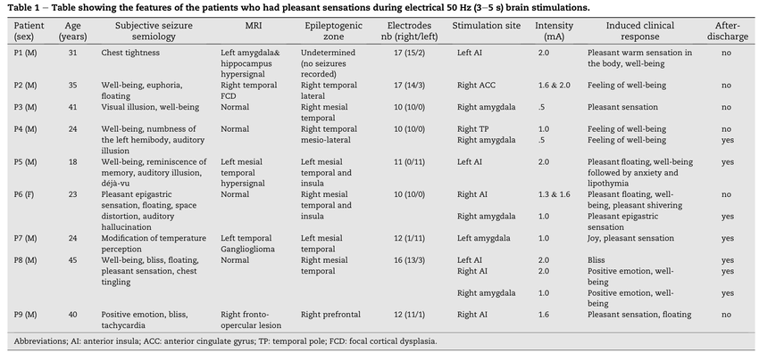
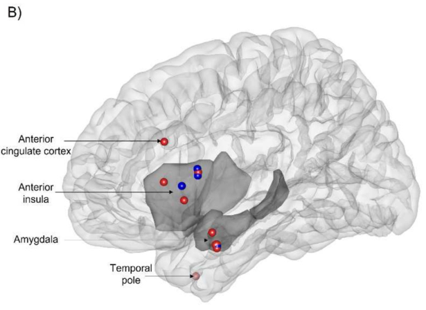

[home](./index.md)
-------------------

*author: niplav, created: 2023-04-07, modified: 2024-07-27, language: english, status: notes, importance: 5, confidence: likely*

> __A collection of quotes and sources of various
methods for generating valence through brain stimulation and
[biofeedback](https://en.wikipedia.org/wiki/Biofeedback), focusing on
invasive stimulation.__

Brain Stimulation for Valence
==============================

> HIGH ON THE WIRE BUT I WON'T TRIP IT  
> HIGH ON THE WIRE BUT I WON'T TRIP IT  
> HIGH ON THE WIRE BUT I WON'T TRIP IT  
> EYES ON THE PRIZE OR YOU MIGHT MISS IT

*—[Worthikids](https://www.youtube.com/@Worthikids/videos), [“Wire”](https://www.youtube.com/watch?v=28w4S2XWJcg), 2021*

See [Constantin
2023a](https://sarahconstantin.substack.com/p/why-should-neuroenhancement-be-possible
"Why Should Neuroenhancement Be Possible?")
for a general overview for neuroenhancement, [Constantin
2023b](https://sarahconstantin.substack.com/p/transcranial-ultrasound-neuromodulation)
and [Constantin
2023c](https://sarahconstantin.substack.com/p/transcranial-ultrasound-studies-part)
for an overview of studies on ultrasound stimulation, and [Constantin
2023d](https://sarahconstantin.substack.com/p/whos-working-on-ultrasound-neuromodulation "Who's Working on Ultrasound Neuromodulation?")
for more information on companies working on ultrasound for
neuromodulation in particular.

<!--TODO
* https://www.theguardian.com/lifeandstyle/video/2021/jun/29/hacking-enlightenment-can-ultrasound-help-you-transcend-reality
* https://consciousness.arizona.edu/sema-lab
* https://crowdfund.arizona.edu/project/20986

Companies:

* https://www.openwater.health/
* https://nurosym.com/
* https://alpha-stim.com/
* [Who's Working on Ultrasound Neuromodulation? (Sarah Constantin, 2023)](https://sarahconstantin.substack.com/p/whos-working-on-ultrasound-neuromodulation)
-->

> The project follows standard neuroscience research protocols. In
the lab, study subjects (novices as well as experienced meditators),
don something that looks like a hairnet studded with ultrasonic
transducers. Over a period of five or 10 minutes, they receive
intermittent pulses of ultrasound energy. Ultrasound frequencies are
far above the threshold of human hearing, so the test subjects feel no
sensations, and because this is a placebo-controlled study, some people
receive no stimulation at all.

> Participants may also undergo ultrasound stimulation while lying in
an MRI scanner that enables the researchers to gauge how different
brain regions respond to the intervention. “The biggest brain
and subjective reports are at about 20 minutes post-ultrasound,”
Sanguinetti says. “So there’s some change in the way the brain
regions are talking to each other.”

> […]

> The primary target is the posterior cingulate cortex (PCC), a region
deep in the brain that is massively connected with other structures and
is associated with the default mode network—active during daydreaming
and mind-wandering. Young and Sanguinetti theorize that the ultrasound
energy mutes activity in the PCC in much the same way meditation tames
the “monkey mind.”

> […]

> Experienced meditators report significant effects after undergoing
the ultrasound sessions, Sanguinetti says.

> […]

> Adds Young, “We get these equanimity-related reports from the
participants without prompting. They don’t know that we’re looking
into anything related to meditation—we’re just some mad scientists
that want to put energy into their brain. They on their own report some
very meditation-like things.”

> […]

> “The general effect was, within the first week, an extreme quieting of
both inner and external space. The inner space became much stiller than
I was able to accomplish just by sitting for 45 minutes every day. With
the PCC ultrasound, it was within the first five minutes.”

*—[Michael Haederle](https://tricycle.org/author/michaelhaederle/), [“Equanimity On Demand: Can Brain Stimulation Technology Mimic the Effects of Meditation?”](https://tricycle.org/article/brain-stimulation-meditation/), 2021*

> During the individual's two-month post-completion evaluation, he
showed a significant score decrease in mood inventories, with virtually
no remaining anxiety or depression. The response pattern observed
may demonstrate that fUS [focused ultra-sound] targeting the amygdala
produces very specific symptom relief in anxiety, but not in depression
and obsessive thinking. In this previously treatment-resistant individual,
anxiety may have prevented the therapeutic response to previous treatments
for comorbid conditions in these patients. Indeed, extremely high levels
of general anxiety are often considered to be markers of non-response
to antidepressants, therapy, rTMS and ECT.

*—Zielinski et al., [“A Case Study of Low-Intensity Focused Ultrasound For Treatment-Resistant Generalized Anxiety Disorder and Major Depressive Disorder”](./doc/stimulation/a_case_study_of_low_intensity_focused_ultrasound_for_treatment_resistant_anxiety_zielinski_et_al_2021.pdf), 2021*

> In three previous experiments, we reported that TUS targeting the
right inferior frontal gyrus (rIFG) enhanced mood in healthy volunteers. […]
Resting state fMRI was recorded at baseline (N=9). Focused TUS (500 kHz,
Ispta=272 mW/cm²) was delivered to the rIFG for 2 minutes and resting
state fMRI was recorded again 25 minutes later. […]  
Previous self-report mood effects were replicated: Participants reported
an enhancement of overall mood 25 minutes after TUS, p=0.022 (Bonferroni
corrected).

*—Jay Sanguinetti/John J. B. Allen, [“Transcranial Ultrasound Improves Mood and Affects Resting State Functional Connectivity in Healthy Volunteers”](./doc/stimulation/transcranial_ultrasound_improves_mood_and_affects_sanguinetti_et_al_2017.pdf), 2017*

> __Participants__: 26 young adults with Beck Depression Inventory […]  
__TUS Parameters__: 30 secs, 500 kHz; PRF 40 Hz; lower power than previous
studies (11% vs. 21%) due to repeated stimulation.  transducer over
right inforerior frontal gyrus (rIFG)[…]  
Replicating past effects, TUS  stimulation compared to TUS sham improved
mood 10 minutes after stimulation Day 1, r=.757, p<.01. […]  
• TUS over the right IFG may impact anxiety rather than
depression-related symptoms, via reducing repetitive thought that is
future-rather than past-focused

*—Reznik et al. 2014, [“Transcranial ultrasound (TUS) reduces worry in a five-day double-blind pilot study”](./doc/stimulation/transcranial_ultrasound_reduces_worry_reznik_et_al_2014.pdf), 2014*

Worry decreased, r(22)=.363, p=.097, depression scores didn't change
r=-.237, p=.288.

> We found a male predominance among the patients reporting pleasant
sensations and a prominent role of the right cerebral hemisphere. Results
show a preponderant role of the dorsal anterior insula and amygdala in
the occurrence of pleasant sensations.
>
> […]
>
> A pleasant sensation was reported during only 13 of these stimulations
(i.e., .60% of all responses) in nine patients (i.e., 2.74% of the
sample), making it a very rare experiential phenomenon evoked by EBS. By
contrast, 111 emotional responses of negative valence (i.e., 5.13% of
all responses) were observed in the same cohort of the patients in 50
patients (i.e., 15.2% of the sample).
>
> […]
>
> Among the nine patients (P1 to P9) who reported pleasant sensations,
three (P4, P6 and P8) showed responses to several EBS […]. Regarding the
experienced phenomena, a pleasant sensation was reported by six patients,
well-being by six patients, positive emotion or joy was reported by
two patients and bliss by one patient. These positive sensations were
accompanied by sensations of floating (three patients), warmth (one
patient) or shivering (one patient). Of note, patient P5 presented a
change in emotional valence of his semiology during the same stimulation,
starting with a pleasant floating sensation and well-being followed by
an unpleasant sensation of anxiety.
>
> […]
>
> 
>
> 
>
> […]
>
> Electrode contacts where a pleasant sensation could be evoked were
mostly located in the anterior insula (AI, a total of six stimulation,
right AI: n=3, left AI: n=3) and in the amygdala (five stimulation; right
amygdala: n=4, left amygdala: n=1) […]. Overall, most EBS that evoked
pleasant sensations were applied to the right cerebral hemisphere (n=9)
whereas only four were applied to the left hemisphere. In two patients,
(P( and P8), the same sensation could be elicited from two different brain
structures, i.e., a feeling of well-being by EBS in the right temporal
pole and the amygdala (P4) and a positive emotion and well-being by EBS
in the AI and the amygdala (P8).

*—Villard et al., [“The origin of pleasant sensations: Insight from direct electrical brain stimulation”](./doc/stimulation/the_origin_of_pleasant_sensations_villard_et_al_2023.pdf), 2023*

> Inducing signals directly into the brain reward systems
is sometimes called “wireheading” (after the original deep
brain stimulation experiments in rats by James Olds and Peter Milner
[2201]). Brain stimulation reward (BSR) is strongly reinforcing, producing
a very strong drive and does not habituate [3083, 3084]. While it is
not simply producing pleasure (there is at least a distinction between
appetitive “wanting”, hedonic “liking”, and the behaviour-changing
learning, in principle they might be dissociable [1685])" "We usually
call compulsions addictions when they become life-impairing, but most of
us are already subject to strong motivational feedbacks involving money,
food, sex and books that may shape our lives in important ways but are
often not recognized as compulsions

*—Anders Sandberg, “Grand Futures” p. 210, 2023*

> Feelings of well-being are not just determined by outside
factors. Happiness has a strong genetic component, ranging from 30-80% of
the variation depending on study […]. Stable, dispositional subjective
well-being seems to be strongly heritable, near 80% [2147]: the hedonic
setpoint is strongly affected by genetic factors.

*—Anders Sandberg, “Grand Futures” p. 213, 2023*

> There are also rare cases of brain lesions apparently affecting
hedonic setpoint. A frontal lobe stroke made a man apparently
“unable to feel sadness” and appear to have gained a highly
positive outlook on life[…].

*—Anders Sandberg, “Grand Futures” p. 217, 2023*

> The known “liking” hotspots involve the nucleus accumbens
shell[…], parts of the ventral pallidum, the parabrachial nucleus of
the pons, and perhaps in orbifrontal cortex and insula.
>
>[…]
>
> "stimulation of more posterior parts of the NAc shell appears to trigger
dread and disgust; even more intriguing the “affective keyboard” of
the shell can be modulated by context, experience and drugs to expand
or shrink the “liking” region

*—Anders Sandberg, “Grand Futures” p. 218, 2023*

See Also
---------

* [OpenFUS](https://github.com/louislva/openFUS/tree/master)
* [Nudge](https://www.nudge.com/)
* [The Startup Landscape for Expanding Consciousness (Greg Kubin/Scott Britton, 2023)](https://scottbritton.substack.com/p/the-startup-landscape-for-expanding)
* [Wireheading Done Right: Stay Positive Without Going Insane (Andrés Gómez-Emilsson, 2016)](https://qualiacomputing.com/2016/08/20/wireheading_done_right/)
