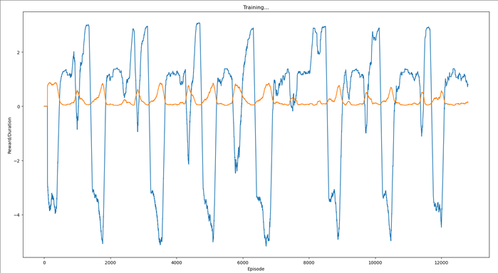

[home](./index.md)
------------------

*author: niplav, created: 2023-12-04, modified: 2023-12-04, language: english, status: notes, importance: 7, confidence: certain*

> __.__

Too Good to be True: Training an RL Agent to be Suspicious
===========================================================

Code based on [this
tutorial](https://pytorch.org/tutorials/intermediate/reinforcement_q_learning.html),
trying to implement the experiment detailed in [Yudkowsky
2017](https://arbital.com/p/environmental_goals/).

