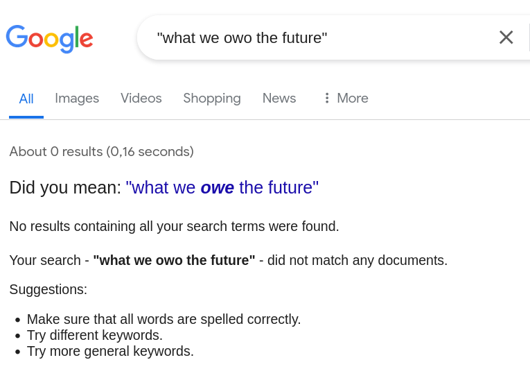

[home](./index.md)
-------------------

*author: niplav, created: 2020-12-30, modified: 2024-04-19, language: english, status: in progress, importance: 3, confidence: opinion*

> __Reading a text is sometimes a big time investment, but people
don't approach their reading in a structured manner, e.g. by keeping
notes, making flashcards, doing exercises, writing reviews or making
summaries. I have been taking notes on the books I read since mid 2017,
but have neglected writing reviews or summaries that might be useful to
others. This is my attempt at salvaging that oversight.__

Text Reviews
=============

Book Reviews
------------

### Compassion, by the Pound (F. Bailey Norwood/Jayson L. Lusk, 2011)

“Compassion, by the Pound” by the economists F. Bailey Norwood and
Jayson L. Lusk is one of those books that are excellent in their first
half, and somewhat (but not utterly) disappointing in their second
half. The two economists, spurred by their own research and their
perceived lack of good information on the topic of farm animal welfare,
start off with a historical overview of animal agriculture and animal
welfare activism, proceed to talking about the sentience of animals,
give an enormous overview of standard animal agriculture praxis, push in
two completely unnecessary chapters about how philosophers and economists
see animal agriculture (the first one being massively oversimplifying,
the second one being annoyed), present a model for consumers to use for
deciding what to eat (although the links have fallen victim to linkrot),
copy-paste one of their papers into the book, and finish with those
kinds of general closing statements that are as so often too vacuous to
be interesting.

At its best, the book is just a delicious heap of information about
animal agriculture praxis. From detailed lists of surgeries performed
on animals without anaesthetics (dehorning, beak trimming, castration,
teeth clipping and tail docking) to the behaviour of cows in big pens
(they huddle together in a corner, and don't use up all the space)
to the hierarchical behavior in chickens (much more strongly than in
cows, actually a major factor of injury in cage-free egg production),
the book presents an industrial-scale mountain of interesting facts
about animal agriculture. The best parts of the book pretty much scream
to be flashcardized.

Norwood's & Lusk's judgement seems well informed and not particularly
strongly clouded by bias, and presented in a empathetic, but also
neutral tone (except in the case of them mentioning in a side remark
that surgeries such as castration on animals are nearly always performed
without anaesthetics, seemingly regarding this as completely acceptable).

However, not everything is golden under the sun. The chapter on
philosophy is especially painful (or might this just be my Gell-Mann
amnesia speaking?) – they seem dismissive of philosophers' arguments,
present them in short and watered-down form, and even state in a footnote:

> If there is one thing we have learned from reading the
> works of ethical philosophers; it is that no one ever, ever wins
> the debate

*— F. Bailey Norwood/Jayson L. Lusk, “Compassion, by the Pound” p. 388, 2011*

The chapter on Talking with Economists is better, but plagued with
the eternal problem of economics: people don't like it, and the same
debate about the very basic tenets of economics needs to be rehashed
over and over again. As it happens here, much to my own disappointment
(“Yes, sure, I agree that things have a price, that regulation is often
nonsensical and consumers change their minds when presented with the same
scenario, worded slightly differently. Can we get back to fascinating
in-depth descriptions of animal agriculture now, please?”).

Chapter 9, Consumer Expressions, is not _bad_ per se, but still sloppy: It
is abundantly clear that the chapter is simply a paper by the two authors
copy-pasted into the book. The experiments they perform are interesting
and scientifically sophisticated, but the chapter is nonetheless jarring
to the reader – clearly somewhat out of place in the rest of the book.

Two things stand out to me from this book:

1. They mention Brian Tomasik's early writings on wild-animal suffering in
a very positive tone, remarking that "It is one of the most interesting
and well researched narratives that is not officially published by any
organization."
2. After reading it, I remain mostly unshaken in my
vegetarianism. However, I have stopped eating eggs as a result of reading
this book, and I now assign a much higher probability to the hypothesis
that beef cows' lives on factory farms are actually net positive, although
I wouldn't go so far as to give it the majority of my probability mass.

“Compassion, by the Pound” is sometimes clearly a product of annoyance
– an annoyance at animal advocates who allegedly spread misinformation
about farming practices, annoyance at people who _just don't understand
economics_ (which I get, yes, it's frustrating), and yes, sometimes
also annoyance at the horrifying conditions many farm animals have to
live under. Hopefully both economists and animal advocates won't have
to be annoyed as much in the future, but for the time being, we're still
killing and eating animals.

__6/10__

### The Human Predicament (David Benatar, 2017)

“The Human Predicament” is a book about life philosophy, written
by the pessimistic analytic philosopher David Benatar. In it, Benatar
describes what he calls the human predicament (hence the title), which
consists of the fact that human lives are usually bad, and much worse
than people themselves think. In his view, human lives lack cosmic (and
sometimes terrestrial) meaning, are bad because they're much shorter
than they could be, much more filled with pain and discomfort than
humans think, and full of ignorance, unfulfilled desires and physical
deterioration during the course of one's lifetime.

However, according to Benatar, all alternatives are also bad: death,
because it often deprives of life, and annihilates the person dying;
and suicide, for much the same reasons, unless it annihilates a life
that is awful enough to justify death. Life extension, under Benatar's
view, is extremely unlikely, and even if achieved, would only prolong
the misery of human existence.

The only positive option is to not come into existence at all–or at
least not make others come into existence, even though one desires to.
He alludes several times to one of his other books, Better Never To Have
Been, in which he advocates for antinatalism.

Reading this book felt a little
bit pointless to me. Since [beliefs are for
actions](https://www.gwern.net/Research-criticism#beliefs-are-for-actions),
and Benatar is just applying a linear transformation to all
available options (if everything's bad, nothing is), you
act exactly the same. Although I had a phase where I believed
antinatalism quite strongly, and still don't plan on having kids
(although I know that this attitude might change with increasing
age), but overall antinatalism does not strike me as a [pragmatic
policy](https://reducing-suffering.org/strategic-considerations-moral-antinatalists/ "Strategic Considerations for Moral Antinatalists"),
me instead adopting an
[anti-pure-replicator](https://qualiacomputing.com/2017/12/20/the-universal-plot-part-i-consciousness-vs-pure-replicators/ "The Universal Plot: Part I – Consciousness vs. Pure Replicators")
strategy.

Especially the chapter on meaning felt irrelevant: I don't have an
internal experience of meaning (or the lack thereof), and oscillate
between believing it to be a subtype of high-valence qualia and believing
it to be a mechanism for the mind to do things that are in themselves
not enjoyable (a "second reward signal" next to pleasure).

Benatar mentions cryonics, life extension technology and
transhumanism in general, and while his treatment of these topics
is more respectful than most, he dismisses them fairly quickly. I
disagree with his underlying skepticism on these the feasibility of radically altering the human condition through technology, given that it seems that humanity
can expect to find itself in a period of [hyperbolic economic
growth](https://sideways-view.com/2017/10/04/hyperbolic-growth/ "Hyperbolic growth")
(see also [Roodman
2020](https://www.openphilanthropy.org/blog/modeling-human-trajectory "Modeling the Human Trajectory")).

I am also not a fan of the pessimism-optimism distinction. Benatar himself
touches on this:

> that a view is pessimistic should, in itself, neither
count in its favor nor against it. (The same, of course, is true
of an optimistic view.)

*— [David Benatar](https://en.wikipedia.org/wiki/David_Benatar), “The Human Predicament” p. 225, 2017*

It seems to me that humans can believe very bad things to be the case and
still be happier than most other humans in their lives (I know this is
at least true for one human, myself). This, combined with the fact that
Benatar simply shifts the utility function downwards, makes me inclined
to rejecting much of his worldview as simply a matter of emotional tone
on the same facts everyone else also believes.

Finally, I want to accuse Benatar of insufficient pessimism (on
his own criteria): The most likely outcome for humanity (and for
life in general) seems not to be total extinction, but instead a
universe filled with beings most capable of copying themselves, the
whole cosmos teeming with [subsistence-level beings with very boring
conscious experiences](https://slatestarcodex.com/2014/07/13/growing-children-for-bostroms-disneyland/ "Growing Children For Bostrom’s Disneyland") until the stars go out. (Or even worse
scenarios from anti-aligned artificial intelligences, see [Tomasik
2019](https://reducing-suffering.org/near-miss/ "Astronomical suffering from slightly misaligned artificial intelligence")).

Overall, the book had some interesting points about suicide, the quality of
life and meaning, but felt rather pointless.

__3/10__

### Right Concentration (Leigh Brasington, 2015)

Illustrates the theory-practice gap, but in the other direction:
excellently practical first half (which helped me get into the first
jhāna (briefly) during a long retreat (the hard part is getting
the access concentration good enough, which the book doesn't spend
enough time on, in my opinion—only a short appendix (at least there's
recommendations for other books)). The anecdotes from his students and
their problems with entering the jhānas are fascinating (pīti that
doesn't go away? jhānas contraindicated with seizures?), as are his
reports of deep concentration states on long retreats (the visual field
turning white in the fourth jhāna, and reports about the the nimitta,
make me wonder what goes on in the visual cortex during absorption
meditation).

But Brasington just *wants* to believe that the Suttas are basically
infallible, **especially** when they report what the Buddha said
(Brasington has remarked on podcasts that we know that the Buddha knew
what he was talking about, which I don't get—even if he was a great
meditator and thinker, he could just have been *wrong* sometimes):
Expecting the Suttas to accurately and coherently reflect reality
in all its aspects is a bit too optimistic for me. But Brasington
goes full memetic immune disorder on the Suttas, and the result is
just…uninteresting?

__6.5/10__

### What We Owe The Future (William MacAskill, 2022)

Preceded by a [superior book on the same
topic](https://www.goodreads.com/book/show/50485582-the-precipice);
this one is sleeker, less filled with random interesting facts, less
scientific, less exuberant in its prose. I enjoyed the introduction of the
[SPC framework](https://forum.effectivealtruism.org/topics/spc-framework)
(though it may be relegated to the dutsbin — unlike with
[ITN](https://forum.effectivealtruism.org/topics/itn-framework) I haven't
even seen anyone else pay lip service to it…), found the alleged first
popular introduction to population axiology cute, and liked the chapters
on stagnation.

But honestly? I enjoyed the research that led to those chapters
more than the chapters in the book themselves (especially [Rodriguez
2019](https://forum.effectivealtruism.org/s/HSA8wsaYiqdt4ouNF/p/pMsnCieusmYqGW26W)
and [Rodriguez
2020](https://forum.effectivealtruism.org/posts/GsjmufaebreiaivF7/what-is-the-likelihood-that-civilizational-collapse-would)),
and I think the team that made The Precipice would've done a nicer job
at exposition.

Similarly, I was not a huge fan of the chapter on risks from artificial
intelligence. Too conservative, which might've been warranted before
GPT-3, but mid-2022? Bad timing to be all "could be soon or bad, or both,
or not, idk". (Although apparently other reviewers have the opposite
issue, so perhaps a good compromise was struck in the realm of public
communication).

I am unsure about the value lock-in frame. On the one hand, it's a very
rough description of some of the danger with AI x-risk, but not all danger
fits in that format: What if AI systems don't lock in any specific value,
but kill off humanity and then go on to explore the space of all possible
values? Not lockin, but it surely doesn't look "good" to me.

This framing also invites endless bickering about "who gets to control
the AIs values" and "democracy" and "social solutions", and the
*completely separate* issue of stable totalitarianism.

Finally: Who *the hell* decided this was a good way to do endnotes? In
general the best policy is to [under no circumstances use endnotes, ever,
__why__](https://entirelyuseless.com/2015/07/11/are-hyperlinks-a-bad-idea/).
But WWOTF makes it 10x worse: I usually read endnotes,
because I'm unusually curious and bad at priorization,
but WWOTF only has ~25% substantive endnotes, with the rest
being just incomplete references (which can be accessed on [the
website](https://whatweowethefuture.com/bibliography/))—so I found
myself flipping back and forth, only to be disappointed most of the
time. Surely there must be a better way of distinguishing between
citations and endnotes.

Maybe I should've avoided it: Pop philosophy that is already in my
own groundwater.

If you're reading this site, read The Precipice instead. (Not a *full*
condemnation of WWOTF).

__5.5/10__

### Attention Span (Gloria Mark, 2023)

> Curiosity is the drug of the internet.

*—Gloria Mark, “Attention Span” p. 114, 2023*

Read this while [researching attention spans](./spans.html), I
did not find what I was looking for (remaining mostly unconvinced
that the reported statistics are strong enough to justify the
claim that attention spans have been declining). Otherwise
acceptable; and in some parts genuinely novel to me, giving a
plethora of ways of measuring attention ([transcranial Doppler
sonography](https://en.wikipedia.org/wiki/Transcranial_Doppler),
[functional near-infrared
spectroscopy](https://en.wikipedia.org/wiki/Functional_near-infrared_spectroscopy),
facial [thermography](https://en.wikipedia.org/wiki/Thermography)
to measure cognitive effort, [blood
velocity](https://en.wikipedia.org/wiki/Hemodynamics#Velocity)…),
claims that the Pomodoro technique hasn't been experimentally tested
(big if true!). Apparently people often *self-interrupt* while on a task,
which I've noticed myself doing more & more. The Big 5 relate to how
humans perform tasks:

> Those who score high in Neuroticism in personality tests also tend
to perform worse on selective attention tasks where they have to pay
attention to some things and ignore distracting stimuli,²⁰ much like
the Stroop task.

*—Gloria Mark, “Attention Span” p. 154, 2023*

> We expected that conscientious people would be more likely to be
continuous email checkers, and that is exactly what we found. In fact,
it explained their email checking behavior to a striking extent […]
we found that people who score higher on the personality trait
of Openness perform better in environments with interruptions.

*—Gloria Mark, “Attention Span” p. 156, 2023*

This leads to conscientious people being more exhausted if possible
low-effort interruptions are taken away from them, they just work
continuously until exhaustion.

Mark's background in art gives some entertaining anecdotes and
statistics, I especially enjoyed learning about [dialectical
montage](https://en.wikipedia.org/wiki/Soviet_montage_theory) and
decreasing shot-lengths in movies, series and advertisements.

Apparently people want to use this as a self-help book‽ Bizarre.

But to me: Satisfactory.

__6.5/10__

### Human Compatible (Stuart Russell, 2019)

> It sounds odd to say that happiness should be an engineering discipline,
but that seems to be the inevitable conclusion.

*—Stuart Russell, “Human Compatible” p. 123, 2019*

[Another](#What_We_Owe_The_Future_William_MacAskill_2022) book with an
orange cover, and another popularization of a thing I spend a lot of
time thinking and reading about. But I like this one much more!

Thoroughly enjoyed the many tidbits from AI history, and the stories
about semi-successful systems, as well as a preference-utilitarian
definition of "sadism, envy, resentment and malice", a naive approach
to meta-reasoning ("just reason about a thing if the expected value of
reasoning is positive", without talking about the obvious boots-trapping
problems…but still), learning about the Baldwin effect and the quotes
about risks from artificial intelligence from Butler's Erewhon.

Skeptical about transformative AI soon, and about the [scaling
hypothesis](https://www.gwern.net/Scaling-hypothesis), but probably for
reasons I can't understand. Also this was written before GPT-3, so he
might've changed his mind since then.

The book *does* assume that [reward is the optimization
target](https://www.lesswrong.com/s/nyEFg3AuJpdAozmoX/p/pdaGN6pQyQarFHXF4),
and doesn't mention [inner
optimizers](https://www.lesswrong.com/posts/FkgsxrGf3QxhfLWHG), but your
popularization of alignment can only do so much. I should really read
into the whole CIRL/corrigibility debate, any day now.

The book *did* have endnotes, which I hate, but less so than with [What We
Owe The Future](#What_We_Owe_The_Future_William_MacAskill_2022)—perhaps
because I got to read the titles of the papers and not just a naked "Foo
et al. 2010", perhaps because there was just more content per footnote.

> The task is, fortunately, not the following: given a machine that
possesses a high degree of intelligence, work out how to contol it. If
that were the task, we would be toast. A machine viewed as a black box,
a *fait accompli*, might as well have arrived from outer space. And
our chances of controlling a superintelligent entity from outer space
are roughly zero. Similar arguments apply to the methods of creating AI
systems that guarantee we won't understand how they work; these methods
include *whole-brain emulation*¹—creating souped-up electronic copies
of human brains—as well as methods based on simulated evolutions of
programs.² I won't say more about these proposals because they are so
obviously a bad idea.

*—Stuart Russell, “Human Compatible” p. 171, 2019*

__7/10__

### The Machinery of Freedom (David Friedman, 2014)

> As a moral philosopher I am a libertarian, insofar as I am anything. As
an economist I am a utilitarian.

*—David Friedman, “The Machinery of Freedom” p. 179, 2014*

Anarcho-capitalist cut from my people's cloth, namely of the consequentialist
variety, writes a series of blogposts in 1967-1973, again in 1989,
and again in 2014.

Unlike many other anarcho-capitalist this one's not completely
[mind-killed](https://www.lesswrong.com/rationality/politics-is-the-mind-killer),
able to acknowledge weaknesses in his position, capable to argue
against the arguments of his allies, and still bullet-biting when its
necessary. (For example on copyright).

Clever proposals for mechanism design that don't quite work, but feel
like they only need one more insight, plus a lot of very good very true
libertarian proposals.

Responsible for a certain cluster of people knowing surprisingly
much about medieval icelandic law. I learned it from here, as well as
Friedman's law — not yet used in a cost-benefit calculation, but surely
feels like it could come in handy. (Some empirical demonstration of it
would be nice.)

Complaint: Instead of rewriting or updating sections of the text, as
one would think of a new edition, the things that have changed about the
world are usually appended to chapters in square brackets. This makes it
confusing while reading: I read a fact, which later is reverted. This
also happens to a lesser degree with the different eras the book was
written in: A strange mix of 90s cypherpunk, 70s quaintness and early
2010s internet culture (complete with a recommendation of Slate Star
Codex in the appendix).

Available online
[here](http://www.daviddfriedman.com/Machinery%203rd%20Edn.pdf), true
to its stance on copyright.

__7/10__

### Three Essays (Richard Rorty, 1983-1990)

__Solidarity or Objectivity (1983)__, __Freud and
Moral Reflection (1984)__, __The Priority of Democracy
to Philosophy (1990)__, read in german as [this
collection](https://www.goodreads.com/book/show/20343958-solidarit-t-oder-objektivit-t-drei-philosophische-essays).

Given his reputation as standing between analytic
and continental philosophy, I'd hoped to get the
*understanding* that I got from the analytics, and the
*poetry* from the continentals. I got neither, just as when I read
[Habermas](https://www.goodreads.com/book/show/321494.Zwischenbetrachtungen_Im_Proze_der_Aufkl_rung)
or
[Benjamin](https://www.goodreads.com/book/show/613761.Illuminationen_Ausgew_hlte_Schriften_1)
or
[Derrida](https://www.goodreads.com/book/show/1421797.Gesetzeskraft_Der_mystische_Grund_der_Autorit_t_).

I mostly didn't understand the essays, and what I understood, I didn't
like—I was confused, couldn't follow, lacked context.

Not for me.

__2/10__

LessWrong Annual Reviews
-------------------------

### 2019

These were written for the [2019 LessWrong Review](https://www.lesswrong.com/posts/QFBEjjAvT6KbaA3dY/the-lesswrong-2019-review).

#### What failure looks like (Paul Christiano, 2019)

[Original Post](https://www.lesswrong.com/posts/HBxe6wdjxK239zajf/what-failure-looks-like).

I read [this
post](https://www.lesswrong.com/posts/HBxe6wdjxK239zajf/what-failure-looks-like)
only half a year ago after seeing it being referenced in several different
places, mostly as a newer, better alternative to the existing FOOM-type
failure scenarios. I also didn't follow the comments on this post when
it came out.

This post makes a lot of sense in Christiano's worldview, where we have a
relatively continuous, somewhat multipolar takeoff which to a large extent
inherits the problem in our current world. This is especially applies to
part I: we already have many different instances of scenarios where humans
follow measured incentives and produce unintended outcomes. [Goodhart's
law](https://en.wikipedia.org/wiki/Goodhart%27s_law) is a thing. Part
I ties in especially well with Wei Dai's concern that

> AI-powered memetic warfare makes all humans effectively insane.

While I haven't done research on this, I have a medium
strength intuition that this is already happening. Many
people I know are at least somewhat addicted to the internet,
having lost a lot of attention due to having their motivational
system hijacked, which is worrying because [Attention is your scarcest
resource](https://www.lesswrong.com/posts/aDtzAZf3LnwYvmBP7/attention-is-your-scarcest-resource).
I believe investigating the amount to which attention has
deteriorated (or has been monopolized by different actors)
would be valuable, as well as thinking about which incentives
will start when AI technologies become more powerful ([Daniel
Kokotajlo](https://www.lesswrong.com/users/daniel-kokotajlo) has been
writing especially interesting essays on this kind of problem).

As for part II, I'm a bit more skeptical. I would summarize "going
out with a bang" as a "collective treacherous turn", which would
demand somewhat high levels of coordination between agents of various
different levels of intelligence (agents would be incentivized to turn
early because of first-mover-advantages, but this would increase the
probability of humans doing something about it), as well as agents
knowing very early that they want to perform a treacherous turn to
influence-seeking behavior. I'd like to think about how the frequency of
premature treacherous turns relates to the intelligence of agents. Would
that be continuous or discontinuous? Unrelated to Christiano's post,
this seems like an important consideration (maybe work has gone into
this and I just haven't seen it yet).

Still, part II holds up pretty well, especially since we can expect AI
systems to cooperate effectively via merging utility functions, and we
can see systems in the real world that fail regularly, but not much is
being done about them (especially social structures that sort-of work).

I have referenced this post numerous times, mostly in connection with a
short explanation of how I think current attention-grabbing systems are
a variant of what is described in part I. I think it's pretty good, and
someone (not me) should flesh the idea out a bit more, perhaps connecting
it to existing systems (I remember the story about the recommender system
manipulating its users into political extremism to increase viewing time,
but I can't find a link right now).

The one thing I would like to see improved is at least some links to
prior existing work. Christiano writes that

> (None of the concerns in this post are novel.)

but it isn't clear whether he is just summarizing things he has thought
about, which are implicit knowledge in his social web, or whether he is
summarizing existing texts. I think part I would have benefitted from a
link to Goodhart's law (or an explanation why it is something different).

#### 1960: The Year The Singularity Was Cancelled (Scott Alexander, 2019)

[Original Post](https://www.lesswrong.com/posts/bYrF8rXFYwPqnfxTp/1960-the-year-the-singularity-was-cancelled).

I believe this is an important
[gears-level](https://www.lesswrong.com/posts/B7P97C27rvHPz3s9B/gears-in-understanding)
addition to posts like [hyperbolic
growth](https://sideways-view.com/2017/10/04/hyperbolic-growth/),
[long-term growth as a sequence of exponential
modes](http://mason.gmu.edu/~rhanson/longgrow.html) and an old Yudkowsky
post I am unable to find at the moment.<!--TODO: capitalization of Yudkowsky is wrong still on LW-->

I don't know how closely these
texts are connected, but [Modeling the Human
Trajectory](https://www.openphilanthropy.org/blog/modeling-human-trajectory)
picks up one year later, creating two technical models: one
stochastically fitting and extrapolating GDP growth; the other providing
a deterministic outlook, considering labor, capital, human capital,
technology and production (and, in one case, natural resources). Roodman
arrives at somewhat similar conclusions, too: The industrial revolution
was a _very_ big deal, and something happened around 1960 that has
slowed the previous strong growth (as far as I remember, it doesn't
provide an explicit reason for this).

A point in this post that I found especially interesting
was the speculation about the back plague being the spark
that ignited the industrial revolution. The reason given is
a good example of [slack catapulting a system out of a local
maximum](https://www.lesswrong.com/posts/GZSzMqr8hAB2dR8pk/studies-on-slack),
in this case a malthusian europe into the industrial revolution.

Interestingly, both this text and Roodman don't consider individual
intelligence as an important factor in global productivity. Despite the
well-known [Flynn-Effect](https://en.wikipedia.org/wiki/Flynn_effect)
that has mostly continued since 1960 (caveat caveat), no extraordinary
change in global productivity has occurred. This makes some sense: a
rise of less than 1 standard deviation might be appreciable, but not
groundbreaking. But the relation to artificial intelligence makes it
interesting: the purported (economic) advantage of AI systems is that
they can copy themselves, thereby making population growth not the
most constraining variable in this growth model. I don't believe this
is particularly anticipation-constraining, though: this could mean that
either the post-singularity ("singularity") world is multipolar, or the
singleton controlling everything has created many sub-agents.

I appreciate this post. I have referenced it a couple of
times in conversations. Together with the investigation
by OpenPhil it makes a solid case that [the gods of straight
lines](https://slatestarcodex.com/2018/11/26/is-science-slowing-down-2/)
have decided to throw us into [the most important century of
history](https://forum.effectivealtruism.org/posts/XXLf6FmWujkxna3E6/are-we-living-at-the-most-influential-time-in-history-1).
May the [godess of everything
else](https://www.lesswrong.com/posts/MFNJ7kQttCuCXHp8P/the-goddess-of-everything-else)
be merciful with us.

### 2020

These were written for the [2020 LessWrong
Review](https://www.lesswrong.com/posts/M9kDqF2fn3WH44nrv/the-2020-review-preliminary-voting).

#### Anti-Aging: State of the Art (JackH, 2020)

[Original post](https://www.lesswrong.com/posts/RcifQCKkRc9XTjxC2/anti-aging-state-of-the-art).

I read this post at the same time as reading [Ascani
2019](https://forum.effectivealtruism.org/s/8QHbqGpXnzcQxiAis)
and [Ricón 2021](https://nintil.com/longevity) in an
attempt to get clear about anti-aging research. Comparing
these three texts against each other, I would classify [Ascani
2019](https://forum.effectivealtruism.org/s/8QHbqGpXnzcQxiAis) as
trying to figure out whether focusing on anti-aging research is a
good idea, [Ricón 2021](https://nintil.com/longevity) trying to give
a gearsy overview of the field (objective unlocked: get Nintil posts
cross-posted to LessWrong), and this text as showing what has already
been accomplished.

In that regard it succeeds perfectly well: The structure of Part V is
so clean I suspect that it sweeps a bunch of complexity and alternative
approaches under the rug, and the results described seriously impressed
me and some of the people I was reading this text with at the time (We
can *reverse arthritis and cataracts in mice*‽ We can *double their
maximum lifespan*‽). It is excellent science propaganda: Inspiring
awe at what has been accomplished, desire to accomplish more, and
hope that this is possible.

While the post shines in parts III, IV and V, I have some
quibbles and complaints about the introduction, part I
and part II. First, I disliked the jab against cryonics
in the first paragraph [without considering the costs and
benefits](https://niplav.github.io/considerations_on_cryonics.html),
which rightly received some pushback in the comments (the strongest
counter-observation being that barring [some practical suggestions
for slowing down aging right now](https://www.gwern.net/Longevity),
cryonics and anti-aging research occupy very different parts of the
strategy for life-extension, and can be pursued in parallel). Part II
disappointed me because it was pro-longevity advocacy under the veneer
of a factual question: Has anybody actually tried to think through how a
world without aging might *actually look like*, instead of re-treading the
same pro-aging trance and anti-aging science arguments? That seems like
a question that is both interesting and pretty relevant, even when you
believe that ending aging is important enough that it should definitely
be done, if just to prepare for weird second- and third-order effects.

(Part I felt like I was a choir being preached to, which isn't *that bad*,
but still…)

I really liked learning a bunch of new facts about aging (as for example
the list of species that don't age, that aging is responsible for 30%
of lost DALYs, and distinction between gerontology, engineering and
geriatrics). Factposts are underrated.

The comments on this post were often very good, and had some nice
discussion about whether the advice in section VII was to be focused on.

I've been overly negative in this review, but overall I still like this
post, and have voted a 4 on it (which I might change to a 1). The parts
III-V are excellent, and I have only minor problems with the preceding
parts. This is the kind of post I would give a science-interested
skeptic of anti-aging research. I'd like to have this post in the review,
because it represents something some part of the core to the LessWrong
transhumanist aesthetic that often gets overlooked.

#### Persuasion Tools: AI takeover without AGI or agency? (Daniel Kokotajlo, 2020)

[Original post](https://www.lesswrong.com/posts/qKvn7rxP2mzJbKfcA/persuasion-tools-ai-takeover-without-agi-or-agency).

The problem outlined in this post results from two major concerns on
lesswrong: risks from advanced AI systems and irrationality due to
parasitic memes.

It presents the problem of persuasion tools as continuous with the
problems humanity has had with virulent ideologies and sticky memes,
exacerbated by the increasing capability of narrowly intelligent machine
learning systems to exploit biases in human thought. It provides (but
doesn't explore) two examples from history to support its hypothesis:
the printing press as a partial cause of the 30 years war, and the radio
as a partial cause of 20th century totalitarianism.

Especially those two concerns reminded me of [Is Clickbait
Destroying Our General Intelligence? (Eliezer Yudkowsky,
2018)](https://www.lesswrong.com/posts/YicoiQurNBxSp7a65), which could
be situated in this series of events:

> I suspect some culturally transmitted parts of the general intelligence
software got damaged by radio, television, and the Internet, with a key
causal step being an increased hypercompetition of ideas compared to
earlier years.

Kokotajlo also briefly considers the hypothesis that
epistemic conditions might have become better through the
internet, but rejects it (for reasons that are not spelled
out, but the answers to [Have epistemic conditions always been this
bad? (Wei Dai, 2021)](https://www.lesswrong.com/posts/PjfsbKrK5MnJDDoFr/have-epistemic-conditions-always-been-this-bad)
might be illuminating). (Survivorship bias probably plays a large
role here: epistemically unsound information is less likely to survive
long-term trials for truth, especially in an environment where memes on
the less truth-oriented side of the spectrum are in a harsher competition
than memes on the more truth-oriented side).

This post was written a year ago, and didn't make any concrete
predictions (for a vignette of the future by the author,
see [What 2026 looks like (Daniel's Median Future) (Daniel Kokotajlo,
2021)](https://www.lesswrong.com/posts/6Xgy6CAf2jqHhynHL/what-2026-looks-like-daniel-s-median-future)).
My personal implied predictions under this worldview are something
like this:

1. A large number (>100 mio.) of people in the western world (USA & EU) will interact with chatbots on a regular basis (e.g. more than once a week).
	* I think this isn't yet the case: I've encountered chatbots mainly in the context of customer service, and don't know anyone personally who has used a chatbot for entertainment for more than an afternoon (Western Europe). If we count automated personal assistants such as Alexa or Siri, this might be true.
2. It is revealed that a government spent a substantial amount of money (>$1B) on automating propaganda creation.
	* As far as I know, there hasn't been any reveal of such a large-scale automated propaganda campaign (the wikipedia pages on [Propaganda in China](https://en.wikipedia.org/wiki/Propaganda_in_China) and [in the US](https://en.wikipedia.org/wiki/Propaganda_in_the_US) mention no such operations.
3. Online ideological conflicts spill over into the real world more often.
	* As I haven't been following the news closely, I don't have many examples here, but the [2020–21 United States election protests](https://en.wikipedia.org/wiki/2020-21_United_States_election_protests) come to mind.
4. The internet becomes more fractured, into discrete walled gardens (e.g. into a Chinese Internet, [US Blue Internet, and US Red Internet](https://slatestarcodex.com/2014/09/30/i-can-tolerate-anything-except-the-outgroup/)).
	* This seems to become more and more true, with sites such as Gab and the Fediverse gaining in popularity. However, it doesn't seem like the US Red Internet has the technological capabilities to automate propaganda or build a complete walled garden, to the extent that the US Blue Internet or the Chinese internet do.

I found the text quite relevant both to thinking about possible alternative
stories about the way in which AI could go wrong, and also to my
personal life.

In the domain of AI safety, I became more convinced of the importance
of aligning recommender systems to human values (also mentioned in the
post), if they pose larger risk than commonly assumed, and provide
a good ground for experimentation on alignment techniques. Whether
[aligning recommender systems](https://arxiv.org/abs/2107.10939v1) is more
important than aligning large language models seems like an important crux
here: Are the short-term/long-term risks higher for recommender systems
(i.e. reinforcement learners) larger than the risks from large language
models? Which route appears more fruitful when trying to align more
generally capable systems? As far as I can see, the alignment community
is more interested in attempts to align large language models, compared
to recommender systems, probably due to recent progress in that area
and because it's easier to test alignment in language models (?).

The scenarios in which AI powered memetic warfare significantly harm
humanity can also be tied into research on the malicious use of AI,
e.g. [The Malicious Use of Artificial Intelligence: Forecasting,
Prevention, and Mitigation (Brundage et al. 2018)](https://www.eff.org/files/2018/02/20/malicious_ai_report_final.pdf). Policy tools from
diplomacy with regard to biological, chemical and nuclear warfare could
be applied to memetic and psychologcial warfare.

The text explicitely positions the dangers of persuasion tools as a risk
factor, but more speculatively, they might also pose an existential risk
in themselves, in two different scenarios:

* If humans are very easy to manipulate by AI systems that are narrowly superhuman in the domain of human psychology, a scenario similar to [Evolving to Extinction (Eliezer Yudkowsky, 2007)](https://www.lesswrong.com/rationality/evolving-to-extinction) might occur: nearly everybody goes [effectively insane](https://www.lesswrong.com/posts/HBxe6wdjxK239zajf/what-failure-looks-like?commentId=CB8ieALcHfSSuAYYJ#CB8ieALcHfSSuAYYJ) at approximately the same time, resulting in the collapse of civilization.
* Humans might become insane enough that further progress along relevant axes is halted, but not insane enough that civilization collapses. We get stuck oscillating around some technological level, until another existential catastrophe like nuclear war and resulting nuclear winter finishes us off.

On the personal side, after being fooled by [people using GPT-3 to
generate tweets](https://nitter.net/lxrjl/status/1376830454075129858)
and seeing at least one instance of observing
someone [asking a commenter for the MD5 hashsum of a
string](https://old.reddit.com/r/TheMotte/comments/qzfptl/culture_war_roundup_for_the_week_of_november_22/hmhnkzg/)
to verify that the commenter was human (and the commenter failing that
challenge), along with observing the increasingly negative effects of
internet usage on my attention span, I decided to separate my place for
sleeping & eating from the place where I use internet, with a ~10 minute
commute between those two. I also decided to pay less attention to news
stories/reddit/twitter, especially from sources affiliated with large
governments, downloaded my favourite websites.

This post was relevant to my thoughts about alternative AI risk scenarios
as well as drastic personal decisions, and I expect to give it a 1 or
(more likely) a 4 in the final vote.

<!--TODO: import 2022 reviews-->
