[home](./index.md)
------------------

*author: niplav, created: 2020-07-22, modified: 2022-03-24, language: english, status: maintenance, importance: 5, confidence: highly unlikely*

> __In [AI safety](https://en.wikipedia.org/wiki/AI_control_problem),
significant time has been spent on the question of
the intelligence of AI systems over time, especially during
[takeoff](https://en.wikipedia.org/wiki/Technological_singularity#Hard_vs._soft_takeoff).
An underappreciated argument in the debate has been the idea that the more
intelligent an AI system becomes, the better it can search the space of
possible optimization algorithms. This post proposes a computational model
of this process by creating an n-dimensional search space and then running
a very simple [hill-climbing](https://en.wikipedia.org/wiki/Hill_climbing)
algorithm and brute-force search on that space. Possible further
improvements to the model are suggested, and implications are discussed.__

<!--
TODO:
* Another view on takeoff speeds in relation to the shape of optimization-space
	*	Maybe model with n-dimensional space with perlin noise,
		depth of current search determines size of subspace
		being searchable at the moment
-->

An Exploratory Toy AI Takeoff Model
===================================

> Libre de la metáfora y del mito  
labra un arduo cristal: el infinito  
mapa de Aquel que es todas Sus estrellas.

*– [Jorge Luis Borges](https://en.wikipedia.org/wiki/Jorge_Luis_Borges), [“Spinoza”](https://thefunambulist.net/literature/litterature-spinoza-by-borges), 1964*

> Paraphrasing Roache (2008) the state of play is such that nobody
believes the result of a simulation, except the person who performed
the simulation, and everybody believes the result of an experiment,
except the person who ran the experiment.

*– Ryan G. McClarren, “Uncertainty Quantification and Predictive Computational Science“ p. 9, 2018*

(Although the quote apparently goes back to Einstein, see “The
advancement of science, and its burdens” p. 13, only there with "theory"
instead of "simulation").

> And let me just make an aside. There’s a lot of meta-debate that goes
on in the AI safety community which I don’t understand why: it’s not
as if we haven’t got enough real work to do. So now we have meta-debates
about whether you should focus on short-term or long-term, or whether
we should try to reduce the conflict between the short-termers and the
long-termers and it’s like, there doesn’t need to be a conflict.

*– [Stuart J. Russell](https://en.wikipedia.org/wiki/Stuart_J._Russell), [“The flaws that make today’s AI architecture unsafe and a new approach that could fix it”](https://80000hours.org/podcast/episodes/stuart-russell-human-compatible-ai/#what-most-needs-to-be-done-015014) (Episode 80 of the [80,000 hours podcast](https://80000hours.org/podcast/)), 2020*

Introduction
------------

Many regard the trajectory of future AI development as
crucial<!--TODO: citation needed-->: when will AGI first be
developed? Will the development be slow, moderate, or fast (in
economic doublings, or in wallclock time)? Will one AGI system become a
[singleton](https://en.wikipedia.org/wiki/Singleton_(global_governance)),
i.e come to dominate the whole world (individual vs. collective
takeoff)? Will AGIs [FOOM](https://intelligence.org/ai-foom-debate/), i.e growing unexpectedly
fast? And: will there be one or more discontinuity when AI systems
recursively self-improve? This text attempts to shine light on the last
question and highlight a (supposedly underappreciated) argument for one or
more discontinuities in AI takeoff based on a computational model of an AI
searching the space of possible optimization algorithms for stronger ones.

In the model, there are three possible ways of an AI improving its
intelligence:

* By working and investing a part of the money to buy more hardware (e.g. by a cloud provider). This should grow roughly exponentially, at a similar speed to the [Gross World Product](https://en.wikipedia.org/wiki/Gross_world_product#Recent_growth) (although the model does not consider wall-clock time)
* By performing a very simple [hill-climbing](https://en.wikipedia.org/wiki/Hill_climbing) algorithm in the space of possible optimization algorithms, such as rewriting parts of its source code in [assembly language](https://en.wikipedia.org/wiki/Assembly_language) or making trivial small performance improvements
* By [brute-force searching](https://en.wikipedia.org/wiki/Brute-force_search) the space of possible optimization algorithms, possibly in the vincinity of the current algorithm

<!--
### Existing Approaches
TODO: collect & write up.

Articles:
* https://aiimpacts.org/historical-growth-trends/
* https://aiimpacts.org/likelihood-of-discontinuous-progress-around-the-development-of-agi/
* https://intelligence.org/ai-foom-debate/
* https://intelligence.org/files/IEM.pdf
* https://longtermrisk.org/the-future-of-growth-near-zero-growth-rates/
* https://sideways-view.com/2018/02/24/takeoff-speeds/
* https://www.lesswrong.com/posts/5WECpYABCT62TJrhY/will-ai-undergo-discontinuous-progress
* https://www.lesswrong.com/posts/66FKFkWAugS8diydF/modelling-continuous-progress
* https://www.lesswrong.com/posts/77xLbXs6vYQuhT8hq/why-ai-may-not-foom
* https://www.lesswrong.com/posts/CjW4axQDqLd2oDCGG/misconceptions-about-continuous-takeoff
* https://www.lesswrong.com/posts/JBadX7rwdcRFzGuju/recursive-self-improvement
* https://www.lesswrong.com/posts/YgNYA6pj2hPSDQiTE/distinguishing-definitions-of-takeoff
* https://www.lesswrong.com/posts/cxgtQXnH2uDGBJJGa/redefining-fast-takeoff
* https://www.lesswrong.com/posts/tjH8XPxAnr6JRbh7k/hard-takeoff
* https://www.openphilanthropy.org/focus/global-catastrophic-risks/potential-risks-advanced-artificial-intelligence/ai-timelines
-->

The Argument
------------

The argument presented has the following premises:

* There exists a property of algorithms called “__optimization power__”
	* Optimization power describes (among other things) the ability of an algorithm to search a search space quickly and efficiently
* There is a space of algorithms, and each algorithm in that space can be given a number according to its optimization power
* The space of algorithms has certain properties
	* There are algorithms that have positive optimization power (>0)
	* There are algorithms that have vastly more optimization power than others

If these premises are accepted, it is possible for some search spaces to
construct an algorithm that attempts to find the best algorithm according
to its optimization power:

* Start with an algorithm with optimization power >0
* Let the algorithm search part of the search space for a better algorithm
	* If it finds one, it modifies itself to become that better algorithm
	* Else it does nothing
*	If it has searched the whole search space (or has proved that no
	better algorithm can exist), it stops the search
* The algorithm acquires some more resources such as computing power

This can be visualized quite nicely when one imagines the search space
to be one-dimensional with arbitrary values (or perhaps its [Gödel
number](https://en.wikipedia.org/wiki/G%C3%B6del_numbering)) on both axes
(which is of course not the case in reality):

At the first step in the optimization process, the algorithm is very
weak and can only search a small portion of the space.

At the second step in the optimization process, the algorithm is slightly
better than before and already defeating a local maximum.

The algorithm is now much stronger, and exploring a sizeable fraction
of the search space.

It has now practically found the global maximum.

The height of the vertical bar indicates the optimization power of
the current optimization process, while the width of the vertical bar
indicates the portion of the space searched by the current algorithm.
For simplicity, the current algorithm searches in its own vincinity,
which also might be a good heuristic (since similar algorithms might
have similar properties). The width of the horizontal bar increases as
the current optimization algorithm becomes stronger and stronger, which
leads to bigger subspaces being searched and in turn better algorithms
being found.

This argument might fail in many different ways, e.g. if
being more intelligent does not imply being more able to
search the space of optimization algorithms quickly (e.g. by
[compression](https://en.wikipedia.org/wiki/Data_compression) and
searching the compressed data).

However, a conceptual argument is not sufficient here. It would be
advantageous to test whether a similarly explosive effect occurs in
higher-dimensional spaces with different characteristics.

The Model
---------

A computational model can shed some light on whether the argument above
would actually bring about discontinuities in the recursive development
of artificial intelligence, and can also provide a more concrete ground
for disagreement (for by creating an opportunity for people to modify
the code and show that different search spaces, search algorithms and
external factors generate different conclusions).

On a high level, in
[pseudocode](https://en.wikipedia.org/wiki/Pseudocode), the model executes
a code similar to this:

	space=gen_space()
	fill_space(space)

	pos=random_pos()

	factor=intelligence=1

	for i=0, rounds
		print(intelligence)
		factor*=1.001
		intelligence=max(1, space[pos])*factor
		pos=climb(space, pos)
		pos=search_subpart(space, pos, intelligence)

First, the space is generated and filled with values. Then, the AI
repeatedly grows a little bit, does some hill-climbing, and brute-force
searches the neighbouring space.

### Generating the Search Space

The search space the AI would be inquiring into here is the
[space](https://en.wikipedia.org/wiki/Space_(mathematics))
of all possible algorithms. While I'm not very knowledgeable
about the structure of the space of algorithms, it seems
plausible to me that it would be isomorphic to the perfect [binary
tree](https://en.wikipedia.org/wiki/Binary_tree) with infinite depth (for
any given [turing machine](https://en.wikipedia.org/wiki/Turing_machine)
with a binary tape).

<!--TODO At the nth level, the parents describe the preceding bits, and the
node describes whether the nth bit is 0 or 1.-->

<!--Perhaps trinary tree? 0/1/$ for bits and ending-->

However, since I do not know algorithms that would assign
possible values to nodes in the tree, as well as fitting
search algorithms, I decided instead to use a [Euclidean
space](https://en.wikipedia.org/wiki/Euclidean_space) to stand in for
the space of all algorithms. Specifically, the metric space was even
further simplified as an n-dimensional array with equal side-lengths:

	dim=5
	size=33
	space=np.zeros([size]*dim)

However, I might return to more accurate representations of the space
of possible algorithms.

<!--TODO: actually do that-->

### Filling the Search Space

The most important decision in this model is how to fill the search space
(that is, what values to give the points in the search space).

Since I am very confused about what what a useful approximation of
the search space of intelligent algorithms could look like, I start by
generalizing the Diamond-Square algorithm to n dimensions.

<!--
TODO:

#### Desiderata for the Search Space

* Sparse: Most algorithms don't really do any optimization work at all
* "Spiky": Some optimization algorithms are vastly stronger than other, very similar algorithms
-->

#### Diamond-Square

The [Diamond-Square
algorithm](https://en.wikipedia.org/wiki/Diamond-square_algorithm)
is a fractal algorithm originally developed for terrain generation.

The generated landscapes often resemble mountain-ranges, they show
relatively few abrupt local maxima. An example for a generated landscape:

The size of the space is restricted to dimensions of height/width/length
etc. `$2^{n}+1$`.

	space=create_space(dim, size, minval, maxval, extrfact)

`create_space` is described in detail in [Generalizing the Diamond-Square Algorithm to n Dimensions](./diamond.html).

### Searching the Space

After generating the search space, it is searched for a number of times,
each time increasing the intelligence of the current search process by
a given factor.

	for i in range(0, rounds):
		factor*=growth
		intelligence=max(1, space[tuple(pos)])*factor
		f.write(str(space[tuple(pos)]) + "," + str(intelligence) + "\n")

To avoid algorithms of zero or negative intelligence, the floor of
intelligence is set to 1.

The space is searched in two different ways, starting from a random point:

	pos=[random.randint(0, size-1) for i in range(0, dim)]
	pos=climb(space, pos, size, dim)
	pos=search_around(space, pos, size, dim, intelligence)

#### Hill Climbing

First, the algorithm executes a very simple hill-climbing procedure. Here,
it examines the position next to it in every dimension (in the case of
two: in front of the current position, behind of the current position,
left to it and right to it), but not the corners, and chooses the
direction with the highest value. It then returns the position with
the highest value, if that value is greater than the one of the current
position.

	maxpos=np.array(pos)
	for i in range(0, dim):
		pos[i]+=1
		if 0<=pos[i]<size:
			if space[tuple(pos)]>space[tuple(maxpos)]:
				maxpos=np.array(pos)
		pos[i]-=2
		if 0<=pos[i]<size:
			if space[tuple(pos)]>space[tuple(maxpos)]:
				maxpos=np.array(pos)
		pos[i]+=1
	return maxpos

#### Brute Force Search

After hill-climbing, the model searches the neighbouring region of
the search space for better algorithms. The neighbouring region,
in this case, is a hypercube of dimension `$n$` and the size
`$1+2*\sqrt[n]{i^2}$`, with the current position being the center
of that cube (`$i$` is the current intelligence).

The choice of making the size of the hypercube cubic in the intelligence
is pretty much arbitrary. I will test with different approaches,
e.g. making it linear.<!--TODO: test around whether this makes any
difference-->

	step=round(intelligence**(2/dim))
	subpos=[slice(0,0)]*dim
	for i in range(0, dim):
		subpos[i]=slice(max(0,pos[i]-step), min(size-1, pos[i]+step))
	subsection=space[tuple(subpos)]

This subsection of the space is then brute-force searched for a maximum,
akin to the agent being able to reason about it and find near local
maxima.

	mp=np.where(subsection == np.amax(subsection))
	pos=np.array([list(mp[i])[0]+subpos[i].start for i in range(0, dim)])
	return pos

The position of the maximum found is then returned (often the current
position). A new maximum having been found is akin to the agent
discovering a more intelligent agent, and modifying itself to become
that agent.

This approach is not as efficient as it could be: If the agent is caught
at a local maximum, this approach leads to it searching parts of the
search space multiple times.

### External Intelligence Improvements

Under this model, I assume an exponential growth as
a backdrop. This exponential growth could be [Moore's
Law](https://en.wikipedia.org/wiki/Moore%27s_law) or [Gross World
Product](https://en.wikipedia.org/wiki/Gross_world_product) growth,
or another uninterrupted exponential growth mode.

This factor is currently set to 1.001 per timestep, or 0.1% growth.
If the backdrop is Moore's Law, with a doubling time of 18 months (or
540 days), then a timestep would be

	$$\frac{540 \hbox{ days}}{\ln_{1.001}(2)} \approx 0.779 \hbox{ days}$$

If one assumes GWP growth as a backdrop instead, one gets a
doubling every 20 years (…yet. growth mindset) (see [Roodman
2020](https://www.openphilanthropy.org/blog/modeling-human-trajectory "Modeling the Human Trajectory")), which
works out to

	$$\frac{7300 \hbox{ days}}{\ln_{1.001}(2)} \approx 10.52 \hbox{ days}$$

per timestep.

Both assumptions seem not unreasonable to me (although I'm not an expert
on such things): A day seems enough time for an AI to design and deploy
an improvement to its own source code, although I acknowledge this might
change with different AI designs (especially more clean and algorithmic
designs might improve faster, while fuzzy & big neural nets might take
much longer).

<!--TODO: add analysis with growth mode of current ML models-->

Parameters
-----------

I ran the model several times, varying the size and dimensionality of
the search space. The spaces used were `$\mathbb{F}_{8193}^{1}$`,
`$\mathbb{F}_{16385}^{1}$`, `$\mathbb{F}_{32769}^{1}$`,
`$\mathbb{F}_{65537}^{1}$`, `$\mathbb{F}_{1048577}^{1}$`,
`$\mathbb{F}_{16777217}^{1}$`, `$\mathbb{F}_{4097}^{2}$`,
`$\mathbb{F}_{65}^{3}$`, `$\mathbb{F}_{129}^{3}$`,
`$\mathbb{F}_{257}^{3}$`, `$\mathbb{F}_{65}^{4}$`,
`$\mathbb{F}_{33}^{5}$`, `$\mathbb{F}_{17}^{6}$` and
`$\mathbb{F}_{9}^{8}$` (`$\mathbb{F}_{a}^{b}$` being the [vector
space](https://en.wikipedia.org/wiki/Vector_space) of dimensionality
`$b$` for the [finite field](https://en.wikipedia.org/wiki/Finite_field)
with `$a$` elements). The biggest search space contained 43m elements.

Each iteration ran through 2048 timesteps, with a growth of 1.001.

<!--TODO: add explanations for minval, maxval & extrfact-->

	datagen(1, 8193, 0, 256, 0.5, 2048, 1.001)
	datagen(1, 16385, 0, 256, 0.5, 2048, 1.001)
	datagen(1, 32769, 0, 256, 0.5, 2048, 1.001)
	datagen(1, 65537, 0, 256, 0.5, 2048, 1.001)
	datagen(1, 1048577, 0, 256, 0.5, 2048, 1.001)
	datagen(1, 16777217, 0, 256, 0.5, 2048, 1.001)
	datagen(2, 4097, 0, 256, 0.5, 2048, 1.001)	# 16785409
	datagen(3, 65, 0, 256, 0.5, 2048, 1.001)	# 274625
	datagen(3, 129, 0, 256, 0.5, 2048, 1.001)       # 2146689
	datagen(3, 257, 0, 256, 0.5, 2048, 1.001)       # 16581375
	datagen(4, 65, 0, 256, 0.5, 2048, 1.001)	# 17850625
	datagen(5, 33, 0, 256, 0.5, 2048, 1.001)	# 39135393
	datagen(6, 17, 0, 256, 0.5, 2048, 1.001)	# 24137569
	datagen(8, 9, 0, 256, 0.5, 2048, 1.001)		# 43046721

I ran the model only once with each set of parameters, since I discovered
that some parts of the model are very slow and take quite some time to
execute on my puny hardware (I left the model running through the night).

I would like to run the model with a bigger search space, and more
often than once, but unless I optimize the code to be faster, I expect
the easiest option would be for me to get access to a computer that
is more capable than my current laptop. If you have access to such
a computer and want to run the code with other parameters on it,
[contact me](./about.html#Contact) or modify the code yourself
([relevant file 1](./code/toy_ai_takeoff_model/takeoff.py), [relevant
file 2](./code/toy_ai_takeoff_model/ndim_diamond_square.py)) and send
me the results.

Results
--------

A gzipped tarfile of the run data can be found
[here](./data/toy_ai_takeoff_runs.tar.gz).

The model generated 14 space, and ran 1 takeoff scenario for each. 9 of
the scenarios showed discontinuities after the first timestep (4 runs
showed one discontinuity, 4 showed two discontinuities, and 1 run showed
three discointuities). Late discontinuities, large discontinuities, and
a higher number of discontinuities seemed more likely in bigger search
spaces, and also with higher-dimensional search spaces.

Here are some graphs of the development of the search process. The
blue line indicates the intelligence of the current algorithm at fixed
resources, while the black line shows the intelligence of the current
algorithm with the current resources.

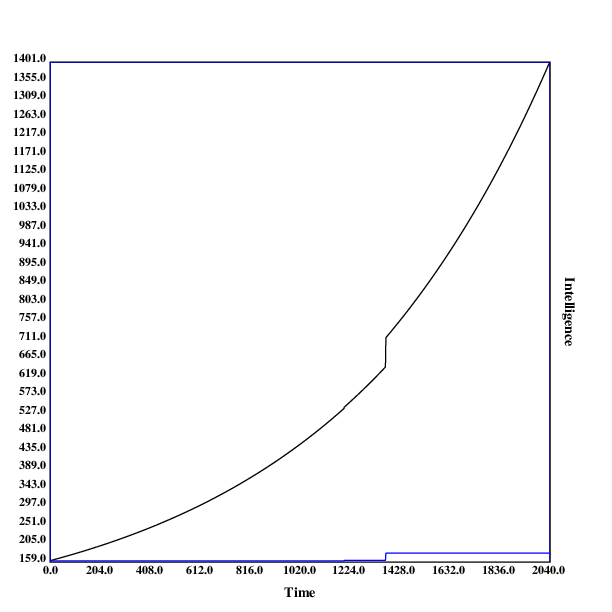

*A run in `$\mathbb{F}_{16777217}^{1}$`, with one discontinuity*

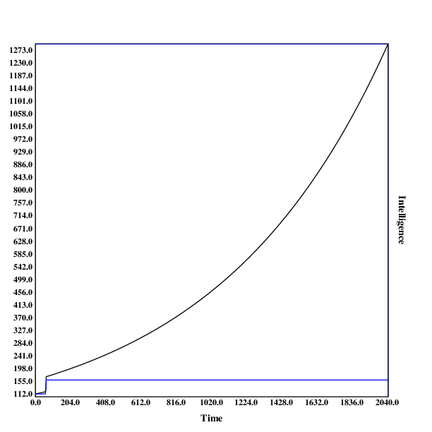

*A run in `$\mathbb{F}_{4097}^{2}$`, with one early discontinuity*

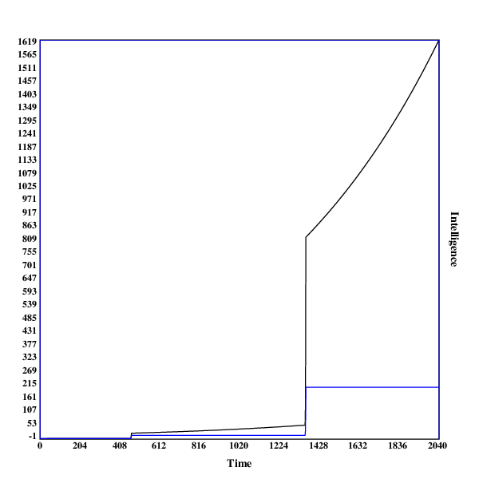

*A run in `$\mathbb{F}_{65}^{4}$`, with two discontinuities*

This run illustrates why even jumps in intelligence can be a little
surprising: the second jump in intelligence both makes the system
around 16 times more intelligent (both controlled for resources and
real-world). Using the resources the system has acquired before the jump,
its growth in real-world intelligence is much faster than beforehand.
If humans were controlling the system before the jump, it has now become
much harder (or even impossible).

.")

*A run in `$\mathbb{F}_{9}^{8}$`, with two early discontinuities*

This run contains two relatively early jumps, both of medium size. Being
the most high-dimensional model, it undermines the hypothesis that late &
big jumps are more common in more high-dimensional settings.

In some scenarios, one can observe that the model makes a very early
jump to a relatively high level of capabilities. That probably happens
due to hill-climbing to the local maximum.

An example for this is the run in `$\mathbb{F}_{65}^{3}$`:

	11.465043286618974,11.476508329905592
	79.33333333333333,79.49207933333331
	173.441875,173.9627211240668
	246.0,246.98547698424588
	246.0,247.23246246123009
	246.0,247.4796949236913
	246.0,247.72717461861495
	246.0,247.97490179323353
	246.0,248.22287669502674
	246.0,248.47109957172174

<!--
### Uniform Values

### Normal Values

### Lognormal Values
-->

Limitations
-----------

As suggested in the title, this model is very much exploratory, and is
in many regards highly inadequate for modeling real-world AI takeoff
scenarios.

### Search Space Wrong

The biggest problem with this analysis is that the space of possible
algorithms (or minds) is nothing like the finite discrete euclidean
space I have used here. I believe that the space of all algorithms is
like an infinite binary tree, with each edge representing one program
(the left child of an edge being the current program appended with 0,
the right child being the current program appended with 1, and the root
being the empty program).

The reason why I didn't use this search space was that I had no idea
how to distribute the values for intelligence in the tree, as well
as being unsure how to implement both the hill climbing as well as the
brute-force search in that space (except only tentative ideas).

### Values for Intelligence Wrong

A separate concern I have is about using the diamond square algorithm
to assign values for intelligence to points in the search space.

Diamond square was devised for producing convincing landscapes, and
therefore has following problems:

1. The values it assigns are very near each other. I expect that
algorithms differ vastly in their general intelligence, with very few
algorithms being extremely intelligent, and most others ranking very low.
2. Related to the previous point, diamond square assigns 0 as the value
of a point very rarely, although most algorithms would have intelligence
0 under a reasonable metric.

I will be experimenting to salvage both of these points. 1. could be
improved by changing the random number to assign to the current point
in the space not using a uniform distribution, but instead perhaps a
lognormal one. 2. Could be improved decreasing the numbers assigned and
then replacing negative values with 0 (or leaving them, if it turns out
that including algorithms of inverse intelligence makes sense).

### Brute-Force Search

The brute-force search in the space around the algorithm is also far from
perfect. Apart from [Vingean](https://arbital.com/p/Vingean_uncertainty/)
considerations, it seems that an AI would search the space much more
systematically, potentially ruling out large portions of the space by
proving that they can't contain more intelligent algorithms.

Furthermore, it would probably not search the space around the current
algorithm repeatedly: This leads to many repeated searches, which could
be avoided by just saving the positions of already observed points in
the search space.

Also, searching the space around the current algorithm makes hill-climbing
obsolete, unless the algorithm is so weak that the brute-force search
has a radius of less than 1: all hill-climbing steps are already included
in the portion of the search space searched in with brute-force.

<!--
### Hill Climbing

Or something stronger, such as gradient descent?
-->

### Small Dataset

The dataset I base my conclusions on is relatively small, only 14 runs,
with a different space and parameters each. This is mostly due to the
fact that I am doing this on my laptop, and didn't want the experiment
running for several days (while it is running, I can't use my browser,
because the model and my browser use more RAM than I have available,
so the model is terminated by the OS).

Generating the search-space is much more expensive than doing several runs
in the same search space, so I will focus on implementing these first.

### Small Search Spaces

The search spaces used in the model are relatively small, with the
biggest containing ~43m points, and the rest being around 25m points big.

This makes inferences about how AI systems will optimize in much bigger
(perhaps even infinite) search spaces harder.

<!--
### Additional Factors

What else? Problems with continuity?
-->

Conclusion
-----------

This text provides a toy-model for AI takeoff scenarios using
high-dimensional spaces filled using a n-dimensional variant of the
diamond square algorithm.

Running the model with limited computing power, I observe that
discontinuities indeed occur, and I hypothesize that in larger search
spaces discontinuities occur later, and are larger.

<!--TODO: this makes sense: $n^t*c<n^{t+k}*c$, i.e. later jumps of the
same factor are larger-->

However, due to multiple limitations, these conclusions are very
haphazard.

If people arguing in favour of discontinuous takeoffs agree that this
model is demonstrating one of their arguments, the main advantage of
this model could be that it now offers a more concrete case at which
skeptics can point to concrete implementation details or assumptions of
the models that they disagree with, as well as modify it and demonstrate
under which conditions no discontinuities occur.

Appendix A: Images of All Runs
-------------------------------

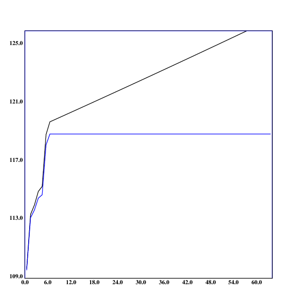

*A run in `$\mathbb{F}_{8193}^{1}$`, with no discontinuities*

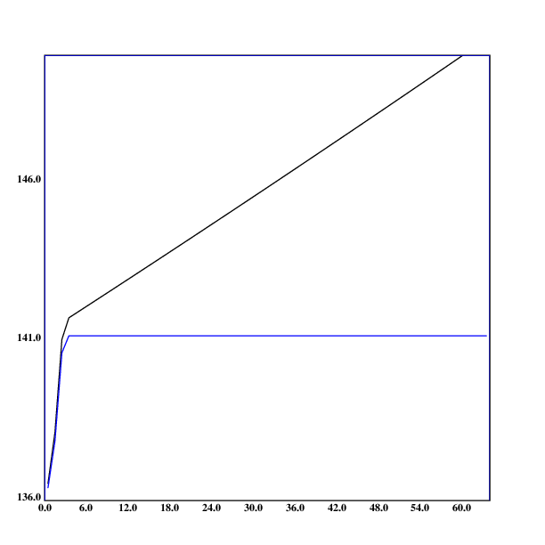

*A run in `$\mathbb{F}_{16385}^{1}$`, with no discontinuities*

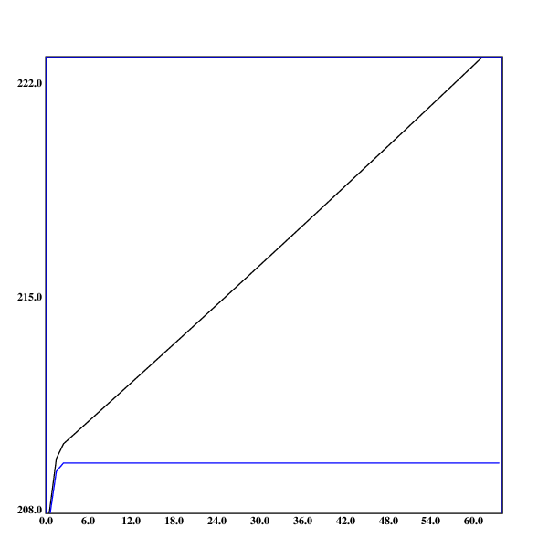

*A run in `$\mathbb{F}_{32769}^{1}$`, with no discontinuities*

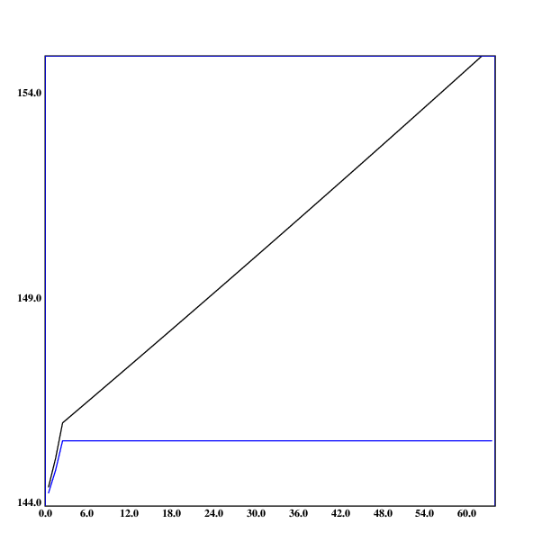

*A run in `$\mathbb{F}_{65537}^{1}$`, with no discontinuities*

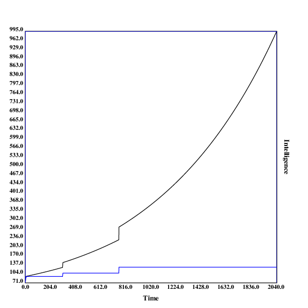

*A run in `$\mathbb{F}_{1048577}^{1}$`, with two discontinuities*

*A run in `$\mathbb{F}_{16777217}^{1}$`, with one discontinuity*

*A run in `$\mathbb{F}_{4097}^{2}$`, with one early discontinuity*

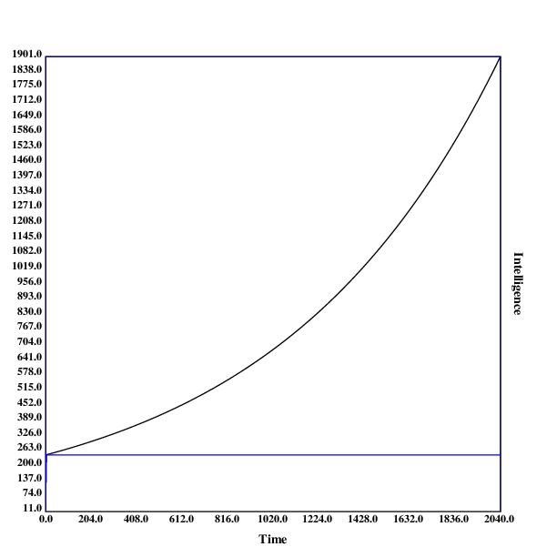

*A run in `$\mathbb{F}_{65}^{3}$`, with no discontinuities*

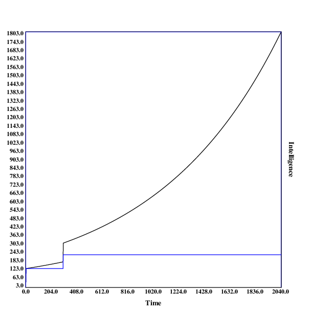

*A run in `$\mathbb{F}_{129}^{3}$`, with one discontinuity*

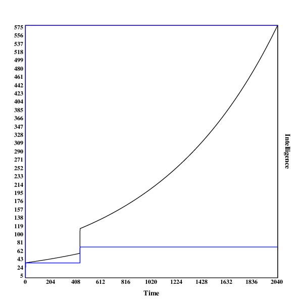

*A run in `$\mathbb{F}_{257}^{3}$`, with two discontinuities*

*A run in `$\mathbb{F}_{65}^{4}$`, with two discontinuities*

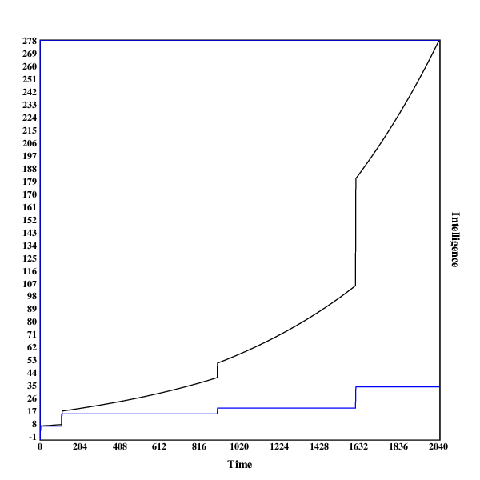

*A run in `$\mathbb{F}_{33}^{5}$`, with three discontinuities*

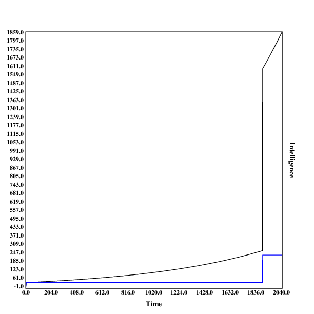

*A run in `$\mathbb{F}_{17}^{6}$`, with one discontinuity*

.")

*A run in `$\mathbb{F}_{9}^{8}$`, with two early discontinuities*

<!--
https://en.wikipedia.org/wiki/Brownian_surface
https://en.wikipedia.org/wiki/Fractal_landscape
https://en.wikipedia.org/wiki/Fractional_Brownian_motion
https://en.wikipedia.org/wiki/Gradient_descent
https://en.wikipedia.org/wiki/Newton%27s_method
https://en.wikipedia.org/wiki/OpenSimplex_noise
https://en.wikipedia.org/wiki/Perlin_noise
https://en.wikipedia.org/wiki/Simplex_noise
https://github.com/buckinha/DiamondSquare
-->
