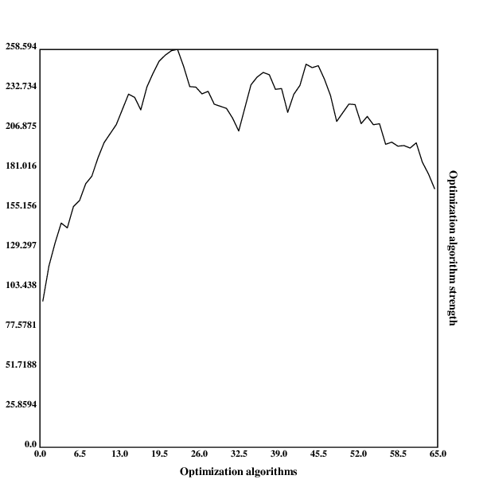
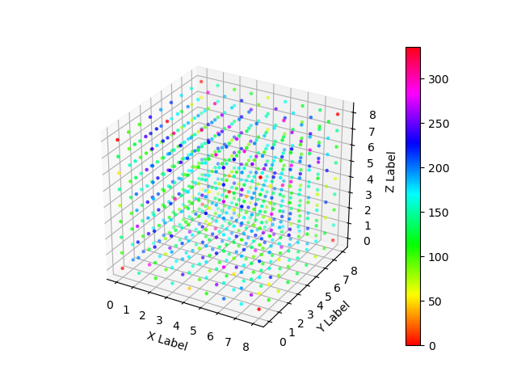

[home](./index.md)
------------------

*author: niplav, created: 2020-07-22, modified: 2020-07-31, language: english, status: draft, importance: 7, confidence: unlikely*

> __In [AI safety](https://en.wikipedia.org/wiki/AI_control_problem),
significant time has been spent on the question of
the intelligence of AI systems over time, especially during
[takeoff](https://en.wikipedia.org/wiki/Technological_singularity#Hard_vs._soft_takeoff).
An underappreciated argument in the debate has been the idea that the more
intelligent an AI system becomes, the better it can search the space of
possible optimization algorithms. This post proposes a computational model
of this process by creating a search space using the [diamond-square
algorithm](https://en.wikipedia.org/wiki/Diamond-square_algorithm)
generalized to n dimensions and then running a very simple
[hill-climbing](https://en.wikipedia.org/wiki/Hill_climbing) algorithm
and brute-force search on that space. Possible further improvements to
the model are suggested, and implications are discussed.__

An Exploratory Toy AI Takeoff Model
===================================

> Libre de la metáfora y del mito  
labra un arduo cristal: el infinito  
mapa de Aquel que es todas Sus estrellas.

*– [Jorge Luis Borges](https://en.wikipedia.org/wiki/Jorge_Luis_Borges), [“Spinoza”](https://thefunambulist.net/literature/litterature-spinoza-by-borges), 1964*

> Paraphrasing Roache (2008) the state of play is such that nobody
believes the result of a simulation, except the person who performed
the simulation, and everybody believes the result of an experiment,
except the person who ran the experiment.

*– Ryan G. McClarren, “Uncertainty Quantification and Predictive Computational Science“ p. 9, 2018*

(Although the quote apparently goes back to Einstein, see “The
advancement of science, and its burdens” p. 13, only there with "theory"
instead of "simulation").

> And let me just make an aside. There’s a lot of meta-debate that goes
on in the AI safety community which I don’t understand why: it’s not
as if we haven’t got enough real work to do. So now we have meta-debates
about whether you should focus on short-term or long-term, or whether
we should try to reduce the conflict between the short-termers and the
long-termers and it’s like, there doesn’t need to be a conflict.

*– [Stuart J. Russell](https://en.wikipedia.org/wiki/Stuart_J._Russell), [“The flaws that make today’s AI architecture unsafe and a new approach that could fix it”](https://80000hours.org/podcast/episodes/stuart-russell-human-compatible-ai/#what-most-needs-to-be-done-015014) (Episode 80 of the [80,000 hours podcast](https://80000hours.org/podcast/), 2020*

Introduction
------------

Many regard the trajectory of future AI development as
crucial<!--TODO: citation needed-->: when will AGI first be
developed? Will the development be slow, moderate, or fast (in
economic doublings, or in wallclock time)? Will one AGI system become a
[singleton](https://en.wikipedia.org/wiki/Singleton_(global_governance)),
i.e come to dominate the whole world (individual vs. collective
takeoff)? Will AGIs FOOM<!--TODO: link-->, i.e growing unexpectedly
fast? And: will there be one or more discontinuity when AI systems
recursively self-improve? This text attempts to shine light on the last
question and highlight a (supposedly underappreciated) argument for one or
more discontinuities in AI takeoff based on a computational model of an AI
searching the space of possible optimization algorithms for stronger ones.

In the model, there are three possible ways of an AI improving its
intelligence:

* By working and investing a part of the money to buy more hardware (e.g. by a cloud provider). This should growth roughly exponentially, at a similar speed to the [Gross World Product](https://en.wikipedia.org/wiki/Gross_world_product#Recent_growth)
* By performing a very simple [hill-climbing](https://en.wikipedia.org/wiki/Hill_climbing) algorithm in the space of possible optimization algorithms, such as rewriting parts of its source code in [assembly language](https://en.wikipedia.org/wiki/Assembly_language) or making trivial small performance improvements
* By [brute-force searching](https://en.wikipedia.org/wiki/Brute-force_search) the space of possible optimization algorithms, possibly in the vincinity of the current algorithm

### Existing Approaches

The Argument
------------

The Model
---------

### Generating the Search Space

#### Desiderata for the Search Space

* Sparse: Most algorithms don't really do any optimization work at all
* "Spiky": Some optimization algorithms are vastly stronger than other, very similar algorithms

### Searching the Space

#### Hill Climbing

#### Brute Force Search

Results
--------

### Uniform Values

### Lognormal Values

Limitations
-----------

### Search Space Wrong

### No Hill Climbing

### No Brute-Force Search

### Additional Factors

Conclusion
----------

Appendix A: N-Dimensional Diamond Square-Ish
--------------------------------------------

#### Square

#### Diamond

### Results

#### One Dimension

#### Two Dimensions

#### Three Dimensions

<!--Articles:
* https://aiimpacts.org/historical-growth-trends/
* https://aiimpacts.org/likelihood-of-discontinuous-progress-around-the-development-of-agi/
* https://intelligence.org/ai-foom-debate/
* https://intelligence.org/files/IEM.pdf
* https://longtermrisk.org/the-future-of-growth-near-zero-growth-rates/
* https://sideways-view.com/2018/02/24/takeoff-speeds/
* https://www.lesswrong.com/posts/5WECpYABCT62TJrhY/will-ai-undergo-discontinuous-progress
* https://www.lesswrong.com/posts/66FKFkWAugS8diydF/modelling-continuous-progress
* https://www.lesswrong.com/posts/77xLbXs6vYQuhT8hq/why-ai-may-not-foom
* https://www.lesswrong.com/posts/CjW4axQDqLd2oDCGG/misconceptions-about-continuous-takeoff
* https://www.lesswrong.com/posts/JBadX7rwdcRFzGuju/recursive-self-improvement
* https://www.lesswrong.com/posts/YgNYA6pj2hPSDQiTE/distinguishing-definitions-of-takeoff
* https://www.lesswrong.com/posts/cxgtQXnH2uDGBJJGa/redefining-fast-takeoff
* https://www.lesswrong.com/posts/tjH8XPxAnr6JRbh7k/hard-takeoff
* https://www.openphilanthropy.org/focus/global-catastrophic-risks/potential-risks-advanced-artificial-intelligence/ai-timelines
-->

<!--
https://en.wikipedia.org/wiki/Brownian_surface
https://en.wikipedia.org/wiki/Fractal_landscape
https://en.wikipedia.org/wiki/Fractional_Brownian_motion
https://en.wikipedia.org/wiki/Gradient_descent
https://en.wikipedia.org/wiki/Hill_climbing
https://en.wikipedia.org/wiki/Newton%27s_method
https://en.wikipedia.org/wiki/OpenSimplex_noise
https://en.wikipedia.org/wiki/Perlin_noise
https://en.wikipedia.org/wiki/Simplex_noise
https://github.com/buckinha/DiamondSquare
https://nullprogram.com/blog/2007/11/20/
-->

