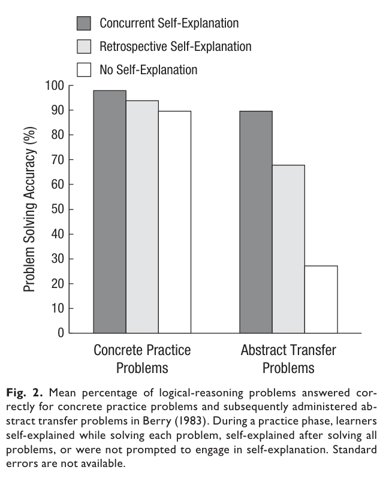
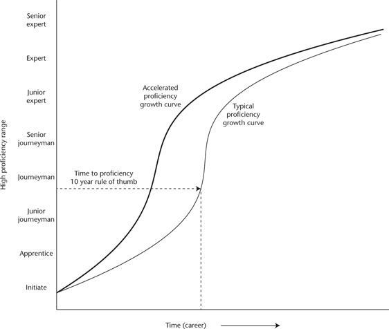
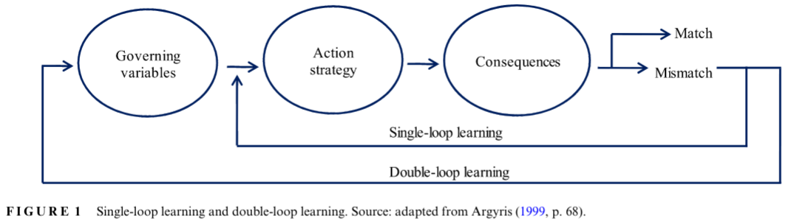

[home](./index.md)
------------------

*author: niplav, created: 2024-02-28, modified: 2024-10-30, language: english, status: on hold, importance: 6, confidence: possible*

> __I examine the literature on transfer learning in humans. [Far
transfer](#Far_Transfer) is difficult to achieve, best
candidate interventions are to [practice at the edge of one's
ability and make many mistakes](#Error_Management_Training),
[evaluate mistakes](#Inducing_Transfer) after one has made
them, [learn from training programs modeled after expert tacit
knowledge](#Accelerated_Expertise), and [talk about on one's strategies
when practicing the domain](#Effective_Learning_Techniques).__

Transfer Learning in Humans
============================

When learning, one would like to progress faster, and learn things
faster. So it makes sense to search for interventions that speed up
learning (effective learning techniques), enable using knowledge
and knowledge patterns from one learned domain in a new domain if
appropriate (transfer learning), and make it easier to find further
learning-accelerating techniques (meta-learning).

Summary
--------

I've spent ~20 hours reading and skimming
papers and parts of books from different fields,
and extracting the results from them. Resulting spreadsheet
[here](https://docs.google.com/spreadsheets/d/1-_EuaLf1Fau7hhH-9lvzec-hhiswmRM2rey2bfbp8mA/),
google doc with notes
[here](https://docs.google.com/document/d/1EjgQJi8XOkiaQg74V1tFgEhFXlg_ueb0Z9N7ABEg4NU/).

I've looked at 50 papers, skimmed 20 and read 10 papers and 20% of a book.
In this text I've included all sufficiently-different interventions I've
found that have been tested empirically.

For interventions tried by scientists I'd classify them into (ordered
by how relevant and effective I think they are):

1. __[Error-based learning](#Error_Management_Training)__ in which trainees deliberately seek out situations in which they make mistakes. This has *medium to large effect sizes* at far transfer.
2. __Long Training Programs__: These usually take the form of one- or two-semester long classes on decision-making, basic statistics and spatial thinking, and produce [far transfer](#Far_Transfer) at *small to medium effect sizes*. Such programs take a semester or two and are usually tested on high-school students or university students.
3. __Effective Learning Techniques__: [Things like](#Effective_Learning_Techniques) doing tests and exercises while learning, or letting learners generate causal mechanisms, which produce *zero to or best small amounts* of far transfer but speed up learning.
4. __OODA-loop-likes__: Methods that structure the problem-solving process, such as the [Pólya method](#Plya_Method) or [DMAIC](https://en.wikipedia.org/wiki/DMAIC). In most cases, these haven't been tested well or at all, but they are popular in the business context. Also they look all the same to me, but probably have the advantage of functioning as [checklists](https://en.wikipedia.org/wiki/Checklist_Manifesto) when performing a task.
5. __Transfer Within Domains__: Methods that are supposed to help with getting knowledge about a particular domain [from an expert to a trainee](#Accelerated_Expertise), or from [training to application on the job](https://www.semanticscholar.org/paper/Training-Transfer%3A-An-Integrative-Literature-Review-Burke-Hutchins/b4432f65b76d9a8d44b8ff68fd01239134f9aec5). Those methods have a high fixed cost since experts have to be interviewed and whole curricula have to be created, but they work *very well* at the task they've been created for (where training sometimes is sped up by more than an order of magnitude).

Additionally, most of the research is on subjects which are probably
not intrinsically motivated to apply a technique well (i.e. high school
students, military trainees, and university students), so there is
a bunch of selection pressure on techniques which still work with
demotivated subjects. I expect that many techniques work much better
with already motivated subjects, especially ones that are easy to
[Goodhart](https://en.wikipedia.org/wiki/Goodharts_law).

In general, the tension I was observing is that industry and the military
are the ones who perform well/do non-fake things, but academia are the
ones who actually measure and report those measures to the public.

From when I've talked with people from industry, they don't seem at
all interested in tracking per-employee performance (e.g. Google isn't
running RCTs on their engineers to increase their coding performance,
and estimates for how long projects will take [are not tracked
& scored](./eschews.html#Software_Development_Effort_Estimation)).
I also haven't seen many studies quantifying the individual performance
of employees, especially high-earning white collar knowledge-workers.

### Recommendations

1. If you want to [learn faster](#Effective_Learning_Techniques):
	1. [Make and seek out errors during learning/training](#Error_Management_Theory). *Importance: 7*[^6]
	2. Spend a lot of time on practice problems. *Importance: 7*
	3. Revisit basics of a field while you're learning. *Importance: 4*
	4. Talk about why you're doing what you're doing, while you're doing it. *Importance: 3*
1. If you want to solve problems:
	1. Try to get feedback on both the process and the outcomes of what you're doing. *Importance: 8*
	2. Explicitly [analyse errors after you've made them](#Inducing_Transfer)[^4]. *Importance: 5*
	3. If there are already experts at the problem you're trying to solve, [interview them in a systematic fashion](https://commoncog.com/accelerated-expertise/) to [extract](https://commoncog.com/an-easier-method-for-extracting-tacit-knowledge/) their [tacit knowledge](https://commoncog.com/the-tacit-knowledge-series/). *Importance: 7*
		1. With enough institutional support this can be turned into a training program.
	4. If there are no experts in the domain where you're trying to solve a problem.
		1. Search for related domains and extract existing tacit knowledge there, or learn those domains—the closer the better. *Importance: 4*
		2. Apply the [Pólya method](#Pólya_Method). *Importance: 3*
			1. Understand the problem.
			2. Devise a plan.
			3. Carry out the plan.
			4. Look back.

[^6]: The importance scores are purely subjective.

If you think that these recommendations are kind of unsatisfying,
I agree with you.

What I Am Looking For
-----------------------

Given a broad set of skills `$S$`, I was looking for an intervention/a
set of interventions `$I$` which has the following properties:

1. After applying `$I$`, an average adult can now learn skills from `$S$` is on average much faster counterfactually to not having applied `$I$`.
2. Applying `$I$` and learning `$S$` is easier than just learning all skills `$S$`.
3. `$S$` is large (or actually encompasses all skills humans have).
4. Optional: `$I$` is *relatively* easy to apply, that is it doesn't need a lot of institutional setup.
5. Optional: `$I$` can be applied to itself, and to find better interventions `$I'$` that have the same properties as `$I$`.

Research on transfer learning in humans isn't clearly differentiated from
the research into effective learning techniques. Transfer learning and
meta-learning are more focused on crossing the theory-practice gap and
making progress in domains where we don't yet have detailed knowledge.

Therefore, I tried to find more information from well-performing
institutions such as the military and large corporations, de-emphasizing
research done in universities and schools (I found this difficult because
universities tend to have more incentive to publish their techniques,
and also strive to quantify their benefits).

Candidate Interventions
------------------------

### Effective Learning Techniques

I found several studies from psychology, especially educational
psychology.

[Dunlosky et al.
2017](https://www.wku.edu/senate/documents/improving_student_learning_dunlosky_2013.pdf)
is the best review of the evidence effective learning techniques
I've found. It examines ten candidate interventions, and singles
out two interventions as having high utility and two interventions
as having moderate utility for tasks similar to learning material
in a school-context, e.g. basic biology, basic economics, simple
procedure-based mathematics &c.

1. High utility:
	1.	__Practice testing__: Testing oneself on the target domain
		in a low-stakes context, ideally repeatedly. Think [spaced
		repetition](https://www.gwern.net/Spaced-repetition) with
		flashcards, or preparing for exams by doing exams from previous
		years. They mention that practice testing generalizes across
		formats (e.g. from simple recall to short answer inference tests).
		Can generate *far transfer*.
		1.	p. 30: "practice testing a subset of information
			influences memory for related but untested information"
	2.	__Distributed practice__: Practice that happens
		spread out over a longer amount of time, instead
		of cramming. This gain is also captured via [spaced
		repetition](https://www.gwern.net/Spaced-repetition). They do
		not mention any transfer benefits here.
2. Moderate utility:
	1.	__Elaborative interrogation__/__Self-explanation__[^2]:
		Generating and saying[^1] an explanation for why an
		explicitly stated fact or concept is true. This most helps
		learners who already know a lot about the target domain, and
		works best if it is done *during* the learning process.
		1. 
	2.	__Interleaved practice__: When learning, repeat basic
		material while learning more advanced material. The
		advantages over distributed practice testing seems
		moderate, but (p. 38): "interleaved practice helped
		students to discriminate between various kinds of
		problems and to learn the appropriate formula to apply
		for each one". Works better on mathematics[^3].

[^1]: Judging from [Dunlosky et al. 2017](https://www.wku.edu/senate/documents/improving_student_learning_dunlosky_2013.pdf) the participants in the various studies were asked to verbally explain their reasoning. It's not said how writing the explanation instead of saying it compares.
[^2]: The two techniques are treated separately in the paper, but as far as I can tell mostly for historical reasons.
[^3]: This is supported by the theory of [transfer-appropriate processing](https://en.wikipedia.org/wiki/Transfer-appropriate_processing), which puts an especially strong emphasis on the encoding and retrieval of learned information. As far as I understand, the recapitulation of basic knowledge in the context of more advanced knowledge allows for a more accurate re-encoding of the basic knowledge. This also tracks with my experience of learning mathematics: I've gotten more mileage out of understanding basic concepts deeply (e.g. how probabilities, logits and bits fit together), than understanding more advanced concepts shallowly.

#### What Didn't Work

The techniques classified as low utility are: summarization of some
learned material, highlighting, using keywords/mnemonics, creating
imagery for textual material while learning, and re-reading. I'm not
surprised at all that highlighting and re-reading aren't effective in
a school context. I'm also a little bit surprised that keywords and
mnemonics don't work (since they are used very often by competitive
[mnemonists](https://en.wikipedia.org/wiki/Mnemonist)), as well
as for mental imagery, since professional mathematicians so often
use visualizations.

I'm moderately intrigued by their finding that summarization
doesn't work, since I've heard from several acquaintances that
it's good practice, but I think this is because it's very easy to
[cargo-cult](https://en.wikipedia.org/wiki/Cargo-cult) and just paraphrase
the previous material.

### Far Transfer

__Summary__: Far transfer occurs if one puts in a lot of effort,
e.g. after doing semester- or year-long courses on decision-making and
such. The effect sizes on general abilities tests are medium (d≈0.3).

Far transfer is:

> improved performance at problems that are similar to but also
substantially different from ones experienced during training (e.g.,
fault diagnosis in process control to fault diagnosis in telecommunication
networks).

*—Hoffman et al., “Accelerated Expertise”, 2014*

One obvious intervention is to have a class in which one person tells
other people about how to do good decisions, make tradeoffs, reason
about statistical quantities, think spatially and improve mental imagery.

These kinds of interventions have been tried in schools, and they are
generally a little bit more effective than I would've expected, yielding
medium effect sizes. However, most of the relevant papers that show those
medium effect sizes are from the dark period in psychology. I think they
look okay[^5], but would want to look into them a bit more before making
strong conclusions.

[^5]: I have some quibbles about the randomization in Herrnstein et al. 1986 (which happens on a class-level and not on an individual level), and the way effect sizes are measured in Fong et al. 1986.

The relevant papers are:

* [Herrnstein et al. 1986](https://www.researchgate.net/profile/Raymond-Nickerson/publication/232424806_Teaching_Thinking_Skills/links/564b3d0408ae3374e5dd841b/Teaching-Thinking-Skills.pdf): n=895 Venezuelan high-school students (mean age 13.22 years), controlled trial. Intervention was a year-long course on decision-making (four days a week), others received a control course (it's not clear what this control course was about). Effect sizes on various general intelligence tests are d=0.35 (General Abilities Test), d=0.43 ([OLSAT](https://en.wikipedia.org/wiki/Otis-Lennon_School_Ability_Test)), d=0.11 ([CATTELL](https://en.wikipedia.org/wiki/Cattell_Culture_Fair_Intelligence_Test)), all at statistical significance.
* [Fong et al. 1986](https://deepblue.lib.umich.edu/bitstream/handle/2027.42/26118/0000194.pdf;sequence=1): n=347 adults and high-school students were instructed on the [law of large numbers](https://en.wikipedia.org/wiki/Law_Of_Large_Numbers), from just reading a description (control) to working through examples where the law was and was not applicable (intervention). They were then tested on the application of the law to new problems. Effect size was 1 logit (which corresponds to d≈0.55 [IIUC](https://en.wiktionary.org/wiki/IIUC)).
* [Cortes et al. 2022](https://www.science.org/doi/epdf/10.1126/sciadv.abo3555): n=182 high-school students, either (intervention) receiving a semester-long course of geospatial information systems with a CS-focus or (control) not receiving such a course, tested on spatial and verbal problems. Yielded a very small but positive effect ([Cohen's f](https://en.wikipedia.org/wiki/Effect_size#Cohens_f2)≤0.2).

<!--TODO: put in another section? Where?-->

#### Negative Transfer

It sometimes happens that training at one domain then *reduces*
performance at another domain. A common example is learning to drive on
the right side of the road and then having to drive on the left side.

This doesn't seem to appear very often, but is still interesting from a
[no-free lunch](https://en.wikipedia.org/wiki/No-free-lunch_theorem)
perspective.

### Error Management Training

__Summary__: If it is obvious that an error has occurred, and errors
are affordable, then making errors during training transfers the learned
knowledge surprisingly well (d=0.8).

[Error Management
Training](https://en.wikipedia.org/wiki/Error_management_theory) (EMT)
is a type of training in which making errors during exploration while
learning is actively encouraged. Trainers encourage learners to make
errors and reflect on those errors while learning, but don't give much
guidance beyond that.

[Keith & Frese
2008](http://fox.leuphana.de/portal/files/607254/Keith_frese_Error_Manag_Train_Metacongition_Em_control_JAP05.pdf)
perform a meta-analysis analysing studies training participants to use
software tools or learn programming languages (n=2183), comparing EMT
to training that encourages error-avoidance, and find that EMT has a
medium-sized advantage over error-avoiding training methods (d=0.44).

EMT shows *larger* effect sizes over error-avoiding methods with more
demanding transfer: d=0.56 for performance after training, and d=0.8 for
transfer that requires modifying learned procedures to fit new contexts
(adaptive transfer). This advantage only occurs if there is clear feedback
on whether an error has occurred or not.

One is reminded of [Umeshisms](https://www.scottaaronson.com/blog/?p=40):
If you never fail, you're underperforming.

Anecdotally, when I've tried tutoring someone in programming for
fun, I tried to give the person assignments that they would only
be able to solve 50% of the time. I don't know whether this is
always optimal, but being wrong 50% of the time maximizes the
entropy of the reward signal, and combats the [problem of sparse
rewards](https://www.geeksforgeeks.org/sparse-rewards-in-reinforcement-learning/).

### Pólya Method

__Summary__: Evidence is pretty scant, but one paper shows suspiciously
large effects. Worth investigating for a little bit, especially since
it's often recommended by research mathematicians.

Another interesting-looking strand of research were tests of the
[Pólya method](https://en.wikipedia.org/wiki/How_To_Solve_It). The
Pólya method is a four-step problem-solving method, with the [four
steps being](https://math.berkeley.edu/~gmelvin/polya.pdf)

1. Understand the problem
2. Devise a plan
	1.	The book "How to Solve It"
		also has a list of [problem solving
		strategies](https://en.wikipedia.org/wiki/How_to_Solve_It#Second_principle:_Devise_a_plan)
3. Carry out the plan
4. Look back

This is a variant of the [OODA
loop](https://en.wikipedia.org/wiki/OODA_Loop), with the difference that
a lessened time pressure allows forming a whole plan (not just a decision)
and for reflection after carrying out the plan.

The relevant papers all test on learning basic
mathematical problem solving skills in [plane
geometry](https://en.wikipedia.org/wiki/Plane_Geometry) and
[fractions](https://en.wikipedia.org/wiki/Fractions), and their results

1. [Nasir & Syartina 2021](https://jurnal.syekhnurjati.ac.id/index.php/eduma/article/viewFile/8700/3969): n=32 Indonesian high-school students, non-RCT, only observational. Effect size d=0.71, but that's not super impressive given it's not an RCT.
2. [Widiana et al. 2018](http://edulearn.intelektual.org/index.php/EduLearn/article/viewFile/4526/5353): n=138 elementary school children, RCT. I'm not *entirely* sure about this, but based on their Table 1 and [this calculator](https://www.socscistatistics.com/effectsize/default3.aspx) I get __d=2.4__, which I find really hard to believe. I think I'm making a mistake`$_{60\%}$` or the paper is fraudulent`$_{40\%}$`.
3. [Hayati et al. 2022](https://jestec.taylors.edu.my/Special%20Issue%20ICMScE2022/ICMScE2022_04.pdf): n=40 Indonesian high-school children. This paper is so confusingly written I can't extract any meaning from it.

For some weird reason, the only scientists who have investigated the
Pólya method experimentally are Indonesian. I have no idea why.

### Accelerated Expertise

__Summary__: With a lot of institutional support, one can extract
knowledge from experts and use it to create better training programs.
This requires a large institution to be worth it, but straightforwardly
works at achieving its goals.

Accelerated Expertise ([Hoffman et al.,
2014](https://www.goodreads.com/book/show/17399473-accelerated-expertise))
was motivated by getting military recruits up to speed quickly before
moving them to deployment. It focuses on the case in which there are
already experts for a given domain, and one aims to move the skills from
domain experts into the mind of new recruits as quickly as possible. They
are skeptical that any training can make trainees much better at the
domain than experts with a lot of experience.

[Chin 2024](https://commoncog.com/accelerated-expertise/) summarizes the
goals of the research project that lead to the book as attempting to speed
up the time from being a beginner at a specific task or set of tasks to
being proficient at that task (hence the name "Accelerated Expertise").

For this, Hoffman et al. have developed a series of multiple steps for
creating training programs for new recruits.

1. Identify domain experts
2. Use [Cognitive Task Analysis](https://commoncog.com/an-easier-method-for-extracting-tacit-knowledge/) to extract expert knowledge
3. Build a case library of difficult cases
4. Turn case library into a set of training simulations
5. Optional: Include introspection & reflection in the program
6. Optional: Teach abstract/generalized principles
7. Test the program

The book contains a literature review on transfer in chapter 5 which
afaik is the best collected resource on transfer learning in humans. They
summarize the chapter by remarking that not artificially "dumbing down"
a domain when a beginner tries to learn it can delay learning in the
beginning, but speed up learning in the long run because it prevents
misunderstandings from becoming entrenched.

__Epistemic Effort__: Read 20% of Accelerated Expertise, and skim-read
several blogposts based on the book.

#### Inducing Transfer

Hoffman et al. also summarize the methods for inducing transfer:

> Transferring a skill to new situations is often difficult but can
be promoted by following a number of training principles: employing
deliberate practice, increasing the variability of practice, adding
sources of contextual interference, using a mixed practice schedule,
distributing practice in time, and providing process and outcome feedback
in an explicit analysis of errors.

*—Hoffman et al., [“Accelerated Expertise”](https://www.goodreads.com/book/show/17399473-accelerated-expertise) p. 176, 2014*

I'd also have liked to dive deeper on extracting expert knowledge,
which looks important especially in novel domains like AI alignment.

### Dual N-Back and Brain Training

__Summary__: Increases working memory, but probably not IQ.

I re-read parts of [Gwern 2019](https://gwern.net/dnb-faq) and [Gwern
2018](https://gwern.net/dnb-meta-analysis), and come away with believing
that if one is bottlenecked by working memory, n-back is worth it, but
it doesn't work well for increasing intelligence. Replication status
[is mixed](https://forrt.org/reversals/#cognitive-psychology).

### Judgmental Forecasting

__Summary__: I didn't find anything on whether learned forecasting
ability transfers across domains. The best paper I could find didn't
look related at all.

The evidence from the judgmental forecasting research is confusing. On
the one hand, it's widely known that domain-level experts are [not
very good](https://en.wikipedia.org/wiki/Expert_Political_Judgment)
at making predictions about their own domain, and are outcompeted by
[superforecasters](https://en.wikipedia.org/wiki/Superforecasting)
who are just generally good at predicting.

On the other hand, the vibe given by forecasters and forecasting
researchers leads to statements like this one:

> By the way, there are no shortcuts. Bridge players may develop
well-calibrated judgment when it comes to bidding on tricks, but *research
shows that judgment calibrated in one context transfers poorly*, if at
all, to another. So if you were thinking of becoming a better political
or business forecaster by playing bridge, forget it.

*—Philip E. Tetlock & Dan Gardner, “Superforecasting” p. 179, 2015*

I tried to find the research this paragraph is talking about by asking
in a couple of discord servers and messaging the [Forecasting Research
Institute](https://forecastingresearch.org/), but the response I got
referred directly to the bridge finding, which I wouldn't have to expected
to work anyway.

I now want to analyze my [own judgmental forecasting
datasets](./iqisa.html) to figure out how much forecasting ability
generalizes across (forecasting) domains.

Creating Self-Improving Institutions
--------------------------------------

__Summary__: Organizations can become organizations that improve their
governing variables. Inducing this is very tricky. Events that can
induce double-loop learning in an organization include a change to
leaders which value reflection and dialogue, and the introduction of
software tools, such as systems which are used for prediction, which
then provide feedback.

*Double-loop learning* is a method to improve learning of organizations,
taking into account the learning process itself.

[Auqui-Caceres & Furlan
2023](https://onlinelibrary.wiley.com/doi/pdf/10.1111/emre.12615) review
the evidence on double-loop learning.

They report on several interventions:

* Tested:
	* [Integrative Double-Kaizen Loop](https://ieeexplore.ieee.org/document/8345680) → implemented and saw improvements, but no controls
	* Writing and iterating on simulation software ("simulation modeling"/machine learning models) → Induced double-loop learning in two different papers
* Tested, didn't work:
	* PIER (Problem-based learning, Interactive multimedia, Experiential learning, and Role-playing) → Allegedly failed because leadership didn't participate
	* Briefing-debriefing sessions → Allegedly failed because the tested protocol didn't include communicating up the hierarchy
	* Incident-reporting systems → No change observed
* Proposed but, as far as I understand, not tested:
	* [DMAIC](https://asq.org/quality-resources/dmaic)
	* ["Circular organization"](https://www.proquest.com/docview/197599398)

> […] these studies maintain that the most prominent barrier to generate
DLL is defensive reasoning and routines (Bochman & Kroth, 2010; Clarke,
2006; Kwon & Nicolaides, 2017; Sisaye & Birnberg, 2010; Stavropoulou et
al., 2015; Sterman, 1994; Wong, 2005), which are produced by participants
in DLL processes, whenever assumptions underlying taken-for-granted
procedures, practices, or policies are challenged. Although people are
aware that they should not use defensive reasoning to deal with daily work
difficulties and challenges (Thornhill & Amit, 2003), they still use them
to avoid losing control and dealing with embarrassment (Mordaunt, 2006).

*—Auqui-Caceres & Furlan, [“Revitalizing double-loop learning in organizational contexts: A systematic review and research agenda”](https://onlinelibrary.wiley.com/doi/pdf/10.1111/emre.12615) p. 14, 2023*

How I'd Proceed If I Was Further Researching Transfer
------------------------------------------------------

One thing I'd like to get clear on is the type I imagine a good
intervention for increasing transfer would have.

1. Obvious interventions with subtle improvements and details30%
2. [Doing more](https://www.lesswrong.com/posts/z8usYeKX7dtTWsEnk/more-dakka) of one intervention/combination of existing interventions30%
3. Really complicated intervention with many moving parts10%
4. Creative novel approach which no one has thought of before5%
5. Something else25%

### Questions

1. Is it better to perform elaborative interrogation verbally, or is it as good to write things down?
2. What is the optimal amount of "going back to the basics" to deepen understanding over time?
	1. Spaced repetition schedules are one suggestion, but they're only geared towards remembering, not deepening understanding.
	2. When learning a domain, what determines the frontier at which one should be trying to improve?
		1. Is it best to make mistakes 50% of the time, or less often, or more often?
		2. How much does this depend on the domain in question?
3. Do people generalize within judgmental forecasting, across question asking domains?
4. Why do so many papers I've found to gravitate to the "better learning techniques" bucket?
	1. Accelerated expertise falls outside of that category, as would things like physical exercise before learning, or meditation, or pharmaceutical interventions.
5. Which techniques do really successful consultancies or investment firms use for problem-solving ability?
6. To what extent do existing interventions also try to tackle low motivation?
	1. Given people who are already motivated, would the profile of successful interventions look different?
	2. Which interventions would be better?
7. Under which conditions does negative transfer happen?
	1. Could it be that negative transfer is more common than normally though?

Context
--------

This review was written after
[Raemon](https://www.lesswrong.com/users/raemon)
comissioned me to research transfer learning in humans,
in the context of his new project on [feedback-loop-first
rationality](https://www.lesswrong.com/posts/pZrvkZzL2JnbRgEBC/feedbackloop-first-rationality).

Appendix A: My Impression of the Literature
---------------------------------------------

After spending a dozen hours researching this area, my current impression
is that this is something that too many different fields are interested
in; among them are business people, military psychologists, education
researchers, neuroscientists, cognitive psychologists…

This results in a wild outgrowth of terminology: "transfer of learning",
"learning to learn", "deutero-learning", "double-loop learning", "design
thinking", "adaptive learning" &c. In my research I don't think I've
encountered a paper being cited by two different papers, which suggests
there's more than a thousand papers grasping at the same question of
transfer learning.

<!--Have people figured anything out, did they do obvious or just
seemingly obvious things-->

[^4]: Since everything is judgmental-forecasting-shaped, one could test this by letting forecasters elaborate on their forecasts and at resolution time analyse their elaborations. I've [tried doing this](./notes_on_predictions.html) but it fell off for other projects.

See Also
---------

* [Ricón 2020](https://nintil.com/bloom-sigma/#darpa-s-study) on a DARPA study with a digital tutor for a specific domain, showing __d=2.81__ improvement
* [Meta-Learning: Learning to Learn Fast (Weng, 2018)](https://lilianweng.github.io/posts/2018-11-30-meta-learning/)
* [Meta Reinforcement Learning (Weng, 2019)](https://lilianweng.github.io/posts/2019-06-23-meta-rl/)
* Discussions
	* [LessWrong](https://www.lesswrong.com/posts/QTTCRytvyFteJgPwg/transfer-learning-in-humans)
