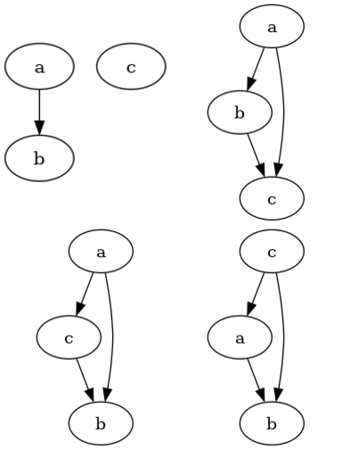
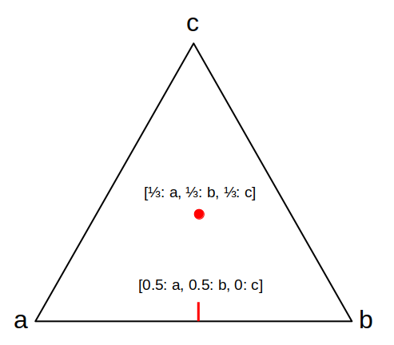

[home](./index.md)
-------------------

*author: niplav, created: 2022-03-04, modified: 2022-07-28, language: english, status: notes, importance: 8, confidence: likely*

> __Representing inconsistent preferences with specific mathematical
structures can clarify thoughts about how to make those preferences
consistent while only minimally changing them. This is discussed in
the case of preferences over world states, represented by [directed
graphs](https://en.wikipedia.org/wiki/Directed_graph); and preferences
over [lotteries](https://en.wikipedia.org/wiki/Lottery_\(probability\))
of world states, represented either by infinitely dense
graphs, (in some cases) vector fields over probability
simplices, or edge-weighted directed graphs. I also present
an algorithm for the discrete case based on the [graph edit
distance](https://en.wikipedia.org/wiki/Graph_Edit_Distance). Implications
for scenarios such as [ontological
shifts](https://arbital.com/p/ontology_identification/) are discussed.__

<!--https://www.lesswrong.com/posts/QZM6pErzL7JwE3pkv/niplav-s-shortform?commentId=XRmMoNCPmDhvyLzwc-->
<!--https://www.lesswrong.com/posts/ky988ePJvCRhmCwGo/using-vector-fields-to-visualise-preferences-and-make-them-->
<!--TODO: THIS FRICKING THING: https://www.lesswrong.com/posts/6RjL996E8Dsz3vHPk/two-more-decision-theory-problems-for-humans#Partial_Utility_Function_Problem-->

Turning Some Inconsistent Preferences into Consistent Ones
===========================================================

> A kind of God-made (or evolution-created) fairness between species is
also unexpectedly found.

*— [Yew-Kwang Ng](https://en.wikipedia.org/wiki/Yew-Kwang_Ng), [“Towards Welfare Biology: Evolutionary Economics of Animal Consciousness and Suffering”](./doc/biology/welfare/towards_welfare_biology_evolutionary_economics_of_animal_consciousness_and_suffering_ng_1995.pdf) p. 1, 1995*

> Random testing is simple in concept, often easy to implement, has been
demonstrated to effectively detect failures, is good at exercising systems
in unexpected ways (which may not occur to a human tester), and may be
the only practical choice when the source code and the specifications
are unavailable or incomplete.

*— Tsong Yueh Chen/Fei-Ching Kuo/Robert G. Merkel/T.H. Tse, [“Adaptive Random Testing: the ART of Test Case Diversity”](./doc/cs/reduction/adaptive_random_testing_chen_et_al_2010.pdf), 2010*

Consider an agent which displays ([von
Neumman-Morgenstern](https://en.wikipedia.org/wiki/Von_Neumann-Morgenstern_utility_theorem))
inconsistent [preferences](https://en.wikipedia.org/wiki/Preference),
for example choosing two incompatible
options in the two scenarios in the [Allais
paradox](https://en.wikipedia.org/wiki/Allais_paradox), or reliably
displaying [cycles](https://en.wikipedia.org/wiki/Cycle_\(graph_theory\))
in its actions (detecting which actions are in fact caused by
inconsistent preferences, and not just exotic ones from weird
abstractions, is considered a separate problem here). We might want
to interact with that agent, e.g. trade with it, help it (or exploit
it), or generally know how it will act But how to go about that if the
agent displays inconsistent preferences? Perhaps it might even be the
case that humans are such agents, and find ourselves in a conundrum:
we know our preferences are inconsistent and reliably exploitable,
and that agents with such preferences [reliably fare worse in the
world](https://www.lesswrong.com/s/FYMiCeXEgMzsB5stm/p/RQpNHSiWaXTvDxt6R),
we might want to change that.

A possible approach to this problem has two steps:

1. Find ways to represent inconsistent preferences with a mathematical structure which can encode all possible violations of the von Neumann-Morgenstern axioms in all their combinations.
2. Then turn those inconsistent preferences into consistent ones, and then inform the agent about these inconsistencies and their optimal resolutions (or, in the case of trying to help the agent, then enacting these preferences in the real world).

Mathematical Formulation of the Problem
----------------------------------------

Define a set of possible (von Neumann-Morgenstern) inconsistent
preferences over a set `$W$` of worlds as `$\not\curlyvee$`, and the set
of consistent preferences over those worlds as `$\curlyvee$`. Elements
from those sets are written as `$\succsim \in \not\curlyvee$` and
`$\succeq \in \curlyvee$`.

One way we could approach the problem is by trying to turn those
inconsistent preferences consistent, i.e. constructing a function `$t:
\not \curlyvee \mapsto \curlyvee$` that takes an inconsistent preference
`$\succsim$` and transforms it into a consistent preference `$\succeq$`,
while retaining as much of the original structure of the preference
as possible (it would make little sense if we replaced the original
preference relation with e.g. indifference over all options).

Formally, we want to find for some given [distance
metric](https://en.wikipedia.org/wiki/Metric_\(mathematics\))
`$d: \not \curlyvee \times \curlyvee \mapsto ℝ$` a function
`$t$` so that

	$$t= \underset{t}{\text{argmin }} d(\succsim, t(\succsim)) \\
	\succeq=t(\succsim)$$

I call this function a __turner__, and sometimes call the results of
that function the __set of turnings__ (an element from that set is a
__turning__). The names mostly chosen for not having been used yet in
mathematics, as far as I know, and because I want to be a little extra.

A solution to the problem of turning inconsistent preferences into
consistent ones then has these components:

1. A mathematical structure for representing `$\not \curlyvee$` and `$\curlyvee$`
	* Inconsistent preferences over discrete options are represented via [directed graphs](https://en.wikipedia.org/wiki/Directed_graph)
	* Inconsistent preferences over [lotteries](https://en.wikipedia.org/wiki/Lottery_\(probability\)) of options are represented via
		* directed graphs over [probability simplices](https://en.wikipedia.org/wiki/Simplex)
			* potentially more exotic structures such as [graphons](https://en.wikipedia.org/wiki/Graphon) or results from [extremal graph theory](https://en.wikipedia.org/wiki/Extremal_graph_theory) might be relevant here, but I haven't investigated these in detail
		* vector fields on probability simplices
		* [graphs with edge weights](https://en.wikipedia.org/wiki/Graph_\(discrete_mathematics\)#Weighted_graph) in `$ℝ$`
2. A specification for `$t$`
	* In the case of discrete options, I propose adding and removing edges from the directed graph
	* In the case of lotteries I don't have yet any clear proposals
3. A specification for `$d$`
	* In the case of discrete options, I propose using the [graph edit distance](https://en.wikipedia.org/wiki/Graph_edit_distance)
	* In the case of lotteries I don't yet have any definite proposals

Related Work
------------

This work is closely related to the investigations in [Aird & Shovelain
2020](https://www.lesswrong.com/posts/ky988ePJvCRhmCwGo/using-vector-fields-to-visualise-preferences-and-make-them)
(so closely that even though I believe I re-invented the
approach independently, it might just be that I had read
their work & simply forgotten it), and broadly related to
the value extrapolation framework outlined in [Armstrong
2022](https://www.lesswrong.com/posts/i8sHdLyGQeBTGwTqq/value-extrapolation-concept-extrapolation-model-splintering).

Discrete Case
--------------

When we have discrete sets of worlds `$W$`, we can represent
an inconsistent preference over those worlds by using a directed graph
`$G_{\succsim}=(W,E_{\succsim} \subseteq W \times W)$`.
The presence of an edge `$(w_1, w_2)$` would mean that `$w_1 \succsim w_2$`,
that is `$w_1$` is preferred to `$w_2$`.

Mathematically, then, `$\not \curlyvee$` is the set of all possible
graphs with edges in `$W \times W$`, that is
`$\not \curlyvee=\{(W, E)| E \in \mathcal{P}(W \times W))\}$`).

The consistent equivalent to an inconsistent preference
represented by a directed graph would be a [path
graph](https://en.wikipedia.org/wiki/Path_graph)
`$G_{\succeq}=(V, E_{\succeq})$` over the same set of
[vertices](https://en.wikipedia.org/wiki/Vertex_\(graph_theory\)) `$W$`.
The method for transforming `$G_{\succsim}$` into `$G_{\succeq}$` would be
by adding/deleting the minimal number of vertices from `$E_{\succsim}$`.

Mathematically, then `$\curlyvee$` is the set of transitive closures
of all possible path graphs that are encode permutations of `$W$`; `$\curlyvee=\{(V, E)^+ | E \in σ(W)\}$`.

### Example

Consider the following directed graph:

Here, `$W=\{a,b,c,d,e,f,g\}$`.

An edge from `$a$` to `$b$` means that `$a$` is preferred to `$b$`
(short `$a \succsim b$`). The absence of an edge between two
options means that those two options are, from the view of the agent,
[incomparable](https://en.wikipedia.org/wiki/Comparability).

It violates the two von Neumann-Morgenstern axioms for discrete options:

* Completeness is violated because for example options `$d$` and `$e$` are incomparable (and we don't merely have [indifference](https://en.wikipedia.org/wiki/Indifference_curve) between these options)
* Transitivity is violated because of the `$b → c → e → f → g → b$` loop

<!--TODO:
#### Recap: von Neumann-Morgenstern Axioms for Discrete Options

-----
-->

A possible turned version of these preferences could then be the
following graph:

This graph looks quite messy, but it's really just the [transitive
closure](https://en.wikipedia.org/wiki/transitive_closure) of this graph:

Whether this is the "right" way to turn the previous inconsistent
preferences depends on the choice of distance metric we would like to use.

### Resolving Inconsistencies

In some sense, we want to change the inconsistent preferences as little
as possible; the more we modify them, the more displayed preferences we
have to remove or change. Since the presence or absence of preferences
is encoded by the presence or absence of edges on the graph, removing
edges or adding new edges is equivalent to removing or adding preferences
(at the moment, we do *not* consider adding or removing vertices: we
stay firmly inside the agent's [ontology](https://en.wikipedia.org/wiki/Ontology_\(information_science\))/world model).

Luckily, there is a concept in computer science called the graph-edit
distance: a measure for the difference between two graphs.

The set of possible editing operations on the graph varies, e.g. Wikipedia lists

> * __vertex insertion__ to introduce a single new labeled vertex to a graph.
* __vertex deletion__ to remove a single (often disconnected) vertex from a graph.
* __vertex substitution__ to change the label (or color) of a given vertex.
* __edge insertion__ to introduce a new colored edge between a pair of vertices.
* __edge deletion__ to remove a single edge between a pair of vertices.
* __edge substitution__ to change the label (or color) of a given edge.

*—[English Wikipedia](), [“Graph Edit Distance”](https://en.wikipedia.org/wiki/Graph_Edit_Distance), 2021*

Since we do not have labels on the edges of the graph, and have disallowed
the deletion or insertion of vertices, this leaves us with the graph
edit distance that uses edge insertion and edge deletion.

We can then write a simple pseudocode algorithm for
`$\succeq=f(\succsim)$`:

	turn(G≿=(W, E≿)):
		mindist=∞
		for L in perm(W):
			L=trans_closure(L)
			dist=ged(G≿, R)
			if dist<mindist:
				R=L
				mindist=dist
		return R

where `perm(W)` is the set of
[permutations](https://en.wikipedia.org/wiki/Permutation) on `W`,
`trans_closure(G)` is the transitive closure of a graph `G`, and `ged(G1,
G2)` is the graph edit distance from `G1` to `G2`.

Or, mathematically,

	$$R=\underset{R \in σ(W)}{\text{argmin }}\text{GED}(R^+, G_{\succsim}))$$

#### Implementation

Implementing this in Python 3 using the [networkx](http://networkx.github.io/)
library turns out to be easy:

	import math
	import networkx as nx
	import itertools as it

	def turn(graph):
		mindist=math.inf
		worlds=list(graph.nodes)
		for perm in it.permutations(worlds):
			perm=list(perm)
			pathgraph=nx.DiGraph()
			for i in range(0, len(worlds)):
				pathgraph.add_node(worlds[i], ind=i)
			# The transitive closure over this particular path graph
			# Simplify to nx.algorithms
			for i in range(0, len(perm)-1):
				pathgraph.add_edge(perm[i], perm[i+1])
			pathgraph=nx.algorithms.dag.transitive_closure(pathgraph)
			# Compute the graph edit distance, disabling node insertion/deletion/substition and edge substitution
			edge_cost=lambda x: 1
			unaffordable=lambda x: 10e10
			same_node=lambda x, y: x['ind']==y['ind']
			edge_matches=lambda x, y: True
			dist=nx.algorithms.similarity.graph_edit_distance(graph, pathgraph, node_match=same_node, edge_match=edge_matches, node_del_cost=unaffordable, node_ins_cost=unaffordable, edge_ins_cost=edge_cost, edge_del_cost=edge_cost)
			if dist<mindist:
				result=pathgraph
				mindist=dist
		return result

We can then test the function, first with a graph with a known best
completion, and then with our [example from above](#Example).

The small example graph (top left) and its possible turnings are
(all others):

	>>> smallworld=['a', 'b', 'c']
	>>> smallgraph=nx.DiGraph()
	>>> for i in range(0, len(smallworld)):
	...     smallgraph.add_node(smallworld[i], ind=i)
	>>> smallgraph.add_edges_from([('a', 'b')])
	>>> smallre=turn(smallworld, smallgraph)
	>>> smallre.nodes
	NodeView(('a', 'b', 'c'))
	>>> smallre.edges
	OutEdgeView([('a', 'b'), ('a', 'c'), ('b', 'c')])

This looks pretty much correct.

	>>> mediumworld=['a', 'b', 'c', 'd', 'e', 'f', 'g']
	>>> mediumgraph=nx.DiGraph()
	>>> for i in range(0, len(mediumworld)):
	...     mediumgraph.add_node(mediumworld[i], ind=i)
	>>> mediumgraph.add_edges_from([('a', 'b'), ('b', 'c'), ('c', 'd'), ('c', 'e'), ('e', 'f'), ('f', 'g'), ('g', 'b')])
	>>> mediumres=turn(mediumworld, mediumgraph)
	>>> mediumres.nodes
	NodeView(('a', 'b', 'c', 'd', 'e', 'f', 'g'))
	>>> mediumres.edges
	OutEdgeView([('a', 'b'), ('a', 'c'), ('a', 'd'), ('a', 'e'), ('a', 'f'), ('a', 'g'), ('b', 'c'), ('b', 'd'), ('b', 'e'), ('b', 'f'), ('b', 'g'), ('c', 'd'), ('c', 'e'), ('c', 'f'), ('c', 'g'), ('d', 'e'), ('d', 'f'), ('d', 'g'), ('e', 'f'), ('e', 'g'), ('f', 'g')])

This is actually equal to the hypothesized solution from above (below
is the non-transitive-closure version):

#### Problems with This Method and its Algorithm

This solution has some glaring problems.

##### Speed (or the Lack Thereof)

Some of you might have noticed that this algorithm is *somewhat
inefficient* (by which I mean *absolutely infeasible*).

Since we iterate through the permutations of `$W$`, the runtime is
`$\mathcal{O}(|W|!)$` (with the added "benefit" of additionally computing
the [NP-complete](https://en.wikipedia.org/wiki/NP-completeness)
graph edit distance inside of the loop, which is also
[APX](https://en.wikipedia.org/wiki/APX)-hard to approximate).

Possible better approaches would involve finding the
longest subgraph that is a path graph, or the [spanning
tree](https://en.wikipedia.org/wiki/Spanning_tree), perhaps the
[transitive reduction](https://en.wikipedia.org/wiki/Transitive_reduction)
is helpful, or maybe the [feedback arc
set](https://en.wikipedia.org/wiki/Feedback_arc_set)?

<!--TODO: measure runtime, think about faster algorithms-->

##### Non-Unique Results

Another, smaller problem is that the algorithm often doesn't have a unique
result, as seen in the small example [above](#Resolving-Inconsistencies).

We can compute the set of all possible turnings with some trivial
changes to the algorithm:

	turn_all(G≿=(W, E≿)):
		mindist=∞
		R=∅
		[…]
			if dist<mindist:
				R={L}
				mindist=dist
			else if dist==mindist:
				R=R∪{L}
		return R

and its implementation

	def turn_all(graph):
		results=set()
		[…]
			if dist<mindist:
				results=set([pathgraph])
				mindist=dist
			elif dist==mindist:
				results.add(pathgraph)
		return results

The results, with the small example, are as expected:

	>>> turnings=list(turn_all(smallworld, smallgraph))
	>>> len(turnings)
	3
	>>> turnings[0].edges
	OutEdgeView([('a', 'b'), ('a', 'c'), ('b', 'c')])
	>>> turnings[1].edges
	OutEdgeView([('a', 'b'), ('c', 'a'), ('c', 'b')])
	>>> turnings[2].edges
	OutEdgeView([('a', 'c'), ('a', 'b'), ('c', 'b')])

For the big example, after waiting a while for the solution:

	>>> turnings=list(turn_all(mediumworld, mediumgraph))
	>>> len(turnings)
	49

I will not list them all, but these are less than the `$7!=5040$`
possible options.

This brings up an interesting question: As we have more and more
elaborate inconsistent preferences over more worlds, does it
become more likely that they have a unique consistent preference
they can be turned to? Or, in other words, if we make the graphs
bigger and bigger, can we expect the fraction of inconsistent
preferences with a unique turning to grow or shrink (strictly)
[monotonically](https://en.wikipedia.org/wiki/Monotonic_function)? Or
will it just oscillate around wildly?

More formally, if we define `$\mathcal{G}_n$` as the set of graphs
with `$n$` nodes, and `$\mathcal{U}_n=\{G \in \mathcal{G}_n | 1=|\text{turn_all}(G)|\}$`
as the set of graphs with `$n$` nodes that
have unique path graphs associated with them.

We can further define the set of all graphs wwith `$n$` nodes
with `$m$` turnings as
`$\mathcal{T}{n,m}=\{G \in \mathcal{G}_n | m=|\text{turn_all}(G)|\}$`
(of which `$\mathcal{U}_n=\mathcal{T}_{n, 1}$`
is just a special case).

We can call the size of the set of all turnings of a graph the
__confusion__ of that graph/set of inconsistent preferences: If the
graph is already the transitive closure of a path graph, the size of
that set is (arguendo) 1: there are no other possible turnings. If the
graph contains no edges (with `$n$` nodes), the confusion is maximal with
`$n!$`, the preferences carry the minimal amount of meaning.

###### Minimal and Maximal Number of Turnings

The minimal number of turnings a graph can have is 1, with a graph-edit
distance of 0: any transitive closure of a path graph satisfies this
criterion (if your preferences are already consistent, why change them
to be more consistent?)

However, those graphs aren't the only graphs with exactly one turning,
consider the following graph (left) and a possible turning (right)
(with graph-edit distance 1; the changed edge is red, a nice opportunity
for some [rubrication](https://gwern.net/Red)):

One can easily see that it has exactly one turning, and checking with
the code confirms:

	>>> counter=nx.DiGraph()
	>>> counterworld=['a', 'b', 'c', 'd']
	>>> for i in range(0, len(smallworld)):
	...	smallgraph.add_node(smallworld[i], ind=i)
	>>> counter.add_edges_from([('a', 'b'), ('b', 'c'), ('c', 'd'), ('a', 'c'), ('b', 'd'), ('d', 'a')])
	>>> counterres=list(turn_all(counter))
	>>> len(counterres)
	>>> >>> counterres[0].edges
	OutEdgeView([('a', 'b'), ('a', 'c'), ('a', 'd'), ('b', 'c'), ('b', 'd'), ('c', 'd')])

For a graph with `$n$` nodes the maximal number of turnings it is
upper-bounded by `$n!$`, and a sufficient condition for the graph to
have that many turnings is when the graph is the union of a set of
[complete digraphs](https://en.wikipedia.org/wiki/Complete_graph) with
disjoint nodes. For example the graph with 4 nodes and no edges has 24
possible turnings, as does the graph with 4 nodes and two edges `$\{(1,2),
(2,1)\}$`.

We can prove this inductively: When considering a node-labeled graph
with `$n$` nodes and no edges, the graph edit distance to any path
graph variant of that graph is the same, because we always have to
add `$n-1+n-2+n-3 \dots 1=\frac{n-1+(n-1)^2}{2}$` edges to reach
any transitive closure of a path graph (by the [sum of any arithmetic
progression](https://en.wikipedia.org/wiki/Arithmetic_progression#Sum)).
Let now `$G^{\circ}$` be a graph with `$n$` nodes that is solely the
union of complete digraphs with disjoint nodes. When we now pick two nodes
`$u$` and `$v$` from `$G^{\circ}$` and add the edges `$\{(u,v), (v,u)\}
\cup \{(v, x)|(u,x) \in E^{\circ}\} \cup \{(u, y)|(v,x) \in E^{\circ}\}\}
\cup \{(x, y)|(u,x) \in E^{\circ}, (v,y) \in E^{\circ}\}$` (that is,
we connect `$u$` and `$v$`, and all their neighbors) to `$G^{\circ}$`,
we have necessarily increased the graph-edit distance to any path graph
by the same amount, we have symmetrically added edge-pairs that need to
be broken in either direction.<!--TODO: make this clearer.-->

### Questions

One can now pose several (possibly distracting) questions:

* Does it matter whether we give `turn` a graph `$G$` or the transitive closure of `$G$`?
* Is there a more efficient algorithm to compute the turning?
	* Can it at least be made exponential?
	* Can we exploit the fact that we're always computing the graph-edit distance to a path-graph?
* As we add more options to our inconsistent preferences, do they become more likely to turn uniquely?
	* That is: Does it hold that `$\frac{|\mathcal{U}_n|}{|\mathcal{G}_n|}<\frac{|\mathcal{U}_{n+1}|}{|\mathcal{G}_{n+1}|}$`?
	* It should be possible to check this for small cases.

#### Number of Turnings for `$\mathcal{G}_n$`

* In general, how does the size of `$\mathcal{U}_n$` develop? What about `$\mathcal{T}_{n,2}$`, or in general `$\mathcal{T}_{n,m}$`?
	* Does the average number of turnings for inconsistent preferences converge to a specific number?
	* That is, what is `$\lim_{n \rightarrow \infty} \frac{1}{\mathcal{G}_n} \sum_{i=1}^{n} \mathcal{T}_{n,i}$`?
	* I predict [20% on the number monotonically increasing](https://predictionbook.com/predictions/208357), [50% on monotonically decreasing](https://predictionbook.com/predictions/208358) and [30% on showing no clear pattern](https://predictionbook.com/predictions/208359).

We can check these empirically! While it would be nice to prove anything
about them, I'm just as happy to investigate them computationally. This is
pretty straightforward: For increasing `$n$`, generate `$\mathcal{G}_n$`,
for every `$G \in \mathcal{G}_n$`, compute `$|\text{turn_all}(G)|$`, save
the data in a file somewhere, and do interesting things with that data.

In code, we first generate all directed graphs with `$n$` nodes with a
recursive function

	def all_directed_graphs(n):
		if n<=0:
			return [nx.DiGraph()]
		graphs=all_directed_graphs(n-1)
		newgraphs=[]
		for g in graphs:
			g.add_node(n, ind=n)
			for tosubset in powerset(range(1, n+1)):
				for fromsubset in powerset(range(1, n)):
					gnew=g.copy()
					for element in tosubset:
						gnew.add_edge(n, element)
					for element in fromsubset:
						gnew.add_edge(element, n)
					newgraphs.append(gnew)
		return newgraphs

and start turning:

	max=16
	for i in range(0,max):
		graphs=turn.all_directed_graphs(i)
		for g in graphs:
			print('{0},{1},"{2}"'.format(i, len(turn.turn_all(g)), g.edges))

However, my computer quickly freezes and I find out that this is a lot
of graphs:

	>>> [len(list(all_directed_graphs(i))) for i in range(0,5)]
	[1, 2, 16, 512, 65536]

So the number directed graphs with 5 nodes would be
`$2^{32}=4294967296$`, far too many for my puny laptop. But
instead of generating them all, one can just generate a
random sample and test on that, using the [Erdős–Rényi
model](https://en.wikipedia.org/wiki/Erdős-Rényi_model),
for which networkx has the helpful function
`generators.random_graphs.gnp_random_graph` (Wikipedia informs us that
"In particular, the case `$p=\frac{1}{2}$`  corresponds to the case
where all `$2^{\binom {n}{2}}$` graphs on `$n$` vertices are chosen
with equal probability."). We have to randomly add reflexive edges (not
included in the model, it seems) with probability `$\frac{1}{2}$` each,
and labels for the nodes, and then we're good to go:

	samples=256
	for i in range(5,lim):
		for j in range(0,samples):
			g=nx.generators.random_graphs.gnp_random_graph(i, 0.5, directed=True)
			for n in g.nodes:
				g.add_node(n, ind=n)
				if random.random()>=0.5:
					g.add_edge(n,n)
			print('{0},{1},"{2}"'.format(i, len(turn.turn_all(g)), g.edges))

We now run the script in the background, happily collecting data for us
(`python3 collect.py >../../data/turnings.csv &`), and after a nice
round of editing this text go back and try to make sense of the data,
which runs squarely counter my expectations:

	>>> import pandas as pd
	>>> df=pd.read_csv('data/turnings.csv')
	>>> df.groupby(['0']).mean()
	           1
	0
	1   1.000000
	2   1.875000
	3   3.941406
	4   9.390289
	5  20.554422
	6  47.389381

It seems like the mean number of turnings actually increases
with the graph size! Surprising. I'm also interested in the
exact numbers: Why *exactly* 9.390289… for the graphs with 4
nodes? What is so special about that number‽ (Except it being
the [longitude](https://en.wikipedia.org/wiki/Longitude)
of the [Cathedral Church of
Christ](https://en.wikipedia.org/wiki/Cathedral_Church_of_Christ)
in Lagos).

Looking at unique turnings turns (hehe) up further questions:

	>>> def uniqueratio(g):
	...     return len(g.loc[g['1']==1])/len(g)
	...
	>>> df.groupby(['0']).apply(uniqueratio)
	0
	1    1.000000
	2    0.125000
	3    0.089844
	4    0.055542
	5    0.050781
	6    0.016393
	dtype: float64
	>>> def uniques(g):
	...     return len(g.loc[g['1']==1])
	>>> df.groupby(['0']).apply(uniques)
	0
	1       2
	2       2
	3      46
	4    3640

Very much to my surprise, searching for "2,2,46,3640" [in the
OEIS](https://oeis.org/search?q=2%2C2%2C46%2C3640&sort=&language=english&go=Search)
yields *no results*, even though the sequence really looks like something
that would already exist! (I think it has a specifically graph-theoretic
"feel" to it). But apparently not so. I have tried to submit this sequence
to the OEIS, but they require either a real-world identity (which I'm
not willing to reveal) or alternatively a fifth term in the sequence
(which I'm currently unable to compute (yet. growth mindset.)). Oh well.

<!--TODO: find this sequence on the OEIS-->

I omit the number of unique turnings for 5 and 6, for obvious reasons
(I also believe that the ratio for 6 is an outlier and should not be
counted). The number of unique resolutions for the graph with 1 node
makes sense, though: Removing the reflexive edge should count as
one edge action, but the graph only has one unique resolution:

	>>> df.loc[df['0']==1]
	   0  1        []
	0  1  1        []
	1  1  1  [(1, 1)]

<!--TODO: play around with this more-->

Encoding Inconsistencies
------------------------

After this concrete example of how to turn inconsistent preferences into
consistent ones, I now try to extract general principles for representing
inconsistent preferences, mainly because while the problem has been
solved for discrete cases (or so at I believe), it is still open for
preferences over lotteries.

### Theory

It is important to distinguish the inconsistent preferences `$\not P$`
and the mathematical structure that is used to represent them, here
`$\not\curlyvee$`, since we might use different ways of representing
`$\not P$` (in the discrete case, we could try to use [choice
functions](https://en.wikipedia.org/wiki/Choice_function),
[set-theoretical
relations](https://en.wikipedia.org/wiki/Finitary_relation), [utility
functions](https://en.wikipedia.org/wiki/Utility) or [directed
graphs](https://en.wikipedia.org/wiki/Directed graph) etc.).

Assuming that we have a set of axioms `$\mathbf{A}$` that describe which
preferences are consistent and which are inconsistent, for the purposes
of this text, we want to ideally find a set of mathematical structures
`$\not \curlyvee$` that can represent inconsistent preferences `$\not P$`:

1. For every subset `$\mathbf{a} \subseteq \mathcal{P}(\mathbf{A})$` of the axioms, `$\not\curlyvee$` can represent a preference `$\not p \in \not P$` that violates all axioms in `$\mathbf{a}$`.
2. Very weak condition of *Partial Representation*: There exists some subset of `$\not P' \subseteq \not P$` so that for each element `$\not p' \in \not P'$` there exists a non-empty subset of elements of `$\not \curlyvee$` that represents `$\not p'$`.
	1. Weak Condition of *Partial Unique Representation*: For each element `$\not p'$` of that subset `$\not P'$`, there exists a unique element of `$\not \curlyvee$` that represents `$\not p'$`
	2. Weak Condition of *Complete Representation*: For every `$\not p \in \not P$` there exists at least one element of `$\not \curlyvee$` that represents `$\not p$`.
	3. Strong Condition of *Complete Unique Representation*: There is a [bijection](https://en.wikipedia.org/wiki/Bijection,_injection_and_surjection) between `$\not P$` and `$\not \curlyvee$`.
2. There is a strict subset `$\curlyvee \subset \not \curlyvee$` so that `$\curlyvee$` can represent only consistent preferences.

### Discrete Case

In the discrete case, the two relevant von Neumman-Morgenstern axioms
are completeness and transitivity, which use as a basic structure
set-theoretical relations. Furthermore, set-theoretical relations can
also represent the violation of both transitivity and completeness.

For purposes of visualization and for the use of some graph-theoretic
constructs, I chose to represent those relations as directed labeled
graphs, but since binary relations and directed labeled graphs have a
bijection between them, this shouldn't be an issue.

#### Incompleteness

[Incompleteness](https://en.wikipedia.org/wiki/Completeness_\(order_theory\))
(or [incomparability](https://en.wikipedia.org/wiki/Comparability))
between two options `$w_1, w_2$` can be represented by not specifying
an edge between the two options, that is `$(w_1, w_2) \not \in E, (w_2,
w_1) \not \in E$`.

#### Intransitivity

Strictly speaking,
[intransitivity](https://en.wikipedia.org/wiki/Transitive_relation)
is already satisfied if there is a triple of worlds `$w_1, w_2, w_2$`
so that `$(w_1, w_2) \in E, (w_2, w_3) \in E$` but `$(w_1, w_3) \not \in
E$` (which is another form of incomparability). So having a cycle in the
graph doesn't necessarily entail intransitivity, unless we also demand
[antisymmetry](https://en.wikipedia.org/wiki/Antisymmetric_relation):

I assume that antisymmetry is necessary for the consistent version of the
preferences, no two options can be considered equally valuable, mainly
for the purposes of simplicity (I do not think that this changes much).

<!--TODO: how does it change if they are allowed-->

#### Non-Encodable Inconsistencies

I believe that using graphs/set theoretic relations is sufficient to be
able to represent all von Neumann-Morgenstern inconsistent preferences.

However, in the formalism of choice sets/choice functions (Gaertner
2009<!--TODO: link--> p. 7-9) I believe that there are some cases which
can't be represented by this formalism (because they violate expansion
consistency:

With option set `$O_1=\{a,b\}$` have `$C(O_1)=\{a\}$`, but with option
set `$O_2=\{a,b,c\}$` we have the choice `$C(O_2)=b$`.

However, my mathematical knowledge here isn't very deep, so I'd be happy
about comments.

(Is this true? Can't we have that generate the relation `$a>b, b>a, b>c$`?
Maybe we'd need the choice for every subset…<!--TODO-->)

### Continuous Case

Von Neumann-Morgenstern utility theory takes as a starting point the
concept of a lottery: a discrete distribution of probability on a set
of worlds `$W$` (the probabilities, naturally, sum to 1). (If we have
three worlds, e.g. `$W=\{\text{apple}, \text{banana}, \text{clementine}\}$`,
an example for a lottery would be
`$[0.3: \text{apple}, 0.65: \text{banana}, 0.05: \text{clementine}]$`).

The consistent case for preferences over lotteries concerns itself
with relations over those lotteries, and has four axioms, two of which
(completeness and transitivity) have already been discussed above.

However, finding a neat mathematical structure that can represent
violations of all four axioms turns out to be finicky.

#### (Dis)Continuity

The continuity axiom demands that for three lotteries `$L, M, N$`,
if `$L \preceq M \preceq N$`, then there exists a probability
`$p \in [0,1]$` so that `$p \cdot L+(1-p) \cdot N \sim M$`.

That is, shifting probabilities can move us toward indifference among
options: there are some probabilites for which we will accept high risks
or abandon possible high rewards.

So we want to have a situation where no linear combination between the
two "outer" options `$L$` and `$N$` is equivalent to `$M$` (or we find
a way that `$L \preceq M \preceq N$`, but `$M$` is nowhere to be found
in any linear combination "between" `$L$` and `$N$`).

#### (In)Dependence

The axiom of independence intuitively states that if we have two options
`$L$` and `$M$`, combining both of those with a third option with some
probability shouldn't change our ordering between `$L$` and `$M$`. (That
is, if we like apples more than bananas, then modifying the choice to
have a 50% chance apple, 50% chance clementine versus a 50% chance banana,
50% chance clementine should not change that we like the first case more
than the second one).

Mathematically, this is expressed as
`$L \preceq M \Leftrightarrow pL+(1-p)N \preceq pM+(1-p)N$`
for any `$N$` and `$p \in (0,1]$`.

This might be violated in two different ways by removing either side of
the implication.

So one could have that `$L \preceq M \not \Rightarrow pL+(1-p)N \preceq pM+(1-p)N$`,
or that `$L \preceq M \not \Leftarrow pL+(1-p)N \preceq pM+(1-p)N$`.

Poetically, a specific datastructure would need to be able to encode a
different preference in a "subspace" than in the whole space.

### Specific Proposals

Following are notes on three different possible approaches for
mathematical structures to represent inconsistent & consistent
preferences. None of these satisfy me as approaches, this could be
rectified through finding a better structure or better algorithms for
the individual structures.

#### Uncountably Large Graphs over Probability Simplices

In utility theory and social choice theory, lotteries over
options are often represented by the so-called probability
[simplex](https://en.wikipedia.org/wiki/Simplex): each vertex of
the simplex represents one option, and each point within the simplex
represents a lottery over the options represented by the vertices,
where the coordinates of every point sum to 1.

For example, the set of all lotteries over one option is a simple point,
over two options it is a line segment, for three options it is a triangle,
for four it is a tetrahedron etc.

Then for example the lottery `$[0.5: a, 0.5: b]$` is right in the middle
on the line between `$a$` and `$b$`, the lottery `$[⅓: a, ⅓: b, ⅓: c]$`
is represented by the point in the middle of an [equilateral
triangle](https://en.wikipedia.org/wiki/Equilateral_triangle), while
`$[0.5: a, 0.5: b, 0: c]$` is in the middle of one edge of that triangle.

Let's call the probability simplex for lotteries over a world `$W$`
`$Δ_W$`, often just `$Δ$` for short (because of the triangle, get it?).

So one can naïvely just extend the concept of graphs over options to
graphs over lotteries: The vertices of the graph are elements in `$Δ$`,
and edges are in `$Δ \times Δ$`.

##### Incompleteness & Intransitivity

One can transfer the representations for [incompleteness](#Incompleteness)
and [intransitivity](#Intransitivity) directly from the discrete case:
Incompleteness exists if for two lotteries `$l_1, l_2 \in Δ_W$` there
are no edges `$(l_1, l_2), (l_2, l_1)$` in the graph, intransitivity
exists if when for three lotteries `$l_1, l_2, l_3$` and edges `$(l_1, l_2), (l_2, l_3)$`
there exists no edge `$(l_1, l_3)$` (because of tacit antisymmetry this
excludes cycles). However, because the graph is _very_ dense (uncountably
so, in fact!) this is difficult to visualize.

In this example, we have two options `$\{a,b\}$`. Every lottery where
`$a$` has a probability higher than some threshold (let's say `$0.55$`)
is incomparable to any lottery where `$p(a)<0.55$`. But otherwise the
preference is simple: `$[1-p:a, p:b] \succsim [1-q:a, q: b]$` iff `$p>q$`.

The image tries to say exactly that: everything left of the red line is
comparable to one another, as is everything to the right of the red line,
and in both cases the more `$b$` the better. It merely leaves out most
of the edges.

This image details shows one intransitive case: We always prefer more
`$b$`, *except* that we prefer pure `$a$` to pure `$b$` (I may display
this preference: In the case of cake with fruit, I always prefer less
fruit and more cake, *but* I usually prefer pure fruit to pure cake).

##### Discontinuity

##### Dependence

##### Representing Only Consistent Preferences

##### Problems

#### Vector Fields over Probability Simplices

Vector field over the probability simplex over the options (representing
local preferences over lotteries).

##### Incompleteness

* Minima/maxima in the vector field
* Discontinuities
* Undifferentiable points

##### Intransitivity

Curl in the vector field?

##### Discontinuity

Can only exist with incompleteness?

##### Dependence

##### Resolving Inconsistencies

Find mapping from vector field to another that makes the vector field
consistent by minimizing the amount of turning/shrinking the vectors
have to perform.

#### Edge-Weighted Graphs

#### Graphons

?

Look into extremal graph theory.

Discussion
-----------

This leads to an interesting ethical consideration: is it a larger change
to a preference relation to add new information or remove information?

It is discussed how to incorporate those weights into an algorithm for
minimally transforming `$G_{\succsim}$` into `$G_{\succeq}$`.

Another possible way to look at the problem is through the lense of
social choice theory, where one has a set of consistent but contradictory
preferences from different agents and needs to aggregate those into
a single preference. In that case the problem is overdetermined:
we have "too much" information from the different agents as to what
is preferred to what. In the case of turning inconsistent preferences
into consistent ones, one might be dealing both with overconstrained and
underconstrained preferences. Still, a social choice theory perspective
might be extremely enlightening, especially if [multiagent models of
mind](https://www.lesswrong.com/s/ZbmRyDN8TCpBTZSip/p/M4w2rdYgCKctbADMn)
are directly applicable to human minds.

Implications for AI Alignment
------------------------------

> I've seen six cities fall for this  
mathematics with incompetence  
red flags stand among the trees  
repugnant symphonies  
a billionaires tarantula just ate the ceiling  
thinking it was yet another floor

*—[Patricia Taxxon](http://patriciataxxon.bandcamp.com/), [“Hellbulb”](https://patriciataxxon.bandcamp.com/track/hellbulb) from [“Gelb”](https://patriciataxxon.bandcamp.com/album/gelb), 2020*

### Ambitious Value Learning

Learn human values, check if known inconsistencies are encoded (to ensure
learning at the correct level of abstraction), then make consistent.

### Ontological Crises

> Furthermore, there remain difficult philosophical problems. We have
made a distinction between the agent’s uncertainty about which model
is correct and the agent’s uncertainty about which state the world is
in within the model. We may wish to eliminate this distinction; we
could specify a single model, but only give utilities for some states
of the model. We would then like the agent to generalize this utility
function to the entire state space of the model.

*—Peter de Blanc, [“Ontological Crises in Artificial Agents’ Value Systems”](./doc/cs/ai/alignment/ontological_crises/ontological_crises_in_artificial_agents_value_systems_de_blanc_2011.pdf), 2010*

If you know a mapping between objects from human to AI ontology, you
could find the mapping from the (consistent) human probability simplex
to the AI simplex?

One can solve the problem [Dai
2019](https://www.lesswrong.com/posts/6RjL996E8Dsz3vHPk/two-more-decision-theory-problems-for-humans#Partial_Utility_Function_Problem)
describes as the "Partial Utility Function Problem" by turning that
partial utility function into a full utility function.

#### Discrete Case

A node splits in two or more, or two or more nodes get merged, one adds
nodes, or removes them. If the then resulting graph isn't a path graph,
it can be turned with the method described above.

##### Calculating Utility Over Non-Unique Turnings

###### Incorporating Moral Uncertainty

###### Multiple Ontological Shifts

Further Questions
------------------

* Does every graph `$G$` have a unique graph `$G'$` so that `$G$` is the transitive closure of `$G'$`?
* There is something interesting going on with lattices (?) over individual transitivity operations

Acknowledgements
------------------------

Thanks to Miranda Dixon-Luinenburg for finding some typos.
