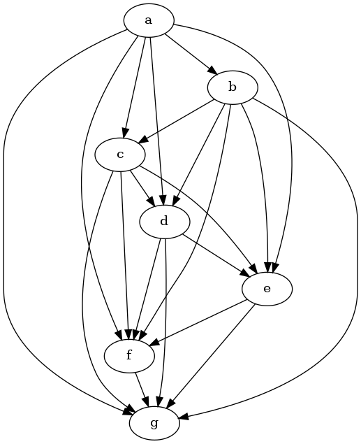

[home](./index.md)
-------------------

*author: niplav, created: 2022-03-04, modified: 2022-07-05, language: english, status: notes, importance: 8, confidence: unlikely*

> __Representing inconsistent preferences with specific mathematical
structures can clarify thoughts about how to make those preferences
consistent while only minimally changing them. This is discussed in
the case of preferences over world states, represented by [directed
graphs](https://en.wikipedia.org/wiki/Directed_graph); and preferences
over [lotteries](https://en.wikipedia.org/wiki/Lottery_\(probability\))
of world states, represented either by infinitely dense
graphs or (in some cases) vector fields over probability
simplices, or edge-weighted directed graphs. I also present
an algorithm for the discrete case based on the [graph edit
distance](https://en.wikipedia.org/wiki/Graph_Edit_Distance). Implications
for scenarios such as ontological crises are discussed.__

<!--https://www.lesswrong.com/posts/QZM6pErzL7JwE3pkv/niplav-s-shortform?commentId=XRmMoNCPmDhvyLzwc-->
<!--https://www.lesswrong.com/posts/ky988ePJvCRhmCwGo/using-vector-fields-to-visualise-preferences-and-make-them-->

Turning Some Inconsistent Preferences into Consistent Ones
===========================================================

> A kind of God-made (or evolution-created) fairness between species is
also unexpectedly found.

*— [Yew-Kwang Ng](https://en.wikipedia.org/wiki/Yew-Kwang_Ng), [“Towards Welfare Biology: Evolutionary Economics of Animal Consciousness and Suffering”](./doc/biology/welfare/towards_welfare_biology_evolutionary_economics_of_animal_consciousness_and_suffering_ng_1995.pdf) p. 1, 1995*

> Random testing is simple in concept, often easy to implement, has been
demonstrated to effectively detect failures, is good at exercising systems
in unexpected ways (which may not occur to a human tester), and may be
the only practical choice when the source code and the specifications
are unavailable or incomplete.

*— Tsong Yueh Chen/Fei-Ching Kuo/Robert G. Merkel/T.H. Tse, [“Adaptive Random Testing: the ART of Test Case Diversity”](./doc/cs/reduction/adaptive_random_testing_chen_et_al_2010.pdf), 2010*

Consider an agent which displays ([von
Neumman-Morgenstern](https://en.wikipedia.org/wiki/Von_Neumann-Morgenstern_utility_theorem))
inconsistent [preferences](https://en.wikipedia.org/wiki/Preference),
for example choosing two incompatible
options in the two scenarios in the [Allais
paradox](https://en.wikipedia.org/wiki/Allais_paradox), or reliably
displaying [cycles](https://en.wikipedia.org/wiki/Cycle_\(graph_theory\))
in its actions (detecting which actions are in fact caused by inconsistent
preferences, and not just exotic ones from weird abstractions, can be
considered a separate problem). We might want to interact with that agent,
e.g. trade with it, help it (or exploit it), or generally know how it
will act. But how to go about that if the agent displays inconsistent
preferences?

A possible approach to this problem has two steps:

1. Find ways to represent inconsistent preferences with a mathematical structure which can encode all possible violations of the von Neumann-Morgenstern axioms in all their combinations.
2. Then turn those inconsistent preferences into consistent ones, and then inform the agent about these inconsistencies and their optimal resolutions (or, in the case of trying to help the agent, then enacting these preferences in the real world).

Mathematical Formulation of the Problem
----------------------------------------

Define a set of possible (von Neumann-Morgenstern) inconsistent
preferences over a set `$W$` of worlds as `$\not\curlyvee_W$`, and the set
of consistent preferences over those worlds as `$\curlyvee_W$`. Elements
from those sets are written as `$\succsim_W \in \not\curlyvee_W$` and
`$\succeq_W \in \curlyvee_W$`.

One way we could approach the problem is by trying to turn those
inconsistent preferences consistent, i.e. constructing a function
`$f: \not \curlyvee_W \mapsto \curlyvee_W$` that takes an inconsistent
preference `$\succsim$` and transforms it into a consistent preference,
while retaining as much of the original structure of the preference
as possible (it would make little sense if we replaced the original
preference relation with indifference over all options).

Formally, we want to find for some given [distance
metric](https://en.wikipedia.org/wiki/Metric_\(mathematics\))
`$d: \not \curlyvee_W \times \curlyvee_W \mapsto ℝ$` a function
`$t$` so that

	$$t= \underset{t}{\text{argmin }} d(\succsim, t(\succsim)) \\
	\succeq=t(\succsim)$$

I call this function a __turning__, and sometimes call the results of
that function __turned preferences__ (usually I just refer to them as
consistent preferences). The names mostly chosen for not having been
used yet in mathematics, as far as I know.

A solution to the problem of turning inconsistent preferences into
consistent ones then has these components:

1. A mathematical structure for representing `$\not \curlyvee_W$` and `$\curlyvee_W$`
	* Inconsistent preferences over discrete options are represented via [directed graphs](https://en.wikipedia.org/wiki/Directed_graph)
	* Inconsistent preferences over [lotteries](https://en.wikipedia.org/wiki/Lottery_\(probability\)) of options are represented via
		* directed graphs over [probability simplices](https://en.wikipedia.org/wiki/Simplex)
			* potentially more exotic structures such as [graphons](https://en.wikipedia.org/wiki/Graphon) or results from [extremal graph theory](https://en.wikipedia.org/wiki/Extremal_graph_theory) are relevant here, but I haven't investigated these in detail
		* vector fields on probability simplices
		* [graphs with edge weights](https://en.wikipedia.org/wiki/Graph_\(discrete_mathematics\)#Weighted_graph) in `$ℝ$`
2. A specification for `$t$`
	* In the case of discrete options, I propose adding and removing edges from the directed graph
	* In the case of lotteries I don't have yet any clear proposals
3. A specification for `$d$`
	* In the case of discrete options, I propose using the [graph edit distance](https://en.wikipedia.org/wiki/Graph_edit_distance)
	* In the case of lotteries I don't yet have any definite proposals

Related Work
------------

This work is closely related to the investigations in [Aird & Shovelain
2020](https://www.lesswrong.com/posts/ky988ePJvCRhmCwGo/using-vector-fields-to-visualise-preferences-and-make-them)
(so closely that even though I believe I re-invented the
approach independently, it might just be that I had read
their work & simply forgotten it), and broadly related to
the value extrapolation framework outlined in [Armstrong
2022](https://www.lesswrong.com/posts/i8sHdLyGQeBTGwTqq/value-extrapolation-concept-extrapolation-model-splintering).

Discrete Case
--------------

When we have discrete sets of worlds `$W$`, we can represent
an inconsistent preference over those worlds by using a directed graph
`$G_{\succsim}=(W,E_{\succsim} \subseteq W \times W)$`.
The presence of an edge `$(w_1, w_2)$` would mean that `$w_1 \succsim w_2$`,
that is `$w_1$` is preferred to `$w_2$`.

Mathematically, then, `$\not \curlyvee_W$` is the set of all possible
graphs with edges in `$W \times W$`, that is
`$\not \curlyvee_W=\{(W, E)| E \in \mathcal{P}(W \times W))\}$`).

The consistent equivalent to an inconsistent preference
represented by a directed graph would be a [path
graph](https://en.wikipedia.org/wiki/Path_graph)
`$G_{\succeq}=(V, E_{\succeq})$` over the same set of
[vertices](https://en.wikipedia.org/wiki/Vertex_\(graph_theory\)) `$W$`.
The method for transforming `$G_{\succsim}$` into `$G_{\succeq}$` would be
by adding/deleting the minimal number of vertices from `$E_{\succsim}$`.

Mathematically, then `$\curlyvee_W$` is the set of transitive closures
of all possible path graphs that are encode permutations of `$W$`; `$\curlyvee_W=\{(V, E)^+ | E \in σ(W)\}$`.

### Example

Consider the following directed graph:

Here, `$W=\{a,b,c,d,e,f,g\}$`.

An edge from `$a$` to `$b$` means that `$a$` is preferred to `$b$`
(short `$a \succsim_W b$`). The absence of an edge between two
options means that those two options are, from the view of the agent,
[incomparable](https://en.wikipedia.org/wiki/Comparability).

It violates the two von Neumann-Morgenstern axioms for discrete options:

* Completeness is violated because for example options `$d$` and `$e$` are incomparable (and we don't merely have [indifference](https://en.wikipedia.org/wiki/Indifference_curve) between these options)
* Transitivity is violated because of the `$b → c → e → f → g → b$` loop

<!--TODO:
#### Recap: von Neumann-Morgenstern Axioms for Discrete Options

-----
-->

A possible turned version of these preferences could then be the
following graph:

This graph looks quite messy, but it's really just the [transitive
closure](https://en.wikipedia.org/wiki/transitive_closure) of this graph:

Whether this is the "right" way to turn the previous inconsistent
preferences depends on the choice of distance metric we would like to use.

### Resolving Inconsistencies

In some sense, we want to change the inconsistent preferences as little
as possible; the more we modify them, the more displayed preferences we
have to remove or change. Since the presence or absence of preferences
is encoded by the presence or absence of edges on the graph, removing
edges or adding new edges is equivalent to removing or adding preferences
(at the moment, we do *not* consider adding or removing vertices: we
stay firmly inside the agent's [ontology](https://en.wikipedia.org/wiki/Ontology_\(information_science\))/world model).

Luckily, there is a concept in computer science called the graph-edit
distance: a measure for the difference between two graphs.

The set of possible editing operations on the graph varies, e.g. Wikipedia lists

> * __vertex insertion__ to introduce a single new labeled vertex to a graph.
* __vertex deletion__ to remove a single (often disconnected) vertex from a graph.
* __vertex substitution__ to change the label (or color) of a given vertex.
* __edge insertion__ to introduce a new colored edge between a pair of vertices.
* __edge deletion__ to remove a single edge between a pair of vertices.
* __edge substitution__ to change the label (or color) of a given edge.

*—[English Wikipedia](), [“Graph Edit Distance”](https://en.wikipedia.org/wiki/Graph_Edit_Distance), 2021*

Since we do not have labels on the edges of the graph, and have disallowed
the deletion or insertion of vertices, this leaves us with the graph
edit distance that uses edge insertion and edge deletion.

We can then write a simple algorithm for
`$\succeq=f(\succsim)$`:

	turn(W, G≿=(W, E≿)):
		mindist=∞
		for L in perm(W):
			L=trans_closure(L)
			dist=ged(G≿, R)
			if dist<mindist:
				R=L
				mindist=dist
		return R

where `perm(W)` is the set of
[permutations](https://en.wikipedia.org/wiki/Permutation) on `W`,
`trans_closure(G)` is the transitive closure of a graph `G`, and `ged(G1,
G2)` is the graph edit distance from `G1` to `G2`.

Or, mathematically,

	$$R=\underset{R \in σ(W)}{\text{argmin }}\text{GED}(R^+, G_{\succsim}))$$

#### Implementation

Implementing this in Python 3 using the [networkx](http://networkx.github.io/)
library turns out to be easy:

	import math
	import networkx as nx
	import itertools as it

	def turn(W, G):
		mindist=math.inf
		for L in it.permutations(W):
			L=list(L)
			LG=nx.DiGraph()
			for i in range(0, len(W)):
				LG.add_node(W[i], ind=i)
			for i in range(0, len(L)-1):
				LG.add_edge(L[i], L[i+1])
			LG=nx.algorithms.dag.transitive_closure(LG)
			# Compute the graph edit distance, disabling node insertion/deletion/substition and edge substitution
			oas=lambda x: 1
			oah=lambda x: 10e10 # math.inf is not accepted here, TODO make some more specific maximum value
			nm=lambda x, y: x['ind']==y['ind']
			em=lambda x, y: True
			dist=nx.algorithms.similarity.graph_edit_distance(G, LG, node_match=nm, edge_match=em, node_del_cost=oah, node_ins_cost=oah, edge_ins_cost=oas, edge_del_cost=oas)
			if dist<mindist:
				R=LG
				mindist=dist
		return R

We can then test the function, first with a graph with a known best
completion, and then with our [example from above](#Example).

The small example graph (top left) and its possible turnings are
(all others):

	>>> WS=['a', 'b', 'c']
	>>> GS=nx.DiGraph()
	>>> for i in range(0, len(WS)):
	...     GS.add_node(WS[i], ind=i)
	>>> GS.add_edges_from([('a', 'b')])
	>>> LGS=turn(WS, GS)
	>>> LGS.nodes
	NodeView(('a', 'b', 'c'))
	>>> LGS.edges
	OutEdgeView([('a', 'b'), ('a', 'c'), ('b', 'c')])

This looks pretty much correct.

	>>> WM=['a', 'b', 'c', 'd', 'e', 'f', 'g']
	>>> GM=nx.DiGraph()
	>>> for i in range(0, len(WM)):
	...     GM.add_node(WM[i], ind=i)
	>>> GM.add_edges_from([('a', 'b'), ('b', 'c'), ('c', 'd'), ('c', 'e'), ('e', 'f'), ('f', 'g'), ('g', 'b')])
	>>> LGM=turn(WM, GM)
	>>> LGM.nodes
	NodeView(('a', 'b', 'c', 'd', 'e', 'f', 'g'))
	>>> LGM.edges
	OutEdgeView([('a', 'b'), ('a', 'c'), ('a', 'd'), ('a', 'e'), ('a', 'f'), ('a', 'g'), ('b', 'c'), ('b', 'd'), ('b', 'e'), ('b', 'f'), ('b', 'g'), ('c', 'd'), ('c', 'e'), ('c', 'f'), ('c', 'g'), ('d', 'e'), ('d', 'f'), ('d', 'g'), ('e', 'f'), ('e', 'g'), ('f', 'g')])

This is actually equal to the hypothesized solution from above (below
is the non-transitive-closure version):

##### Questions

* Does it matter whether we give `turn` a graph `$G$` or the transitive closure of `$G$`?

#### Problems with This Method and its Algorithm

This solution has some glaring problems.

##### Speed (or the Lack Thereof)

Some of you might have noticed that this algorithm is *somewhat
inefficient* (by which I mean *absolutely infeasible*).

Since we iterate through the permutations of `$W$`, the runtime is
`$\mathcal{O}(|W|!)$` (with the added benefit of computing the
[NP-complete](https://en.wikipedia.org/wiki/NP-completeness)
graph edit distance inside of the loop, which is also
[APX](https://en.wikipedia.org/wiki/APX)-hard to approximate).

<!--TODO: measure runtime-->

* Question: Is there a more efficient algorithm to compute the turned preference? Can it at least be made exponential?

##### Non-Unique Results

Another, smaller problem is that the algorithm often doesn't have a unique
result, as seen in the small example [above](#Resolving-Inconsistencies).

We can compute the set of all possible turnings with some trivial
changes to the algorithm:

	turn_all(W, G≿=(W, E≿)):
		mindist=∞
		R=∅
		[…]
			if dist<mindist:
				R={L}
				mindist=dist
			else if dist==mindist:
				R=R∪{L}
		return R

and its implementation

	def turn_all(W, G):
		R=set()
		[…]
			if dist<mindist:
				R=set([LG])
				mindist=dist
			elif dist==mindist:
				R.add(LG)
		return R

The results, with the small example, are as expected:

	>>> S=list(turn_all(WS, GS))
	>>> len(S)
	3
	>>> S[0].edges
	OutEdgeView([('a', 'b'), ('a', 'c'), ('b', 'c')])
	>>> S[1].edges
	OutEdgeView([('a', 'b'), ('c', 'a'), ('c', 'b')])
	>>> S[2].edges
	OutEdgeView([('a', 'c'), ('a', 'b'), ('c', 'b')])

For the big example, after waiting a while for the solution:

	>>> S=list(turn_all(WM, GM))
	>>> len(S)
	49

I will not list them all, but these are less than the `$7!=5040$`
possible options.

This brings up an interesting question: As we have more and more
elaborate inconsistent preferences with more elements, does it
become more likely that they have a unique consistent preference
they can be turned to? Or, in other words, if we make the graphs
bigger and bigger, can we expect the fraction of inconsistent
preferences with a unique turning to grow (strictly)
[monotonically](https://en.wikipedia.org/wiki/Monotonic_function)?

More formally, if we define `$\mathcal{G}$` as the set of graphs
with `$n$` nodes, and `$\mathcal{U}_n=\{G \in \mathcal{G}_n | 1=|\text{turn_all}(G)|\}$`
as the set of graphs with `$n$` nodes that
have unique path graphs associated with them.

###### Maximal and Minimal Number of Resolutions

###### Questions

One can now pose several (possibly distracting) questions:

* As we add more options to our inconsistent preferences, do they become more likely to turn uninuely?
	* That is: Does it hold that `$\frac{|\mathcal{U}_n|}{|\mathcal{G}_n|}<\frac{|\mathcal{U}_{n+1}|}{|\mathcal{G}_{n+1}|}$`?
	* It should be possible to check this for small cases.
* In general, how does the size of `$\mathcal{U}_n$` develop? What about graphs with 2 possible consistent turnings, or in general `$m$`?
	* One can define `$\mathcal{T}(n,m)=\{G \in \mathcal{G}_n | m=|\text{turn_all}(G)|\}$`
		* How, then, does `$\mathcal{T}(n,m)$` behave?
		* Does the average number of turnings for inconsistent preferences converge to a specific number?
		* That is, what is `$\lim_{n \rightarrow \infty} \frac{1}{\mathcal{G}_n} \sum_{i=1}^{n} \mathcal{T}(n,i)$`? Does it converge?
		* I predict [20% on the number monotonically increasing](https://predictionbook.com/predictions/208299), [50% on monotonically decreasing](https://predictionbook.com/predictions/208300) and [30% on showing no clear pattern](https://predictionbook.com/predictions/208300).

Encoding Inconsistencies
------------------------

### Theory

Assuming that we have a set of axioms that describe which preferences
are consistent and which are inconsistent, for the purposes of this
text, we want to ideally find a set `$\not \curlyvee$` of mathematical
structures that

1. can represent preferences that violate each possible subset of those axioms.
	1. Each inconsistent preference should have exactly one element of `$\not \curlyvee$` that represents it
2. has a strict subset `$\curlyvee \subset \not \curlyvee$` so that `$\curlyvee$` can represent only consistent preferences.

### Discrete Case

The two relevant von Neumman-Morgenstern axioms are completeness and
transitivity, with a directed graph one can also represent incompleteness
and intransitivity.

#### Incompleteness

Incompleteness (or incomparability) between two options `$w_1, w_2$`
can be represented by not specifying an edge between the two options,
that is `$(w_1, w_2) \not \in E, (w_2, w_1) \not \in E$`.

#### Intransitivity

Intransitivity can be represented by cycles in the graph:

#### Non-Encodable Inconsistencies

With option set `$\{a,b\}$` have preference `$a \succsim b$`, with
option set `$\{a,b,c\}$` have preferences
`$b \succsim a, a \succsim c, b \succsim c$`.

### Continuous Case

#### Incompleteness

* Minima/maxima in the vector field
* Discontinuities
* Undifferentiable points

#### Intransitivity

Curl in the vector field?

#### Discontinuity

Can only exist with incompleteness?

#### Dependence

### Discussion

This leads to an interesting ethical consideration: is it a larger change
to a preference relation to add new information or remove information?

It is discussed how to incorporate those weights into an algorithm for
minimally transforming `$G_{\succsim}$` into `$G_{\succeq}$`.

Continuous Case
----------------

### Vector Fields over Probability Simplices

Vector field over the probability simplex over the options (representing
local preferences over lotteries).

#### Resolving Inconsistencies

Find mapping from vector field to another that makes the vector field
consistent by minimizing the amount of turning/shrinking the vectors
have to perform.

### Graphons

?

Look into extremal graph theory.

Implications for AI Alignment
------------------------------

> I've seen six cities fall for this  
mathematics with incompetence  
red flags stand among the trees  
repugnant symphonies  
a billionaires tarantula just ate the ceiling  
thinking it was yet another floor

*—[Patricia Taxxon](), [“Hellbulb”]() from [“Gelb”](), YEAR<!--TODO-->*

### Ambitious Value Learning

Learn human values, check if known inconsistencies are encoded (to ensure
learning at the correct level of abstraction), then make consistent.

### Ontological Crises

> Furthermore, there remain difficult philosophical problems. We have
made a distinction between the agent’s uncertainty about which model
is correct and the agent’s uncertainty about which state the world is
in within the model. We may wish to eliminate this distinction; we
could specify a single model, but only give utilities for some states
of the model. We would then like the agent to generalize this utility
function to the entire state space of the model.

*—Peter de Blanc, “Ontological Crises in Artificial Agents’ Value Systems”, 2010*

If you know a mapping between objects from human to AI ontology, you
could find the mapping from the (consistent) human probability simplex
to the AI simplex?

#### Discrete Case

A node splits in two or more, or two or more nodes get merged. If the
then resulting graph isn't a path graph, it can be turned with the
method described above.

Further Questions
------------------

* Does every graph `$G$` have a unique graph `$G'$` so that `$G$` is the transitive closure of `$G'$`?
* There is something interesting going on with lattices (?) over individual transitivity operations

Acknowledgements
------------------------

Thanks to Miranda Dixon-Luinenburg for finding some typos.

<!--
*epistemic status: butterfly idea, I really should learn more topology
and vector calculus, potentially very fruitful line of research in
theoretical ethics*

Consider an agent with inconsistent preferences. How can we represent
their inconsistent preferences so that they can be turned into consistent
variants of themselves, while minimally changing their structure?

One way to approach this is to represent the preferences as a directed
graph. In this case, we have for example an intransitive preference

We can make this preference consistent by deleting an edge, but
unfortunately we don't have a unique solution to making this preference
consistent. I am interested in the combinatorics of turning a directed
graph into a [path graph](https://en.wikipedia.org/wiki/Path_graph) (or
its transitive closure) while making the minimal number of modificiations
(deleting edges, adding edges, merging edges) to the initial graph.

If we look at preferences over lotteries, we could represent a subset
of all possible inconsistent preferences as a vector field over the
probability simplex of all underlying options. Circular preferences
would then be represented by the curl of the vector field, violations
of continuity would be points in the vector field where the vectors
are "0": for example on the line simplex, it would be the vector field
"flipping around" at some point on the line (I don't know vector calculus
that well).

It might then be possible to define a function that minimally modifies
that vector field to convert it to a consistent preference relation
(i.e. a vector field that "flows toward a single option"). Defining
"minimally" is the trick here: I'm imagining something akin to taking
the integral over the rotation & size of the vectors of the difference
of the vector field before and after (I told you I don't really know
the math of that yet).

I suspect that there are interesting further extensions to be discovered
in extremal graph theory, for example graphons which look like they
might be able to represent more & different preferential inconsistencies,
but this is more of a hunch.

If solved, this could be relevant to ambitious value learning and
potential resolving ontological crises.

Here are some questions I have:

* I bet there is research on how to turn inconsistent preferences into consistent ones, but a cursory search hasn't shown me anything satisfactory yet. Where is it?
* I would be fairly sure that there is also research on how to turn arbitrary directed graphs into directed path graphs, but I don't know about it yet.
* What kinds of preferential inconsistencies can be represented via directed graphs/vector fields on probability simplices?
* What would the vector field over a probability simplex look like to be equivalent to a consistent preference?
* What is the topology of minimally transforming such a "inconsistent" vector field into a "consistent" vector field?
* Does any of this actually make sense?
-->
