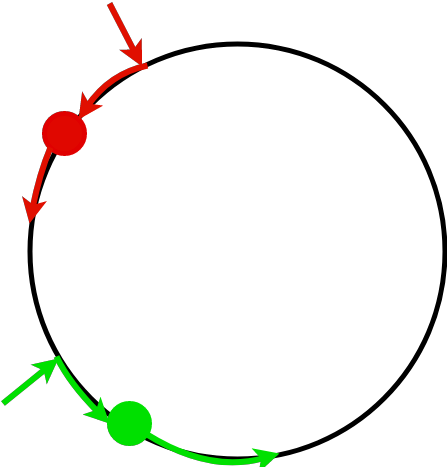

[home](./index.md)
-----------------

*author: niplav, created: 2019-04-02, modified: 2020-06-01, language: english, status: in progress, importance: 3, confidence: likely*

> __Two people are abducted and placed on the opposite poles of a
> habitable planet. They want to find each other, but they have no
> way to communicate. The only things they know is their their own
> respective position on the planet and the position of the equator and
> the poles. Here, different methods for finding each other under similar
> conditions are explained and discussed, and a deterministic method
> for finding each other is introduced.__

Two People on a Planet
======================

> Wo ist dein Delos, wo dein Olympia,  
> Daß wir uns alle finden am höchsten Fest?

*– [Friedrich Hölderlin](https://en.wikipedia.org/wiki/Friedrich_H%C3%B6lderlin), [“Gesang des Deutschen”](https://www.textlog.de/17843.html), 1800*

The Problem
------------

The original problem is taken from [Munroe
2014](./doc/lost_immortals_munroe_2014.pdf "“Lost Immortals“ (Randall
Munroe 2014)"):

> If two immortal people were placed on opposite sides of an uninhabited
> Earthlike planet, how long would it take them to find each other?

*– [Randall Munroe](https://en.wikipedia.org/wiki/Randall_Munroe), [“Lost Immortals” in “What If?”, p. 183](./doc/lost_immortals_munroe_2014.pdf), 2014*

Here, I add several clarifications to the problem.

For the following ideas, it is not necessary that the planet is
earth-like, but it is assumed that the planet has a relatively flat
surface, lacking oceans, where the two people can leave footprints.

Each of the two people has the following abilities:

* Know their own position on the planet
* Walk at approximately the same speed
* Reason about the other person
* Leave footprints on the ground

Both lack all other abilities, including (but not limited to) creating
new technology and communicating when they are out of sight (no fireworks,
launching spaceships etc.).

Both people are typical, but had no opportunity to communicate with
each other beforehand. They can reason about each others' strategy and
behavior, but have no intricate knowledge about each others decision
process (if they are artificial agents, they don't know each others'
algorithm).

These two people want to find each other.

Different Existing Solutions
----------------------------

### Munroes Solutions

Munroe proposes different solutions:

* Walk around at random: He states that they would find each other within 3000 years (though no explicit calculation is provided).
* Agree beforehand to meet at a specific point on the planet (such as the highest mountain, one of the poles etc.).
* Follow the coastlines of the continents. This is not applicable here, because it is assumed that there are no oceans.
* Follow the coastlines of the continents, but after each circling, decide randomly whether to switch direction or resume the known path.
* Walk at random, while leaving a trail of signs with increasing counter along the way, increasing ones speed when finding an unknown trail.

### Other Proposed Solutions

A very similar problem was discussed in a Mathematics Stack
Exchange post:

> Suppose you and your friend end up on a big sphere. There are no visual
> cues on where on the sphere you both are, and the sphere is way bigger
> than you two. There are no means of communication. You can determine
> your relative position and direction by navigating the stars. You can
> move anywhere, and your friend too.  
> Upon inspecting the sphere, you see it is rock-solid, so you cannot
> create markings. To protect the environment, you are not allowed to
> leave other stuff, like a blood trace or breadcrumbs.

*– [RobAu](https://math.stackexchange.com/users/53495/robau), [“Fastest way to meet, without communication, on a sphere?”](https://math.stackexchange.com/questions/1214022/fastest-way-to-meet-without-communication-on-a-sphere/), 2015*

In this problem, marking are not possible, and players don't start at
the opposite sides of the planet (which makes a solution a lot harder).

#### Moving at Random, but Changing Directions Rarely

> Move at random. [...]
> you could prefer to walk longer distances in a straight line as opposed
> to choosing a completely new direction after every centimeter of movement.

*– [MvG](https://math.stackexchange.com/users/35416/mvg), answer to [“Fastest way to meet, without communication, on a sphere?”](https://math.stackexchange.com/a/1214062), 2015*

This solution does not need any prerequisites.

#### Exhaustive Search, Moving in Spirals

> So the first thing to do is to calculate the size of the sphere (by
> picking a direction and walking until you arrive back at the start point
> or some other, more efficient technique). At that point, you can work out
> an exhaustive search pattern and the duration to perform one (a spiral
> pattern is close to optimal but difficult for a human to perform). That
> duration becomes your frequency of decision making.
> Once per period, you flip a coin. Heads, you do an exhaustive
> search. Tails, you stay put. Each of the longer period (e.g. the less
> efficient search pattern), you have a 50/50 chance of doing the opposite
> of your partner and thus discovering each other in the course of the
> exhaustive search.

*– [Danikov](https://math.stackexchange.com/users/221242/danikov), answer to [“Fastest way to meet, without communication, on a sphere?”](https://math.stackexchange.com/a/1214323), 2015*

This is similar to the strategy of randomly switching positions, but
without opposite starting positions. It assumes one can adequately
calculate the circumference of the sphere, which is not a given, and it
assumes that the person can generate random bits.

#### Randomizing Speed While Keeping Direction

> I think a better strategy is to pick a direction (any will do), stick
> to it and randomise your speed.  
> If both parties do this their paths will cross twice each orbit (unless
> they are on the same orbit in which case they will meet sooner due to
> randomised speed)  
> if you go full random changing direction as well as velocity you aren't
> guaranteed to ever cross the path of the other. (although as t gets large
> it becomes increasingly likely that your paths will cross at least once.)  
> Speed randomisation is necessary to avoid never meeting because of resonance.

*– [Luke McGregor](https://math.stackexchange.com/users/30204/luke-mcgregor), answer to [“Fastest way to meet, without communication, on a sphere?”](https://math.stackexchange.com/a/1215229), 2015*

#### Find a Schelling Point

> I would posit that a better-than-random solution would include finding
> the most "interesting" such configuration (so first you have to map
> them all by traveling the sphere methodically) and heading there as a
> Schelling point.

*– [Qwertronix](https://math.stackexchange.com/users/54545/qwertronix), answer to [“Fastest way to meet, without communication, on a sphere?”](https://math.stackexchange.com/a/1214322), 2015*

This solution is similar to most practical solutions to these kinds
of problems. It assumes that there *is* a most interesting star
configuration, the size of such a configuration, and a given metric
on how to determine the interesting-ness of such a configuration.
The metric is the least difficult of them: given a size of the region
of sky, the most interesting such region would be the one that is the
most compressible (or most regular). The size aspect of this possible
configuration is much more difficult: Where does such a configuration
end? One possible answer is: "At the horizon.", then the [Schelling
point](https://en.wikipedia.org/wiki/Focal_point_(game_theory)) would
be the point where the whole sky is most interesting.

### Randomly Switching Positions

Another solution is possible due to the fact that both people start out
at the opposite sides of the planet. Each person determines randomly
whether they should travel to the opposite side of the planet or stay
at ones own side for the duration of such a travel. This drastically
decreases the time until meeting, since the chance of not having met after
n such iterations the chance of having met is `$1-\frac{1}{2^n}$`. Munroe
proposes coin flips to determine whether one changes position, but one
can imagine other such methods if coins are not available.

One could assign the choice of staying to the left body half and
the choice of going to the other side of the planet to the right
body half, and then choosing the strategy based on which part of the
body itches first. This would be useful since humans are notoriously
bad at consciously generating random bits (see [Figurska et al.
2007](./doc/two_people_on_a_planet/humans_cannot_consciously_generate_random_numbers_sequences_figurska_et_al_2008.pdf "Humans cannot consciously generate random numbers sequences: Polemic study")).

On the other hand, this method could be biased, since many humans have
points on their skin that are constantly itchy.

A Better Solution
-----------------

A better solution is possible because both people start out at the
opposite sides of the planet, and know their own respective position on
the planet.

Taking their own position as one pole, they could infer an equator as
the set of points on the planet that is equally far away from each of
their positions. They would then both proceed to go to this equator
and start walking along it.

Then each person could follow the following algorithm: If they had
walked less than half of the circumference of the planet, and encountered
footsteps, they would reverse direction. If they had walked more than
half of the circumference of the planet, they would continue walking no
matter whether they would see other footsteps on the ground.

This would ensure that they would deterministically meet in `$\cal{O}(n)$`
(`$n$` being the circumference of the planet).

Pseudocode
----------

This code does not deal with the possibility that the other agent doesn't
use the same method, or that they don't arrive at the equator at the
same time.

	circumference=4*walk_to_equator() /* circumference in steps */

	set_marker() /* in case footsteps are not visible after some time */
	equator_steps=0

	while met_person()==false
		walk_step()
		equator_steps++
		if marker_visible==true and steps_on_equator<circumference/2
			turn_around()

Why it Works
------------

Here, it is assumed that they both reach the equator at the same time.

If both start walking towards each other, the algorithm succeeds:
Both can walk at most half of the length of the equator upon meeting
each other in the extreme case, namely, starting back to back and not
realizing it. In this case, the last part of the method is not applied,
because both will walk less than half of the length of the equator in
any case. In this case, finding each other takes at most `$\frac{3}{4}$`
of the time it takes to walk across the whole equator (including the
walk from the starting point to the equator).

If they both start walking in the same direction, the method still
succeeds: one of the two people has a distance of less than half of the
length of the equator to the starting point of the other person.

This person p₁ walks that distance, and then can use that fact as a
distinguishing strategy for acting, namely, turning around and starting
to walk towards the other person. The other person p₂ can use the
fact that their distance to the starting point of the other person is
more than half of the length of the equator to distinguish themselves,
and continue walking. Because p₁ is now walking towards p₂, they will
definitely meet.

Interestingly, because they are both walking the whole time, it will
take them less than one walk across the whole equator for this algorithm
(again including the journey from the pole to the equator).

### Difference to Other Solutions

Of course, this strategy is only one of infinitely many that will result
in the two people deterministically meeting after a linear amount of
time. Other such algorithms include meeting at any specific point on
the planet (such as the starting position of one particular person,
or 0°0′N 0°0′E etc.). However, the proposed strategy is different
from these.

First of all, it is not person-specific: Both people follow the same
strategy, and still manage to meet each other deterministically in
linear time. This is not the case for strategies that involve one
person doing something different from the other person: there is no
way for them to know which one of them was meant in the first place,
unless specific characteristics are given (but those are, of course,
also person-specific).

Second, it does not need an absolute coordinate system. The algorithm
works even when the two people only known where the equator is (e.g. with
an inner sense of direction or a compass), since they randomly choose
directions once they have reached the equator.

This allows quite restricted conditions for the algorithm to work:
Each of the people knows the direction towards the equator, knows how
much they have walked, and can leave one sign on the surface (more are
not needed, since the point where they both reached the equator is the
only relevant information to both).

Complications
-------------

There are, of course, several problems with this approach.

### Assumptions

This strategy assumes several things:

* The two people start at opposite points on the planet
* The two people know where the equator is
* Both can make at least one marking
* Both follow the same strategy

### The Strategy is not Obvious

This objection of course applies to all possible strategies,
including Randomly Switching Positions and nearly all of Munroes
propositions. Ideally, one would try to generate all possible
strategies of a typical agent and then generate a probability
distribution over them, using methods such as [Minimum Message
Length](https://en.wikipedia.org/wiki/Minimum_message_length)
and [Solomonoff
Induction](https://en.wikipedia.org/wiki/Solomonoff's_theory_of_inductive_inference)
to penalize very complex solutions.

A good approximation to this is to assume that the other person is moving
around randomly, accounting slightly the possibility that they have
stayed where started, and then taking into account the other strategies
proposed here.

More intricate and speculative methods of finding this (or even
more optimal) strategies are possible: One can imagine using a
[self-sampling](https://en.wikipedia.org/wiki/Self-sampling_assumption) or
[self-indication](https://en.wikipedia.org/wiki/Self-indication_assumption)
assumption and try to act in predictable ways, assuming that the
other person is similar to oneself based on the assumption that both
are typical observers. Furthermore, it would be possible (but perhaps
computationally intractable) to create a probability distribution over
the set of possible other observers and then calculate their respective
strategies. For this, a fixed period of time might be allocated, such as
a day (if the planet has them) or the time it takes to do a full walk
from the starting point over the equator back to the origin. Here, one
runs into issues, because the two most obvious choices (walking along
the circumference once vs. switching places) seem to be equally simple.

### Arriving at Opposite Points on the Equator Fails

If both of them arrive at opposite sides of the equator, following the
algorithm will result in them both switching their direction or both of
them continuing with their course. In this case, the algorithm fails,
and results in them not meeting after less than one iteration. Several
strategies would be possible at this point: Attempt the algorithm again by
returning to the starting point, or assuming one of the other strategies.
This becomes less of a problem depending on how exact the persons'
knowledge about the already walked distance and the circumference of
the planet is. The more accurate, the less often the case of arriving
at perceived opposite points of the equator occurs.

Further Questions
-----------------

* Under given conditions, are there other deterministic algorithms for meeting on a sphere?
* In which ways can the conditions be made more/less strict, and which kinds of methods would they allow?

External Links
--------------

<!--
TODO: read.

* /usr/local/doc/unread/rendezvous/deterministic_rendez_vous_ta_shma_zwick_2007.pdf
* /usr/local/doc/unread/rendezvous/deterministic_rendezvous_in_graphs_dessmark_et_al_2006.pdf
* /usr/local/doc/unread/rendezvous/how_to_meet_in_anonymous_network_kowalski_malinowski_2008.pdf
* /usr/local/doc/unread/rendezvous/random_walks_universal_traversal_sequences_aleliunas_et_al_1979.pdf
* /usr/local/doc/unread/rendezvous/rendezvous_problem_gasieniec_2004.pdf
* /usr/local/doc/unread/rendezvous/theory_of_search_games_and_rendezvous_alpern_2002.pdf
* https://mathoverflow.net/questions/184404/randall-munroes-lost-immortals
* [Rendezvous problem](https://en.wikipedia.org/wiki/Rendezvous_problem)
* [Deterministic rendezvous problem](https://en.wikipedia.org/wiki/Deterministic_rendezvous_problem)
-->
